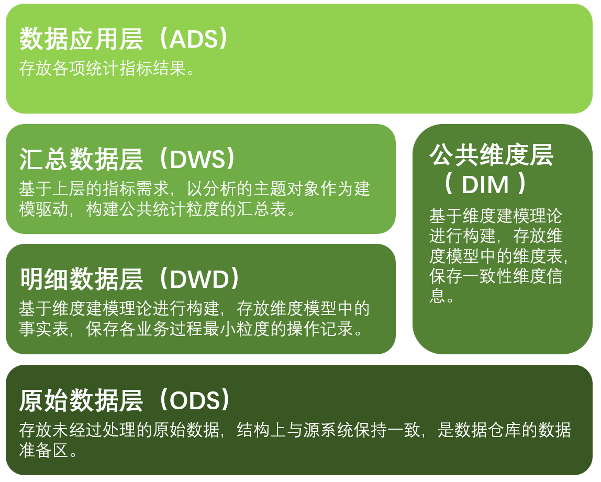
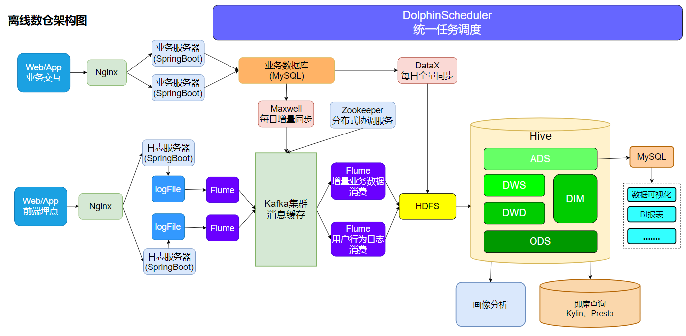

# 电商行业离线数仓

## 1.数仓架构

## 2.技术选型

| 软件             | 版本   |
| ---------------- | ------ |
| Hadoop           | 3.1.3  |
| Zookeeper        | 3.5.7  |
| Hive             | 3.1.2  |
| Flume            | 1.9.0  |
| Kafka            | 3.0.0  |
| Spark            | 3.0.0  |
| DataX            | 3.0    |
| Maxwell          | 1.2.92 |
| DolphinScheduler | 1.39   |
| MySQL            | 5.7.16 |

- **数据采集**：DataX、Flume、Kafka、Maxwell
- **数据存储**：HDFS、MySQL
- **数据计算**：Hive、MapReduce、Spark
- **资源管理**：Yarn
- **任务调度**：DolphinScheduler
- **协调服务**：Zookeeper

## 3.系统逻辑架构

## 4.实现的功能

**日志数据**：启动、曝光、点击日志

**业务数据**：用户登陆、注册、加购、收藏、下单、支付、退款等核心交易数据的分析

**数仓分析指标**：

1. **流量主题**：   
   (1). 个渠道流量统计  
   (2). 路径分析
2. **用户主题**：  
   (1). 用户变动统计  
   (2). 用户留存率  
   (3). 新增用户活跃统计  
   (4). 用户行为漏斗分析  
   (5). 新增交易用户统计  
3. **商品主题**：  
   (1). 最近7/30日各品牌复购率  
   (2). 各品牌商品交易统计  
   (3). 各品类商品交易统计  
   (4). 各分类商品购物车存量Top N  
4. **交易主题**：  
   (1). 最近每日交易综合统计   
   (2). 各省份交易统计   
5. **活动、优惠卷主题**：  
   (1). 最近30日发布优惠券的补贴率  
   (2). 最近30日发布活动的补贴率  