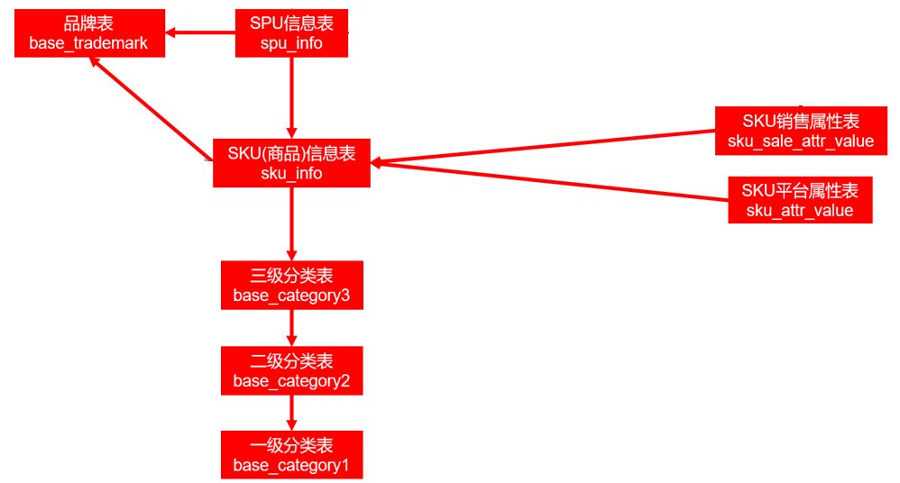
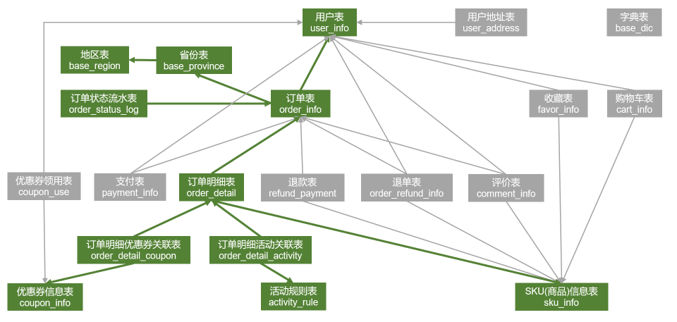

# 一、数仓建模
## 1.1 建模理论

## 1.2 维度模型

## 1.3 构建流程

## 1.4 环境准备

# 二、数据准备
为了保证数据的准确性，在进行数据生成前需要先将HDFS下之前生成的`origin_data`目录删除

## 2.1 日志数据准备

需要的服务: `HDFS`、`Zookeeper`、`Kafka`

这里只生成2020-06-14一天的用户行为日志数据即可

操作顺序：

1. 启动日志采集服务，依次执行脚本(**bigdata101**下)：`f2_log.sh`、`f1_log.sh`
2. 依次修改bigdata101、bigdata102下`/opt/module/app_log/`目录中`application.yml`中`mock_date`的日期为2020-06-14
3. 启动日志生成脚本：`lg.sh`
4. 前往HDFS目录下查看`origin_data/gmall/log/topic_log/2020-06-14`下是否有相应的文件生成

## 2.2 业务数据准备

需要的服务: `HDFS`、`Zookeeper`、`Kafka`

在`bigdata101`启动任务数据采集进程：`f3_db.sh start`

这里模式的业务数据的背景是业务数据库中已有一部分业务数据，然后才搭建数仓的情景。所以需要先生成5日左右的数据：2020-06-10、2020-06-11、2020-06-12、2020-06-13、2020-06-14 。
1.这里生成数据的日期必须从2020-06-10按顺序开始，首先生成2020-06-10的数据，在`bigdata101`下`/opt/module/db_log/application.properties`编辑如下内容：

```properties
# 业务日期
mock.date=2020-06-10
# 是否重置
mock.clear=1
# 是否重置用户
mock.clear.user=1
```
然后执行数据生成：
`bigdata101 db_log]$ java -jar gmall2020-mock-db-2021-11-14.jar`

2.再次编辑`application.properties`中`mock.date、mock.clear、mock.clear.user`：
```properties
# 业务日期
mock.date=2020-06-11
# 是否重置
mock.clear=0
# 是否重置用户
mock.clear.user=0
```
执行数据生成：
`bigdata101 db_log]$ java -jar gmall2020-mock-db-2021-11-14.jar`
3.在[步骤2]的基础上再次编辑`application.properties`中`mock.date`的值为2020-06-12
执行数据生成：
`bigdata101 db_log]$ java -jar gmall2020-mock-db-2021-11-14.jar`
4.重复[步骤3],依次生成2020-06-13、2020-06-14日的数据

### 2.2.1 全量数据
执行全量数据同步脚本：`mysql_to_hdfs_full.sh`
`bigdata101 db_log]$ mysql_to_hdfs_full.sh all 2020-06-14`
之后进入HDFS查看数据目录`origin_data/gmall/db/`下是否有以`_full`结尾的目录生成

### 2.2.2 增量数据准备
由于Maxwell支持断点续传，而上述重新生成业务数据的过程，会产生大量的binlog操作日志，这些日志我们并不需要。故此处需清除Maxwell的断点记录，另其从binlog最新的位置开始采集。

准备工作：
1.重置Maxwell：清空mysql中Maxwell库下面的所有表：

```sql
mysql> drop table maxwell.bootstrap;
mysql> drop table maxwell.columns;
mysql> drop table maxwell.databases;
mysql> drop table maxwell.heartbeats;
mysql> drop table maxwell.positions;
mysql> drop table maxwell.schemas;
mysql> drop table maxwell.tables;
```
2.修改Maxwell配置文件中`mock_date`参数：
`@bigdata101 ~]$ cd /opt/module/maxwell`
`@bigdata101 maxwell]$ vim config.properties`

```properties
mock_date=2020-06-14
```

同步增量数据--首日全量同步
`@bigdata101 ~]$ mysql_to_kafka_inc_init.sh all`

等待执行完毕前往HDFS查看`origin_data/gmall/db/`下是否有以`_inc`结尾的目录生成

# 三、数仓搭建
## 3.1 ODS
### 3.1.1 日志数据加载
**前置补充：JSON数据的处理**

在对于JSON数据的存储时，有两种方案可供选择

1. 将整条JSON字符串当做一个字段建表存储
2. 使用Hive提供的JSON格式支持进行建表分字段存储

这里选用第二种解决方案对JSON数据进行存储，关于Hive对于JSON数据的处理，可以参照官网：

1. [Hive关于JSON数据建表的语法](https://cwiki.apache.org/confluence/display/Hive/LanguageManual+DDL#LanguageManualDDL-RowFormats&SerDe)
2. [Hive复杂数据格式](https://cwiki.apache.org/confluence/display/Hive/LanguageManual+UDF#LanguageManualUDF-ComplexTypeConstructors)

关于JSON表的建表规则

1. JSON字符串中key值需要与表中字段名保持一致，否则表中字段会存储null值
2. 对于`{key:value}`形式的JSON格式在建表时相应字段的类型只需与value的类型匹配即可
3. 对于`{key:[...]}`形式的JSON格式在建表时相应字段的类型需要定义为数组：`array<Type>`
4. 对于`{key:{subKey:subValue,...}}`形式的JSON格式在建表时相应字段的类型需要定义为结构体：`struct&lt;subKey:type,subValue:type,...>`

示例：
```sql
--JSON表测试
--person数据：{"id":1001,"name":"zhangsan"}
--JSON中的字段顺序可以和表字段顺序不同
--当JSON字段中的key值与表字段名不一致时，load数据后表中不一致的字段显示null值
create table person(id int ,name string)
ROW FORMAT SERDE 'org.apache.hadoop.hive.serde2.JsonSerDe'
location '/person';

--加载数据 (linux下执行)
load data local inpath './person' into table person;
select * from person;
select id from person;

-- --复杂数据结构的操作
--person数据: {"id":1001,"name":"zhangsan","hobby":["song","jump","rap","basketball"],"address":{"country":"China","city":"zhengzhou"}}
drop table if exists person;
create table person(
    id int ,
    name string,
    hobby array<STRING>,
    address struct<country:string,city:string>
)
ROW FORMAT SERDE 'org.apache.hadoop.hive.serde2.JsonSerDe'
location '/person';

--加载数据(linux下执行)
load data local inpath './person' into table person;

select *from gmall.person;
select name,hobby[2],address.city from gmall.person;
```

1.日志数据建表
```sql
DROP TABLE IF EXISTS ods_log_inc;
CREATE EXTERNAL TABLE ods_log_inc
(
    `common`   STRUCT<ar :STRING,ba :STRING,ch :STRING,is_new :STRING,md :STRING,mid :STRING,os :STRING,uid :STRING,vc
                      :STRING> COMMENT '公共信息',
    `page`     STRUCT<during_time :STRING,item :STRING,item_type :STRING,last_page_id :STRING,page_id
                      :STRING,source_type :STRING> COMMENT '页面信息',
    `actions`  ARRAY<STRUCT<action_id:STRING,item:STRING,item_type:STRING,ts:BIGINT>> COMMENT '动作信息',
    `displays` ARRAY<STRUCT<display_type :STRING,item :STRING,item_type :STRING,`order` :STRING,pos_id
                            :STRING>> COMMENT '曝光信息',
    `start`    STRUCT<entry :STRING,loading_time :BIGINT,open_ad_id :BIGINT,open_ad_ms :BIGINT,open_ad_skip_ms
                      :BIGINT> COMMENT '启动信息',
    `err`      STRUCT<error_code:BIGINT,msg:STRING> COMMENT '错误信息',
    `ts`       BIGINT  COMMENT '时间戳'
) COMMENT '活动信息表'
    PARTITIONED BY (`dt` STRING)
    ROW FORMAT SERDE 'org.apache.hadoop.hive.serde2.JsonSerDe'
    LOCATION '/warehouse/gmall/ods/ods_log_inc/';
```
2.装载数据
```sql
load data inpath '/origin_data/gmall/log/topic_log/2020-06-14' into table ods_log_inc partition(dt='2020-06-14')
```
3.编辑装载数据脚本

由于后续需要使用调度平台对整体任务进行调度，并且每日都需要装载前一日的数据，使用手动执行SQL的方式过于繁琐且不便于调度平台使用。于是将装载数据这一过程封装为脚本

在`bigdata101`当前用户的`~/bin`目录下编辑文件`hdfs_to_ods_log.sh`：
```shell
#!/bin/bash

# 定义变量
APP=gmall

# 如果输入了日期就按照输入的日期，未输入的情况下日期去当前日期的前一天
if [ -n "$1" ]
then
    do_date=$1
else
    do_date=`date -d "-1 day" +%F`
fi

echo "--------------->日志日期为 $do_date <----------------"
sql="load data inpath '/origin_data/$APP/log/topic_log/$do_date' into table ${APP}.ods_log_inc partition(dt='$do_date');"

hive -e "$sql"
```

给`hdfs_to_ods_log.sh`增加执行权限：`@bigdata101 bin]$ chmod +x hdfs_to_ods_log.sh`

执行脚本: `@bigdata101 ~]$ hdfs_to_ods_log.sh 2020-06-14`

执行完毕后查询`ods_log_inc`表中的内容是否加载

### 3.2.2 业务数据加载
<b>建表语句</b>
#### (1) 全量表数据
<hr>

##### 1.活动信息表
```sql
DROP TABLE IF EXISTS ods_activity_info_full;
CREATE EXTERNAL TABLE ods_activity_info_full
(
    `id`            STRING COMMENT '活动id',
    `activity_name` STRING COMMENT '活动名称',
    `activity_type` STRING COMMENT '活动类型',
    `activity_desc` STRING COMMENT '活动描述',
    `start_time`    STRING COMMENT '开始时间',
    `end_time`      STRING COMMENT '结束时间',
    `create_time`   STRING COMMENT '创建时间'
) COMMENT '活动信息表'
    PARTITIONED BY (`dt` STRING)
    ROW FORMAT DELIMITED FIELDS TERMINATED BY '\t'
    NULL DEFINED AS ''
    LOCATION '/warehouse/gmall/ods/ods_activity_info_full/';
```
##### 2.活动规则表
```sql
DROP TABLE IF EXISTS ods_activity_rule_full;
CREATE EXTERNAL TABLE ods_activity_rule_full
(
    `id`               STRING COMMENT '编号',
    `activity_id`      STRING COMMENT '类型',
    `activity_type`    STRING COMMENT '活动类型',
    `condition_amount` DECIMAL(16, 2) COMMENT '满减金额',
    `condition_num`    BIGINT COMMENT '满减件数',
    `benefit_amount`   DECIMAL(16, 2) COMMENT '优惠金额',
    `benefit_discount` DECIMAL(16, 2) COMMENT '优惠折扣',
    `benefit_level`    STRING COMMENT '优惠级别'
) COMMENT '活动规则表'
    PARTITIONED BY (`dt` STRING)
    ROW FORMAT DELIMITED FIELDS TERMINATED BY '\t'
    NULL DEFINED AS ''
    LOCATION '/warehouse/gmall/ods/ods_activity_rule_full/';
```
##### 3.一级品类表
```sql
DROP TABLE IF EXISTS ods_base_category1_full;
CREATE EXTERNAL TABLE ods_base_category1_full
(
    `id`   STRING COMMENT '编号',
    `name` STRING COMMENT '分类名称'
) COMMENT '一级品类表'
    PARTITIONED BY (`dt` STRING)
    ROW FORMAT DELIMITED FIELDS TERMINATED BY '\t'
    NULL DEFINED AS ''
    LOCATION '/warehouse/gmall/ods/ods_base_category1_full/';
```
##### 4.二级品类表
```sql
DROP TABLE IF EXISTS ods_base_category2_full;
CREATE EXTERNAL TABLE ods_base_category2_full
(
    `id`           STRING COMMENT '编号',
    `name`         STRING COMMENT '二级分类名称',
    `category1_id` STRING COMMENT '一级分类编号'
) COMMENT '二级品类表'
    PARTITIONED BY (`dt` STRING)
    ROW FORMAT DELIMITED FIELDS TERMINATED BY '\t'
    NULL DEFINED AS ''
    LOCATION '/warehouse/gmall/ods/ods_base_category2_full/';
```
##### 5.三级品类表
```sql
DROP TABLE IF EXISTS ods_base_category3_full;
CREATE EXTERNAL TABLE ods_base_category3_full
(
    `id`           STRING COMMENT '编号',
    `name`         STRING COMMENT '三级分类名称',
    `category2_id` STRING COMMENT '二级分类编号'
) COMMENT '三级品类表'
    PARTITIONED BY (`dt` STRING)
    ROW FORMAT DELIMITED FIELDS TERMINATED BY '\t'
    NULL DEFINED AS ''
    LOCATION '/warehouse/gmall/ods/ods_base_category3_full/';
```
##### 6.编码字典表
```sql
DROP TABLE IF EXISTS ods_base_dic_full;
CREATE EXTERNAL TABLE ods_base_dic_full
(
    `dic_code`     STRING COMMENT '编号',
    `dic_name`     STRING COMMENT '编码名称',
    `parent_code`  STRING COMMENT '父编号',
    `create_time`  STRING COMMENT '创建日期',
    `operate_time` STRING COMMENT '修改日期'
) COMMENT '编码字典表'
    PARTITIONED BY (`dt` STRING)
    ROW FORMAT DELIMITED FIELDS TERMINATED BY '\t'
    NULL DEFINED AS ''
    LOCATION '/warehouse/gmall/ods/ods_base_dic_full/';
```
##### 7.省份表
```sql
DROP TABLE IF EXISTS ods_base_province_full;
CREATE EXTERNAL TABLE ods_base_province_full
(
    `id`         STRING COMMENT '编号',
    `name`       STRING COMMENT '省份名称',
    `region_id`  STRING COMMENT '地区ID',
    `area_code`  STRING COMMENT '地区编码',
    `iso_code`   STRING COMMENT '旧版ISO-3166-2编码，供可视化使用',
    `iso_3166_2` STRING COMMENT '新版IOS-3166-2编码，供可视化使用'
) COMMENT '省份表'
    PARTITIONED BY (`dt` STRING)
    ROW FORMAT DELIMITED FIELDS TERMINATED BY '\t'
    NULL DEFINED AS ''
    LOCATION '/warehouse/gmall/ods/ods_base_province_full/';
```
##### 8.地区表
```sql
DROP TABLE IF EXISTS ods_base_region_full;
CREATE EXTERNAL TABLE ods_base_region_full
(
    `id`          STRING COMMENT '编号',
    `region_name` STRING COMMENT '地区名称'
) COMMENT '地区表'
    PARTITIONED BY (`dt` STRING)
    ROW FORMAT DELIMITED FIELDS TERMINATED BY '\t'
    NULL DEFINED AS ''
    LOCATION '/warehouse/gmall/ods/ods_base_region_full/';
```
##### 9.品牌表
```sql
DROP TABLE IF EXISTS ods_base_trademark_full;
CREATE EXTERNAL TABLE ods_base_trademark_full
(
    `id`       STRING COMMENT '编号',
    `tm_name`  STRING COMMENT '品牌名称',
    `logo_url` STRING COMMENT '品牌logo的图片路径'
) COMMENT '品牌表'
    PARTITIONED BY (`dt` STRING)
    ROW FORMAT DELIMITED FIELDS TERMINATED BY '\t'
    NULL DEFINED AS ''
    LOCATION '/warehouse/gmall/ods/ods_base_trademark_full/';
```
##### 10.购物车表
```sql
DROP TABLE IF EXISTS ods_cart_info_full;
CREATE EXTERNAL TABLE ods_cart_info_full
(
    `id`           STRING COMMENT '编号',
    `user_id`      STRING COMMENT '用户id',
    `sku_id`       STRING COMMENT 'sku_id',
    `cart_price`   DECIMAL(16, 2) COMMENT '放入购物车时价格',
    `sku_num`      BIGINT COMMENT '数量',
    `img_url`      BIGINT COMMENT '商品图片地址',
    `sku_name`     STRING COMMENT 'sku名称 (冗余)',
    `is_checked`   STRING COMMENT '是否被选中',
    `create_time`  STRING COMMENT '创建时间',
    `operate_time` STRING COMMENT '修改时间',
    `is_ordered`   STRING COMMENT '是否已经下单',
    `order_time`   STRING COMMENT '下单时间',
    `source_type`  STRING COMMENT '来源类型',
    `source_id`    STRING COMMENT '来源编号'
) COMMENT '购物车全量表'
    PARTITIONED BY (`dt` STRING)
    ROW FORMAT DELIMITED FIELDS TERMINATED BY '\t'
    NULL DEFINED AS ''
    LOCATION '/warehouse/gmall/ods/ods_cart_info_full/';
```
##### 11.优惠券信息表
```sql
DROP TABLE IF EXISTS ods_coupon_info_full;
CREATE EXTERNAL TABLE ods_coupon_info_full
(
    `id`               STRING COMMENT '购物券编号',
    `coupon_name`      STRING COMMENT '购物券名称',
    `coupon_type`      STRING COMMENT '购物券类型 1 现金券 2 折扣券 3 满减券 4 满件打折券',
    `condition_amount` DECIMAL(16, 2) COMMENT '满额数',
    `condition_num`    BIGINT COMMENT '满件数',
    `activity_id`      STRING COMMENT '活动编号',
    `benefit_amount`   DECIMAL(16, 2) COMMENT '减金额',
    `benefit_discount` DECIMAL(16, 2) COMMENT '折扣',
    `create_time`      STRING COMMENT '创建时间',
    `range_type`       STRING COMMENT '范围类型 1、商品 2、品类 3、品牌',
    `limit_num`        BIGINT COMMENT '最多领用次数',
    `taken_count`      BIGINT COMMENT '已领用次数',
    `start_time`       STRING COMMENT '开始领取时间',
    `end_time`         STRING COMMENT '结束领取时间',
    `operate_time`     STRING COMMENT '修改时间',
    `expire_time`      STRING COMMENT '过期时间'
) COMMENT '优惠券信息表'
    PARTITIONED BY (`dt` STRING)
    ROW FORMAT DELIMITED FIELDS TERMINATED BY '\t'
    NULL DEFINED AS ''
    LOCATION '/warehouse/gmall/ods/ods_coupon_info_full/';
```
##### 12.商品平台属性表
```sql
DROP TABLE IF EXISTS ods_sku_attr_value_full;
CREATE EXTERNAL TABLE ods_sku_attr_value_full
(
    `id`         STRING COMMENT '编号',
    `attr_id`    STRING COMMENT '平台属性ID',
    `value_id`   STRING COMMENT '平台属性值ID',
    `sku_id`     STRING COMMENT '商品ID',
    `attr_name`  STRING COMMENT '平台属性名称',
    `value_name` STRING COMMENT '平台属性值名称'
) COMMENT 'sku平台属性表'
    PARTITIONED BY (`dt` STRING)
    ROW FORMAT DELIMITED FIELDS TERMINATED BY '\t'
    NULL DEFINED AS ''
    LOCATION '/warehouse/gmall/ods/ods_sku_attr_value_full/';
```
##### 13.商品表
```sql
DROP TABLE IF EXISTS ods_sku_info_full;
CREATE EXTERNAL TABLE ods_sku_info_full
(
    `id`              STRING COMMENT 'skuId',
    `spu_id`          STRING COMMENT 'spuid',
    `price`           DECIMAL(16, 2) COMMENT '价格',
    `sku_name`        STRING COMMENT '商品名称',
    `sku_desc`        STRING COMMENT '商品描述',
    `weight`          DECIMAL(16, 2) COMMENT '重量',
    `tm_id`           STRING COMMENT '品牌id',
    `category3_id`    STRING COMMENT '品类id',
    `sku_default_igm` STRING COMMENT '商品图片地址',
    `is_sale`         STRING COMMENT '是否在售',
    `create_time`     STRING COMMENT '创建时间'
) COMMENT 'SKU商品表'
    PARTITIONED BY (`dt` STRING)
    ROW FORMAT DELIMITED FIELDS TERMINATED BY '\t'
    NULL DEFINED AS ''
    LOCATION '/warehouse/gmall/ods/ods_sku_info_full/';
```
##### 14.商品销售属性值表
```sql
DROP TABLE IF EXISTS ods_sku_sale_attr_value_full;
CREATE EXTERNAL TABLE ods_sku_sale_attr_value_full
(
    `id`                   STRING COMMENT '编号',
    `sku_id`               STRING COMMENT 'sku_id',
    `spu_id`               STRING COMMENT 'spu_id',
    `sale_attr_value_id`   STRING COMMENT '销售属性值id',
    `sale_attr_id`         STRING COMMENT '销售属性id',
    `sale_attr_name`       STRING COMMENT '销售属性名称',
    `sale_attr_value_name` STRING COMMENT '销售属性值名称'
) COMMENT 'sku销售属性名称'
    PARTITIONED BY (`dt` STRING)
    ROW FORMAT DELIMITED FIELDS TERMINATED BY '\t'
    NULL DEFINED AS ''
    LOCATION '/warehouse/gmall/ods/ods_sku_sale_attr_value_full/';
```
##### 15.SPU表
```sql
DROP TABLE IF EXISTS ods_spu_info_full;
CREATE EXTERNAL TABLE ods_spu_info_full
(
    `id`           STRING COMMENT 'spu_id',
    `spu_name`     STRING COMMENT 'spu名称',
    `description`  STRING COMMENT '描述信息',
    `category3_id` STRING COMMENT '品类id',
    `tm_id`        STRING COMMENT '品牌id'
) COMMENT 'SPU商品表'
    PARTITIONED BY (`dt` STRING)
    ROW FORMAT DELIMITED FIELDS TERMINATED BY '\t'
    NULL DEFINED AS ''
    LOCATION '/warehouse/gmall/ods/ods_spu_info_full/';
```
<hr>

#### (2) 增量表数据
<hr>

##### 1.购物车表
```sql
DROP TABLE IF EXISTS ods_cart_info_inc;
CREATE EXTERNAL TABLE ods_cart_info_inc
(
    `type` STRING COMMENT '变动类型',
    `ts`   BIGINT COMMENT '变动时间',
    `data` STRUCT<id :STRING,user_id :STRING,sku_id :STRING,cart_price :DECIMAL(16, 2),sku_num :BIGINT,img_url :STRING,sku_name
                  :STRING,is_checked :STRING,create_time :STRING,operate_time :STRING,is_ordered :STRING,order_time
                  :STRING,source_type :STRING,source_id :STRING> COMMENT '数据',
    `old`  MAP<STRING,STRING> COMMENT '旧值'
) COMMENT '购物车增量表'
    PARTITIONED BY (`dt` STRING)
    ROW FORMAT SERDE 'org.apache.hadoop.hive.serde2.JsonSerDe'
    LOCATION '/warehouse/gmall/ods/ods_cart_info_inc/';
```
##### 2.评论表
```sql
DROP TABLE IF EXISTS ods_comment_info_inc;
CREATE EXTERNAL TABLE ods_comment_info_inc
(
    `type` STRING COMMENT '变动类型',
    `ts`   BIGINT COMMENT '变动时间',
    `data` STRUCT<id :STRING,user_id :STRING,nick_name :STRING,head_img :STRING,sku_id :STRING,spu_id :STRING,order_id
                  :STRING,appraise :STRING,comment_txt :STRING,create_time :STRING,operate_time :STRING> COMMENT '数据',
    `old`  MAP<STRING,STRING> COMMENT '旧值'
) COMMENT '评价表'
    PARTITIONED BY (`dt` STRING)
    ROW FORMAT SERDE 'org.apache.hadoop.hive.serde2.JsonSerDe'
    LOCATION '/warehouse/gmall/ods/ods_comment_info_inc/';
```
##### 3.优惠券领用表
```sql
DROP TABLE IF EXISTS ods_coupon_use_inc;
CREATE EXTERNAL TABLE ods_coupon_use_inc
(
    `type` STRING COMMENT '变动类型',
    `ts`   BIGINT COMMENT '变动时间',
    `data` STRUCT<id :STRING,coupon_id :STRING,user_id :STRING,order_id :STRING,coupon_status :STRING,get_time :STRING,using_time
                  :STRING,used_time :STRING,expire_time :STRING> COMMENT '数据',
    `old`  MAP<STRING,STRING> COMMENT '旧值'
) COMMENT '优惠券领用表'
    PARTITIONED BY (`dt` STRING)
    ROW FORMAT SERDE 'org.apache.hadoop.hive.serde2.JsonSerDe'
    LOCATION '/warehouse/gmall/ods/ods_coupon_use_inc/';
```
##### 4.收藏表
```sql
DROP TABLE IF EXISTS ods_favor_info_inc;
CREATE EXTERNAL TABLE ods_favor_info_inc
(
    `type` STRING COMMENT '变动类型',
    `ts`   BIGINT COMMENT '变动时间',
    `data` STRUCT<id :STRING,user_id :STRING,sku_id :STRING,spu_id :STRING,is_cancel :STRING,create_time :STRING,cancel_time
                  :STRING> COMMENT '数据',
    `old`  MAP<STRING,STRING> COMMENT '旧值'
) COMMENT '收藏表'
    PARTITIONED BY (`dt` STRING)
    ROW FORMAT SERDE 'org.apache.hadoop.hive.serde2.JsonSerDe'
    LOCATION '/warehouse/gmall/ods/ods_favor_info_inc/';
```
##### 5.订单明细表
```sql
DROP TABLE IF EXISTS ods_order_detail_inc;
CREATE EXTERNAL TABLE ods_order_detail_inc
(
    `type` STRING COMMENT '变动类型',
    `ts`   BIGINT COMMENT '变动时间',
    `data` STRUCT<id :STRING,order_id :STRING,sku_id :STRING,sku_name :STRING,img_url :STRING,order_price
                  :DECIMAL(16, 2),sku_num :BIGINT,create_time :STRING,source_type :STRING,source_id :STRING,split_total_amount
                  :DECIMAL(16, 2),split_activity_amount :DECIMAL(16, 2),split_coupon_amount
                  :DECIMAL(16, 2)> COMMENT '数据',
    `old`  MAP<STRING,STRING> COMMENT '旧值'
) COMMENT '订单明细表'
    PARTITIONED BY (`dt` STRING)
    ROW FORMAT SERDE 'org.apache.hadoop.hive.serde2.JsonSerDe'
    LOCATION '/warehouse/gmall/ods/ods_order_detail_inc/';
```
##### 6.订单明细活动关联表
```sql
DROP TABLE IF EXISTS ods_order_detail_activity_inc;
CREATE EXTERNAL TABLE ods_order_detail_activity_inc
(
    `type` STRING COMMENT '变动类型',
    `ts`   BIGINT COMMENT '变动时间',
    `data` STRUCT<id :STRING,order_id :STRING,order_detail_id :STRING,activity_id :STRING,activity_rule_id :STRING,sku_id
                  :STRING,create_time :STRING> COMMENT '数据',
    `old`  MAP<STRING,STRING> COMMENT '旧值'
) COMMENT '订单明细活动关联表'
    PARTITIONED BY (`dt` STRING)
    ROW FORMAT SERDE 'org.apache.hadoop.hive.serde2.JsonSerDe'
    LOCATION '/warehouse/gmall/ods/ods_order_detail_activity_inc/';
```
##### 7.订单明细优惠券关联表
```sql
DROP TABLE IF EXISTS ods_order_detail_coupon_inc;
CREATE EXTERNAL TABLE ods_order_detail_coupon_inc
(
    `type` STRING COMMENT '变动类型',
    `ts`   BIGINT COMMENT '变动时间',
    `data` STRUCT<id :STRING,order_id :STRING,order_detail_id :STRING,coupon_id :STRING,coupon_use_id :STRING,sku_id
                  :STRING,create_time :STRING> COMMENT '数据',
    `old`  MAP<STRING,STRING> COMMENT '旧值'
) COMMENT '订单明细优惠券关联表'
    PARTITIONED BY (`dt` STRING)
    ROW FORMAT SERDE 'org.apache.hadoop.hive.serde2.JsonSerDe'
    LOCATION '/warehouse/gmall/ods/ods_order_detail_coupon_inc/';
```
##### 8.订单表
```sql
DROP TABLE IF EXISTS ods_order_info_inc;
CREATE EXTERNAL TABLE ods_order_info_inc
(
    `type` STRING COMMENT '变动类型',
    `ts`   BIGINT COMMENT '变动时间',
    `data` STRUCT<id :STRING,consignee :STRING,consignee_tel :STRING,total_amount :DECIMAL(16, 2),order_status :STRING,user_id
                  :STRING,payment_way :STRING,delivery_address :STRING,order_comment :STRING,out_trade_no :STRING,trade_body
                  :STRING,create_time :STRING,operate_time :STRING,expire_time :STRING,process_status :STRING,tracking_no
                  :STRING,parent_order_id :STRING,img_url :STRING,province_id :STRING,activity_reduce_amount
                  :DECIMAL(16, 2),coupon_reduce_amount :DECIMAL(16, 2),original_total_amount :DECIMAL(16, 2),freight_fee
                  :DECIMAL(16, 2),freight_fee_reduce :DECIMAL(16, 2),refundable_time :DECIMAL(16, 2)> COMMENT '数据',
    `old`  MAP<STRING,STRING> COMMENT '旧值'
) COMMENT '订单表'
    PARTITIONED BY (`dt` STRING)
    ROW FORMAT SERDE 'org.apache.hadoop.hive.serde2.JsonSerDe'
    LOCATION '/warehouse/gmall/ods/ods_order_info_inc/';
```
##### 9.退单表
```sql
DROP TABLE IF EXISTS ods_order_refund_info_inc;
CREATE EXTERNAL TABLE ods_order_refund_info_inc
(
    `type` STRING COMMENT '变动类型',
    `ts`   BIGINT COMMENT '变动时间',
    `data` STRUCT<id :STRING,user_id :STRING,order_id :STRING,sku_id :STRING,refund_type :STRING,refund_num :BIGINT,refund_amount
                  :DECIMAL(16, 2),refund_reason_type :STRING,refund_reason_txt :STRING,refund_status :STRING,create_time
                  :STRING> COMMENT '数据',
    `old`  MAP<STRING,STRING> COMMENT '旧值'
) COMMENT '退单表'
    PARTITIONED BY (`dt` STRING)
    ROW FORMAT SERDE 'org.apache.hadoop.hive.serde2.JsonSerDe'
    LOCATION '/warehouse/gmall/ods/ods_order_refund_info_inc/';
```
##### 10.订单状态流水表
```sql
DROP TABLE IF EXISTS ods_order_status_log_inc;
CREATE EXTERNAL TABLE ods_order_status_log_inc
(
    `type` STRING COMMENT '变动类型',
    `ts`   BIGINT COMMENT '变动时间',
    `data` STRUCT<id :STRING,order_id :STRING,order_status :STRING,operate_time :STRING> COMMENT '数据',
    `old`  MAP<STRING,STRING> COMMENT '旧值'
) COMMENT '退单表'
    PARTITIONED BY (`dt` STRING)
    ROW FORMAT SERDE 'org.apache.hadoop.hive.serde2.JsonSerDe'
    LOCATION '/warehouse/gmall/ods/ods_order_status_log_inc/';
```
##### 11.支付表
```sql
DROP TABLE IF EXISTS ods_payment_info_inc;
CREATE EXTERNAL TABLE ods_payment_info_inc
(
    `type` STRING COMMENT '变动类型',
    `ts`   BIGINT COMMENT '变动时间',
    `data` STRUCT<id :STRING,out_trade_no :STRING,order_id :STRING,user_id :STRING,payment_type :STRING,trade_no
                  :STRING,total_amount :DECIMAL(16, 2),subject :STRING,payment_status :STRING,create_time :STRING,callback_time
                  :STRING,callback_content :STRING> COMMENT '数据',
    `old`  MAP<STRING,STRING> COMMENT '旧值'
) COMMENT '支付表'
    PARTITIONED BY (`dt` STRING)
    ROW FORMAT SERDE 'org.apache.hadoop.hive.serde2.JsonSerDe'
    LOCATION '/warehouse/gmall/ods/ods_payment_info_inc/';
```
##### 12.退款表
```sql
DROP TABLE IF EXISTS ods_refund_payment_inc;
CREATE EXTERNAL TABLE ods_refund_payment_inc
(
    `type` STRING COMMENT '变动类型',
    `ts`   BIGINT COMMENT '变动时间',
    `data` STRUCT<id :STRING,out_trade_no :STRING,order_id :STRING,sku_id :STRING,payment_type :STRING,trade_no :STRING,total_amount
                  :DECIMAL(16, 2),subject :STRING,refund_status :STRING,create_time :STRING,callback_time :STRING,callback_content
                  :STRING> COMMENT '数据',
    `old`  MAP<STRING,STRING> COMMENT '旧值'
) COMMENT '退款表'
    PARTITIONED BY (`dt` STRING)
    ROW FORMAT SERDE 'org.apache.hadoop.hive.serde2.JsonSerDe'
    LOCATION '/warehouse/gmall/ods/ods_refund_payment_inc/';
```
##### 13.用户表
```sql
DROP TABLE IF EXISTS ods_user_info_inc;
CREATE EXTERNAL TABLE ods_user_info_inc
(
    `type` STRING COMMENT '变动类型',
    `ts`   BIGINT COMMENT '变动时间',
    `data` STRUCT<id :STRING,login_name :STRING,nick_name :STRING,passwd :STRING,name :STRING,phone_num :STRING,email
                  :STRING,head_img :STRING,user_level :STRING,birthday :STRING,gender :STRING,create_time :STRING,operate_time
                  :STRING,status :STRING> COMMENT '数据',
    `old`  MAP<STRING,STRING> COMMENT '旧值'
) COMMENT '用户表'
    PARTITIONED BY (`dt` STRING)
    ROW FORMAT SERDE 'org.apache.hadoop.hive.serde2.JsonSerDe'
    LOCATION '/warehouse/gmall/ods/ods_user_info_inc/';
```
<hr>

#### (3) 装载数据
在`bigdata101`下的`~/bin`目录下创建文件`hdfs_to_ods_db.sh`并编辑：
```shell
#!/bin/bash

if [ $# -lt 1 ]
then
    echo "参数的个数有误!"
    echo "参数1: 要加载数据的表名,加载全部表请输入 all"
    echo "参数2: 加载的数据时间,自定义请输入时间,默认为当前日期的前一天"
fi

APP=gmall

if [ -n "$2" ]
then
  do_date=$2
else
  do_date=`date -d '-1 day' +%F`
fi

load_data(){
  sql=""
  for i in $*
  do
    # 判断路径是否存在
    hadoop fs -test -e /origin_data/${APP}/db/${i:4}/${do_date}
    # 路径存在方可加载数据
    if [[ $? = 0 ]]
    then
      sql=$sql"load data inpath '/origin_data/${APP}/db/${i:4}/${do_date}' overwrite into table ${APP}.$i partition(dt='$do_date');"
    fi
  done
  hive -e "$sql"
}

case $1 in
    "ods_activity_info_full")
        load_data "ods_activity_info_full"
    ;;
    "ods_activity_rule_full")
        load_data "ods_activity_rule_full"
    ;;
    "ods_base_category1_full")
        load_data "ods_base_category1_full"
    ;;
    "ods_base_category2_full")
        load_data "ods_base_category2_full"
    ;;
    "ods_base_category3_full")
        load_data "ods_base_category3_full"
    ;;
    "ods_base_dic_full")
        load_data "ods_base_dic_full"
    ;;
    "ods_base_province_full")
        load_data "ods_base_province_full"
    ;;
    "ods_base_region_full")
        load_data "ods_base_region_full"
    ;;
    "ods_base_trademark_full")
        load_data "ods_base_trademark_full"
    ;;
    "ods_cart_info_full")
        load_data "ods_cart_info_full"
    ;;
    "ods_coupon_info_full")
        load_data "ods_coupon_info_full"
    ;;
    "ods_sku_attr_value_full")
        load_data "ods_sku_attr_value_full"
    ;;
    "ods_sku_info_full")
        load_data "ods_sku_info_full"
    ;;
    "ods_sku_sale_attr_value_full")
        load_data "ods_sku_sale_attr_value_full"
    ;;
    "ods_spu_info_full")
        load_data "ods_spu_info_full"
    ;;
    "ods_cart_info_inc")
        load_data "ods_cart_info_inc"
    ;;
    "ods_comment_info_inc")
        load_data "ods_comment_info_inc"
    ;;
    "ods_coupon_use_inc")
        load_data "ods_coupon_use_inc"
    ;;
    "ods_favor_info_inc")
        load_data "ods_favor_info_inc"
    ;;
    "ods_order_detail_inc")
        load_data "ods_order_detail_inc"
    ;;
    "ods_order_detail_activity_inc")
        load_data "ods_order_detail_activity_inc"
    ;;
    "ods_order_detail_coupon_inc")
        load_data "ods_order_detail_coupon_inc"
    ;;
    "ods_order_info_inc")
        load_data "ods_order_info_inc"
    ;;
    "ods_order_refund_info_inc")
        load_data "ods_order_refund_info_inc"
    ;;
    "ods_order_status_log_inc")
        load_data "ods_order_status_log_inc"
    ;;
    "ods_payment_info_inc")
        load_data "ods_payment_info_inc"
    ;;
    "ods_refund_payment_inc")
        load_data "ods_refund_payment_inc"
    ;;
    "ods_user_info_inc")
        load_data "ods_user_info_inc"
    ;;
    "all")
        load_data "ods_activity_info_full" "ods_activity_rule_full" "ods_base_category1_full" "ods_base_category2_full" "ods_base_category3_full" "ods_base_dic_full" "ods_base_province_full" "ods_base_region_full" "ods_base_trademark_full" "ods_cart_info_full" "ods_coupon_info_full" "ods_sku_attr_value_full" "ods_sku_info_full" "ods_sku_sale_attr_value_full" "ods_spu_info_full" "ods_cart_info_inc" "ods_comment_info_inc" "ods_coupon_use_inc" "ods_favor_info_inc" "ods_order_detail_inc" "ods_order_detail_activity_inc" "ods_order_detail_coupon_inc" "ods_order_info_inc" "ods_order_refund_info_inc" "ods_order_status_log_inc" "ods_payment_info_inc" "ods_refund_payment_inc" "ods_user_info_inc"
    ;;
esac
```
为`hdfs_to_ods_db.sh`增加运行权限：<br>`@bigdata101 bin]$ chmod +x hdfs_to_ods_db.sh`<br>
执行装载：<br>`@bigdata101 bin]$ ./hdfs_to_ods_db.sh all 2020-06-14`<br>
待装载数据执行完成后查看ods数据是否正确装载

<b>可能存在的问题：DataGrip等工具元数据信息显示异常</b><br>
解决：在hive的配置文件`hive-site.xml`中添加如下配置:<br>
```xml
<property>
	<name>metastore.storage.schema.reader.impl</name>
	<value>org.apache.hadoop.hive.metastore.SerDeStorageSchemaReader</value>
</property>
```

## 3.2 DIM
### 3.2.1 商品维度表
建表语句
```sql
DROP TABLE IF EXISTS dim_sku_full;
CREATE EXTERNAL TABLE dim_sku_full
(
    `id`                   STRING COMMENT 'sku_id',
    `price`                DECIMAL(16, 2) COMMENT '商品价格',
    `sku_name`             STRING COMMENT '商品名称',
    `sku_desc`             STRING COMMENT '商品描述',
    `weight`               DECIMAL(16, 2) COMMENT '重量',
    `is_sale`              BOOLEAN COMMENT '是否在售',
    `spu_id`               STRING COMMENT 'spu编号',
    `spu_name`             STRING COMMENT 'spu名称',
    `category3_id`         STRING COMMENT '三级分类id',
    `category3_name`       STRING COMMENT '三级分类名称',
    `category2_id`         STRING COMMENT '二级分类id',
    `category2_name`       STRING COMMENT '二级分类名称',
    `category1_id`         STRING COMMENT '一级分类id',
    `category1_name`       STRING COMMENT '一级分类名称',
    `tm_id`                STRING COMMENT '品牌id',
    `tm_name`              STRING COMMENT '品牌名称',
    `sku_attr_values`      ARRAY<STRUCT<attr_id :STRING,value_id :STRING,attr_name :STRING,value_name:STRING>> COMMENT '平台属性',
    `sku_sale_attr_values` ARRAY<STRUCT<sale_attr_id :STRING,sale_attr_value_id :STRING,sale_attr_name :STRING,sale_attr_value_name:STRING>> COMMENT '销售属性',
    `create_time`          STRING COMMENT '创建时间'
) COMMENT '商品维度表'
    PARTITIONED BY (`dt` STRING)
    STORED AS ORC
    LOCATION '/warehouse/gmall/dim/dim_sku_full/'
    TBLPROPERTIES ('orc.compress' = 'snappy');
```
关联的表信息：


装载语句:
```sql
with sku as (
    select
        id,
        spu_id,
        price,
        sku_name,
        sku_desc,
        weight,
        tm_id,
        category3_id,
        sku_default_igm,
        is_sale,
        create_time,
        dt
    from ods_sku_info_full
    where dt='2020-06-14'
),
spu as (
        select
            id,
            spu_name
        from ods_spu_info_full
        where dt='2020-06-14'
    ),
c3 as (
    select
        id,
        name,
        category2_id
    from ods_base_category3_full
    where dt='2020-06-14'
),
c2 as (
    select
        id,
        name,
        category1_id
    from ods_base_category2_full
    where dt='2020-06-14'
),
c1 as (
    select
        id,
        name
    from ods_base_category1_full
    where dt='2020-06-14'
),
tm as (
    select
        id,
        tm_name
    from ods_base_trademark_full
    where dt='2020-06-14'
    ),
attr_values as (
    select
        sku_id,
        collect_set(named_struct("attr_id",attr_id,"value_id",value_id,"attr_name",attr_name,"value_name",value_name)) attr_value
    from ods_sku_attr_value_full
    where dt='2020-06-14'
    group by sku_id
),
sale_attr_values as (
    select
        sku_id,
        collect_set(named_struct("sale_attr_id",sale_attr_id,"sale_attr_value_id",sale_attr_value_id,"sale_attr_name",sale_attr_name,"sale_attr_value_name",sale_attr_value_name)) sale_attr_value
    from ods_sku_sale_attr_value_full
    where dt='2020-06-14'
    group by sku_id
)
insert overwrite table dim_sku_full partition (dt='2020-06-14')
select
    sku.id,
    sku.price,
    sku.sku_name,
    sku.sku_desc,
    sku.weight,
    sku.is_sale,
    sku.spu_id,
    spu.spu_name,
    sku.category3_id,
    c3.name,
    c3.category2_id,
    c2.name,
    c2.category1_id,
    c1.name,
    sku.tm_id,
    tm.tm_name,
    attr_values.attr_value,
    sale_attr_values.sale_attr_value,
    sku.create_time
from sku
    left join spu on sku.spu_id = spu.id
    left join c3 on sku.category3_id = c3.id
    left join c2 on c3.category2_id = c2.id
    left join c1 on c2.category1_id = c1.id
    left join tm on sku.tm_id = tm.id
    left join attr_values on sku.id = attr_values.sku_id
    left join sale_attr_values on sku.id = sale_attr_values.sku_id;
```
### 3.2.2 优惠券维度表
建表语句：
```sql
DROP TABLE IF EXISTS dim_coupon_full;
CREATE EXTERNAL TABLE dim_coupon_full
(
    `id`               STRING COMMENT '购物券编号',
    `coupon_name`      STRING COMMENT '购物券名称',
    `coupon_type_code` STRING COMMENT '购物券类型编码',
    `coupon_type_name` STRING COMMENT '购物券类型名称',
    `condition_amount` DECIMAL(16, 2) COMMENT '满额数',
    `condition_num`    BIGINT COMMENT '满件数',
    `activity_id`      STRING COMMENT '活动编号',
    `benefit_amount`   DECIMAL(16, 2) COMMENT '减金额',
    `benefit_discount` DECIMAL(16, 2) COMMENT '折扣',
    `benefit_rule`     STRING COMMENT '优惠规则:满元*减*元，满*件打*折',
    `create_time`      STRING COMMENT '创建时间',
    `range_type_code`  STRING COMMENT '优惠范围类型编码',
    `range_type_name`  STRING COMMENT '优惠范围类型名称',
    `limit_num`        BIGINT COMMENT '最多领取次数',
    `taken_count`      BIGINT COMMENT '已领取次数',
    `start_time`       STRING COMMENT '可以领取的开始日期',
    `end_time`         STRING COMMENT '可以领取的结束日期',
    `operate_time`     STRING COMMENT '修改时间',
    `expire_time`      STRING COMMENT '过期时间'
) COMMENT '优惠券维度表'
    PARTITIONED BY (`dt` STRING)
    STORED AS ORC
    LOCATION '/warehouse/gmall/dim/dim_coupon_full/'
    TBLPROPERTIES ('orc.compress' = 'snappy');
```

装载语句：
```sql
with cou as (
    select
        id,
        coupon_name,
        coupon_type,
        condition_amount,
        condition_num,
        activity_id,
        benefit_amount,
        benefit_discount,
        create_time,
        range_type,
        limit_num,
        taken_count,
        start_time,
        end_time,
        operate_time,
        expire_time,
        dt
    from ods_coupon_info_full
    where dt='2020-06-14'
),
dic as (
    select
        dic_code,
        dic_name
    from ods_base_dic_full
    where dt='2020-06-14'
)
insert overwrite table dim_coupon_full partition (dt='2020-06-14')
select
    id,
    coupon_name,
    coupon_type,
    dic_1.dic_name,
    condition_amount,
    condition_num,
    activity_id,
    benefit_amount,
    benefit_discount,
    case dic_1.dic_code
        when '3201' then concat("满",condition_amount,"元减",benefit_amount,"元")
        when '3202' then concat("满",condition_num,"件打",(1-benefit_discount)*10,"折")
        when '3203' then concat("减",benefit_amount,"元")
    end benefit_rule,
    create_time,
    range_type,
    dic_2.dic_name,
    limit_num,
    taken_count,
    start_time,
    end_time,
    operate_time,
    expire_time
from cou
    left join dic dic_1 on cou.coupon_type = dic_1.dic_code
    left join dic dic_2 on cou.range_type = dic_2.dic_code;
```
### 3.2.3 活动维度表
建表语句：
```sql
DROP TABLE IF EXISTS dim_activity_full;
CREATE EXTERNAL TABLE dim_activity_full
(
    `activity_rule_id`   STRING COMMENT '活动规则ID',
    `activity_id`        STRING COMMENT '活动ID',
    `activity_name`      STRING COMMENT '活动名称',
    `activity_type_code` STRING COMMENT '活动类型编码',
    `activity_type_name` STRING COMMENT '活动类型名称',
    `activity_desc`      STRING COMMENT '活动描述',
    `start_time`         STRING COMMENT '开始时间',
    `end_time`           STRING COMMENT '结束时间',
    `create_time`        STRING COMMENT '创建时间',
    `condition_amount`   DECIMAL(16, 2) COMMENT '满减金额',
    `condition_num`      BIGINT COMMENT '满减件数',
    `benefit_amount`     DECIMAL(16, 2) COMMENT '优惠金额',
    `benefit_discount`   DECIMAL(16, 2) COMMENT '优惠折扣',
    `benefit_rule`       STRING COMMENT '优惠规则',
    `benefit_level`      STRING COMMENT '优惠级别'
) COMMENT '活动维度表'
PARTITIONED BY (`dt` STRING)
STORED AS ORC
LOCATION 'warehouse/gmall/dim/dim_activity_full/'
TBLPROPERTIES ('orc.compress' = 'snappy');
```

装载语句：
```sql
with rule as (
    select
        id,
        activity_id,
        activity_type,
        condition_amount,
        condition_num,
        benefit_amount,
        benefit_discount,
        benefit_level
    from ods_activity_rule_full
    where dt='2020-06-14'
),
info as (
    select
        id,
        activity_name,
        activity_type,
        activity_desc,
        start_time,
        end_time,
        create_time
    from ods_activity_info_full
    where dt='2020-06-14'
),
dic as (
    select
        dic_code,
        dic_name
    from ods_base_dic_full
    where dt='2020-06-14'
    and parent_code='31'
)
-- insert overwrite table dim_activity_full partition (dt='2020-06-14')
select
    rule.id,
    rule.activity_id,
    info.activity_name,
    rule.activity_type,
    dic.dic_name,
    info.activity_desc,
    info.start_time,
    info.end_time,
    info.create_time,
    rule.condition_amount,
    rule.condition_num,
    rule.benefit_amount,
    rule.benefit_discount,
    case rule.activity_type
        when '3101' then concat("满",condition_amount,"元减",benefit_amount,"元")
        when '3102' then concat("满",condition_num,"件打",(1-benefit_discount)*10,"折")
        when '3103' then concat("打",(1-benefit_discount)*10,"折")
    end benefit_rule,
    rule.benefit_level
from rule
left join info on rule.activity_id = info.id
left join dic on rule.activity_type = dic.dic_code;
```
### 3.2.4 地区维度表

(部分场景下只需加载一次即可)

建表语句
```sql
DROP TABLE IF EXISTS dim_province_full;
CREATE EXTERNAL TABLE dim_province_full
(
    `id`            STRING COMMENT 'id',
    `province_name` STRING COMMENT '省市名称',
    `area_code`     STRING COMMENT '地区编码',
    `iso_code`      STRING COMMENT '旧版ISO-3166-2编码，供可视化使用',
    `iso_3166_2`    STRING COMMENT '新版IOS-3166-2编码，供可视化使用',
    `region_id`     STRING COMMENT '地区id',
    `region_name`   STRING COMMENT '地区名称'
) COMMENT '地区维度表'
PARTITIONED BY (`dt` STRING)
STORED AS ORC
LOCATION '/warehouse/gmall/dim/dim_province_full/'
TBLPROPERTIES ('orc.compress' = 'snappy');
```
装载语句：
```sql
with province as (
    select
        id,
        name,
        region_id,
        area_code,
        iso_code,
        iso_3166_2
    from ods_base_province_full
    where dt='2020-06-14'
),
region as (
    select
        id,
        region_name
    from ods_base_region_full
    where dt='2020-06-14'
)
-- insert overwrite table dim_province_full partition (dt='2020-06-14')
select
    province.id,
    province.name,
    area_code,
    iso_code,
    iso_3166_2,
    region_id,
    region_name
from province
left join region on province.region_id = region.id;
```
### 3.2.5 日期维度
建表语句:
```sql
DROP TABLE IF EXISTS dim_date;
CREATE EXTERNAL TABLE dim_date
(
    `date_id`    STRING COMMENT '日期ID',
    `week_id`    STRING COMMENT '周ID,一年中的第几周',
    `week_day`   STRING COMMENT '周几',
    `day`        STRING COMMENT '每月的第几天',
    `month`      STRING COMMENT '一年中的第几月',
    `quarter`    STRING COMMENT '一年中的第几季度',
    `year`       STRING COMMENT '年份',
    `is_workday` STRING COMMENT '是否是工作日',
    `holiday_id` STRING COMMENT '节假日'
) COMMENT '时间维度表'
    STORED AS ORC
    LOCATION '/warehouse/gmall/dim/dim_date/'
    TBLPROPERTIES ('orc.compress' = 'snappy');
```

数据装载：

由于日期数据不同于其他表格数据，所以日期的数据需要预先使用Java或者其他程序生成并写入文档；之后通过一张临时表`tmp_dim_date_info`对数据进行映射，之后在使用`insert`语句将数据装载`dim_date`中即可

**创建临时表**
```sql
DROP TABLE IF EXISTS tmp_dim_date_info;
CREATE EXTERNAL TABLE tmp_dim_date_info (
                                            `date_id` STRING COMMENT '日',
                                            `week_id` STRING COMMENT '周ID',
                                            `week_day` STRING COMMENT '周几',
                                            `day` STRING COMMENT '每月的第几天',
                                            `month` STRING COMMENT '第几月',
                                            `quarter` STRING COMMENT '第几季度',
                                            `year` STRING COMMENT '年',
                                            `is_workday` STRING COMMENT '是否是工作日',
                                            `holiday_id` STRING COMMENT '节假日'
) COMMENT '时间维度表'
    ROW FORMAT DELIMITED FIELDS TERMINATED BY '\t'
    LOCATION '/warehouse/gmall/tmp/tmp_dim_date_info/';
```
上传数据

往`dim_date`中装载数据：
```sql
insert overwrite table dim_date select * from tmp_dim_date_info;
```


### 3.2.6 用户维度(拉链表)
建表语句：
```sql
DROP TABLE IF EXISTS dim_user_zip;
CREATE EXTERNAL TABLE dim_user_zip
(
    `id`           STRING COMMENT '用户id',
    `login_name`   STRING COMMENT '用户名称',
    `nick_name`    STRING COMMENT '用户昵称',
    `name`         STRING COMMENT '用户姓名',
    `phone_num`    STRING COMMENT '手机号码',
    `email`        STRING COMMENT '邮箱',
    `user_level`   STRING COMMENT '用户等级',
    `birthday`     STRING COMMENT '生日',
    `gender`       STRING COMMENT '性别',
    `create_time`  STRING COMMENT '创建时间',
    `operate_time` STRING COMMENT '操作时间',
    `start_date`   STRING COMMENT '开始日期',
    `end_date`     STRING COMMENT '结束日期'
) COMMENT '用户表'
    PARTITIONED BY (`dt` STRING)
    STORED AS ORC
    LOCATION '/warehouse/gmall/dim/dim_user_zip/'
    TBLPROPERTIES ('orc.compress' = 'snappy');
```
首日导入：
```sql
insert overwrite table dim_user_zip partition (dt='9999-12-31')
select
    data.id,
    data.login_name,
    data.nick_name,
    md5(data.name),
    md5(data.phone_num),
    md5(data.email),
    data.user_level,
    data.birthday,
    data.gender,
    data.create_time,
    data.operate_time,
    '2020-06-14' start_date,
    '9999-12-31' end_date
from ods_user_info_inc
where dt='2020-06-14'
and type='bootstrap-insert';
```
每日导入：
```sql
-- 开启动态分区
set hive.exec.dynamic.partition.mode=nonstrict;
with tmp as (
    select
        old.id old_id,
        old.login_name old_login_name,
        old.nick_name old_nick_name,
        old.name old_name,
        old.phone_num old_phone_num,
        old.email old_email,
        old.user_level old_user_level,
        old.birthday old_birthday,
        old.gender old_gender,
        old.create_time old_create_time,
        old.operate_time old_operate_time,
        old.start_date old_start_date,
        old.end_date old_end_date,
        new.id new_id,
        new.login_name new_login_name,
        new.nick_name new_nick_name,
        md5(new.name) new_name,
        md5(new.phone_num) new_phone_num,
        md5(new.email) new_email,
        new.user_level new_user_level,
        new.birthday new_birthday,
        new.gender new_gender,
        new.create_time new_create_time,
        new.operate_time new_operate_time,
        new.start_date new_start_date,
        new.end_date new_end_date
    from
        (
            select
                id,
                login_name,
                nick_name,
                name,
                phone_num,
                email,
                user_level,
                birthday,
                gender,
                create_time,
                operate_time,
                start_date,
                end_date
            from dim_user_zip
            where dt='9999-12-31') old
            full join
        (
            select
                id,
                login_name,
                nick_name,
                name,
                phone_num,
                email,
                user_level,
                birthday,
                gender,
                create_time,
                operate_time,
                '2020-06-15' start_date,
                '9999-12-31' end_date
            from
                (
                    select
                         data.id,
                         data.login_name,
                         data.nick_name,
                         data.name,
                         data.phone_num,
                         data.email,
                         data.user_level,
                         data.birthday,
                         data.gender,
                         data.create_time,
                         data.operate_time,
                         rank() over (partition by data.id order by ts desc ) rk
                     from ods_user_info_inc
                     where dt='2020-06-15'
                ) t1
            where rk = 1
        ) new
    on old.id = new.id
)
-- insert overwrite table dim_user_zip partition (dt)
select
    `if`(old_id is not null, old_id, new_id),
    `if`(old_id is not null, old_login_name, new_login_name),
    `if`(old_id is not null, old_nick_name, new_nick_name),
    `if`(old_id is not null, old_name, new_name),
    `if`(old_id is not null, old_phone_num, new_phone_num),
    `if`(old_id is not null, old_email, new_email),
    `if`(old_id is not null, old_user_level, new_user_level),
    `if`(old_id is not null, old_birthday, new_birthday),
    `if`(old_id is not null, old_gender, new_gender),
    `if`(old_id is not null, old_create_time, new_create_time),
    `if`(old_id is not null, old_operate_time, new_operate_time),
    `if`(old_id is not null, old_start_date, new_start_date),
    `if`(old_id is not null, old_end_date, new_end_date),
    '9999-12-31' dt
from tmp
union all
select
    old_id,
    old_login_name,
    old_nick_name,
    old_name,
    old_phone_num,
    old_email,
    old_user_level,
    old_birthday,
    old_gender,
    old_create_time,
    old_operate_time,
    old_start_date,
    cast(date_sub('2020-06-15',1) as STRING) old_end_date,
    cast(date_sub('2020-06-15', 1) as STRING) dt
from tmp
where old_id is not null and new_id is not null;
```

### 3.2.7 同步脚本
#### (1) 首日同步脚本
在bigdata101的`~/bin`目录下编辑`ods_to_dim_init.sh`:
```shell
#!/bin/bash

if [ $# -lt 1 ]
then
    echo "参数不能为空!!!"
    echo "参数1: 要装载数据的表：dim_activity_full、dim_coupon_full、dim_province_full、dim_sku_full、dim_user_zip,全部同步请输入 all"
    echo "参数2: 首日装载的日期,格式:yyyy-MM-dd"
    exit
fi

APP=gmall

if [ -n "$2" ]
then
    do_date=$2
else
    echo "请输入首日装载的日期,格式:yyyy-MM-dd"
    exit
fi

dim_user_zip="
insert overwrite table ${APP}.dim_user_zip partition (dt='9999-12-31')
select
    data.id,
    data.login_name,
    data.nick_name,
    md5(data.name),
    md5(data.phone_num),
    md5(data.email),
    data.user_level,
    data.birthday,
    data.gender,
    data.create_time,
    data.operate_time,
    '${do_date}' start_date,
    '9999-12-31' end_date
from ${APP}.ods_user_info_inc
where dt='${do_date}'
and type='bootstrap-insert';"

dim_sku_full="
with sku as (
    select
        id,
        spu_id,
        price,
        sku_name,
        sku_desc,
        weight,
        tm_id,
        category3_id,
        sku_default_igm,
        is_sale,
        create_time,
        dt
    from ${APP}.ods_sku_info_full
    where dt='${do_date}'
),
spu as (
        select
            id,
            spu_name
        from ${APP}.ods_spu_info_full
        where dt='${do_date}'
    )
, c3 as (
    select
        id,
        name,
        category2_id
    from ${APP}.ods_base_category3_full
    where dt='${do_date}'
),c2 as (
    select
        id,
        name,
        category1_id
    from ${APP}.ods_base_category2_full
    where dt='${do_date}'
),c1 as (
    select
        id,
        name
    from ${APP}.ods_base_category1_full
    where dt='${do_date}'
),
tm as (
    select
        id,
        tm_name
    from ${APP}.ods_base_trademark_full
    where dt='${do_date}'
    ),
attr_values as (
    select
        sku_id,
        collect_set(named_struct('attr_id',attr_id,'value_id',value_id,'attr_name',attr_name,'value_name',value_name)) attr_value
    from ${APP}.ods_sku_attr_value_full
    where dt='${do_date}'
    group by sku_id
),
sale_attr_values as (
    select
        sku_id,
        collect_set(named_struct('sale_attr_id',sale_attr_id,'sale_attr_value_id',sale_attr_value_id,'sale_attr_name',sale_attr_name,'sale_attr_value_name',sale_attr_value_name)) sale_attr_value
    from ${APP}.ods_sku_sale_attr_value_full
    where dt='${do_date}'
    group by sku_id
)
insert overwrite table ${APP}.dim_sku_full partition (dt='${do_date}')
select
    sku.id,
    sku.price,
    sku.sku_name,
    sku.sku_desc,
    sku.weight,
    sku.is_sale,
    sku.spu_id,
    spu.spu_name,
    sku.category3_id,
    c3.name,
    c3.category2_id,
    c2.name,
    c2.category1_id,
    c1.name,
    sku.tm_id,
    tm.tm_name,
    attr_values.attr_value,
    sale_attr_values.sale_attr_value,
    sku.create_time
from sku
left join spu on sku.spu_id = spu.id
left join c3 on sku.category3_id = c3.id
left join c2 on c3.category2_id = c2.id
left join c1 on c2.category1_id = c1.id
left join tm on sku.tm_id = tm.id
left join attr_values on sku.id = attr_values.sku_id
left join sale_attr_values on sku.id = sale_attr_values.sku_id;"

dim_province_full="
with province as (
    select
        id,
        name,
        region_id,
        area_code,
        iso_code,
        iso_3166_2
    from ${APP}.ods_base_province_full
    where dt='${do_date}'
),
region as (
    select
        id,
        region_name
    from ${APP}.ods_base_region_full
    where dt='${do_date}'
)
insert overwrite table ${APP}.dim_province_full partition (dt='${do_date}')
select
    province.id,
    province.name,
    area_code,
    iso_code,
    iso_3166_2,
    region_id,
    region_name
from province
left join region on province.region_id = region.id;"

dim_coupon_full="
with cou as (
    select
        id,
        coupon_name,
        coupon_type,
        condition_amount,
        condition_num,
        activity_id,
        benefit_amount,
        benefit_discount,
        create_time,
        range_type,
        limit_num,
        taken_count,
        start_time,
        end_time,
        operate_time,
        expire_time,
        dt
    from ${APP}.ods_coupon_info_full
    where dt='${do_date}'
),
dic as (
    select
        dic_code,
        dic_name
    from ${APP}.ods_base_dic_full
    where dt='${do_date}'
)
insert overwrite table ${APP}.dim_coupon_full partition (dt='${do_date}')
select
    id,
    coupon_name,
    coupon_type,
    dic_1.dic_name,
    condition_amount,
    condition_num,
    activity_id,
    benefit_amount,
    benefit_discount,
    case dic_1.dic_code
        when '3201' then concat('满',condition_amount,'元减',benefit_amount,'元')
        when '3202' then concat('满',condition_num,'件打',(1-benefit_discount)*10,'折')
        when '3203' then concat('减',benefit_amount,'元')
    end benefit_rule,
    create_time,
    range_type,
    dic_2.dic_name,
    limit_num,
    taken_count,
    start_time,
    end_time,
    operate_time,
    expire_time
from cou
    left join dic dic_1 on cou.coupon_type = dic_1.dic_code
    left join dic dic_2 on cou.range_type = dic_2.dic_code;"

dim_activity_full="
with rule as (
    select
        id,
        activity_id,
        activity_type,
        condition_amount,
        condition_num,
        benefit_amount,
        benefit_discount,
        benefit_level
    from ${APP}.ods_activity_rule_full
    where dt='${do_date}'
),
info as (
    select
        id,
        activity_name,
        activity_type,
        activity_desc,
        start_time,
        end_time,
        create_time
    from ${APP}.ods_activity_info_full
    where dt='${do_date}'
),
dic as (
    select
        dic_code,
        dic_name
    from ${APP}.ods_base_dic_full
    where dt='${do_date}'
    and parent_code='31'
)
insert overwrite table ${APP}.dim_activity_full partition (dt='${do_date}')
select
    rule.id,
    rule.activity_id,
    info.activity_name,
    rule.activity_type,
    dic.dic_name,
    info.activity_desc,
    info.start_time,
    info.end_time,
    info.create_time,
    rule.condition_amount,
    rule.condition_num,
    rule.benefit_amount,
    rule.benefit_discount,
    case rule.activity_type
        when '3101' then concat('满',condition_amount,'元减',benefit_amount,'元')
        when '3102' then concat('满',condition_num,'件打',(1-benefit_discount)*10,'折')
        when '3103' then concat('打',(1-benefit_discount)*10,'折')
    end benefit_rule,
    rule.benefit_level
from rule
left join info on rule.activity_id = info.id
left join dic on rule.activity_type = dic.dic_code;"

case $1 in
"dim_user_zip")
  hive -e "$dim_user_zip"
;;
"dim_sku_full")
  hive -e "$dim_sku_full"
;;
"dim_province_full")
  hive -e "$dim_province_full"
;;
"dim_coupon_full")
  hive -e "$dim_coupon_full"
;;
"dim_activity_full")
  hive -e "$dim_activity_full"
;;
"all")
  hive -e "$dim_user_zip$dim_sku_full$dim_province_full$dim_coupon_full$dim_activity_full"
;;
esac
```
#### (2) 每日同步脚本
在bigdata101的`~/bin`目录下编辑`ods_to_dim.sh`:
```shell
#!/bin/bash

if [ $# -lt 1 ]
then
    echo "参数不能为空!!!"
    echo "参数1: 要装载数据的表：dim_activity_full、dim_coupon_full、dim_province_full、dim_sku_full、dim_user_zip,全部同步请输入 all"
    echo "参数2: 装载的日期,格式:yyyy-MM-dd,未指定则使用当前日期的前一日"
    exit
fi

APP=gmall

if [ -n "$2" ]
then
    do_date=$2
else
    do_date=`date -d '-1 day' +%F`
fi

dim_user_zip="
set hive.exec.dynamic.partition.mode=nonstrict;
with tmp as (
    select
        old.id old_id,
        old.login_name old_login_name,
        old.nick_name old_nick_name,
        old.name old_name,
        old.phone_num old_phone_num,
        old.email old_email,
        old.user_level old_user_level,
        old.birthday old_birthday,
        old.gender old_gender,
        old.create_time old_create_time,
        old.operate_time old_operate_time,
        old.start_date old_start_date,
        old.end_date old_end_date,
        new.id new_id,
        new.login_name new_login_name,
        new.nick_name new_nick_name,
        md5(new.name) new_name,
        md5(new.phone_num) new_phone_num,
        md5(new.email) new_email,
        new.user_level new_user_level,
        new.birthday new_birthday,
        new.gender new_gender,
        new.create_time new_create_time,
        new.operate_time new_operate_time,
        new.start_date new_start_date,
        new.end_date new_end_date
    from
        (
            select
                id,
                login_name,
                nick_name,
                name,
                phone_num,
                email,
                user_level,
                birthday,
                gender,
                create_time,
                operate_time,
                start_date,
                end_date
            from ${APP}.dim_user_zip
            where dt='9999-12-31') old
            full join
        (
            select
                id,
                login_name,
                nick_name,
                name,
                phone_num,
                email,
                user_level,
                birthday,
                gender,
                create_time,
                operate_time,
                '$do_date' start_date,
                '9999-12-31' end_date
            from
                (
                    select
                         data.id,
                         data.login_name,
                         data.nick_name,
                         data.name,
                         data.phone_num,
                         data.email,
                         data.user_level,
                         data.birthday,
                         data.gender,
                         data.create_time,
                         data.operate_time,
                         rank() over (partition by data.id order by ts desc ) rk
                     from ${APP}.ods_user_info_inc
                     where dt='$do_date'
                ) t1
            where rk = 1
        ) new
    on old.id = new.id
)
insert overwrite table ${APP}.dim_user_zip partition (dt)
select
    if(old_id is not null, old_id, new_id),
    if(old_id is not null, old_login_name, new_login_name),
    if(old_id is not null, old_nick_name, new_nick_name),
    if(old_id is not null, old_name, new_name),
    if(old_id is not null, old_phone_num, new_phone_num),
    if(old_id is not null, old_email, new_email),
    if(old_id is not null, old_user_level, new_user_level),
    if(old_id is not null, old_birthday, new_birthday),
    if(old_id is not null, old_gender, new_gender),
    if(old_id is not null, old_create_time, new_create_time),
    if(old_id is not null, old_operate_time, new_operate_time),
    if(old_id is not null, old_start_date, new_start_date),
    if(old_id is not null, old_end_date, new_end_date),
    '9999-12-31' dt
from tmp
union all
select
    old_id,
    old_login_name,
    old_nick_name,
    old_name,
    old_phone_num,
    old_email,
    old_user_level,
    old_birthday,
    old_gender,
    old_create_time,
    old_operate_time,
    old_start_date,
    cast(date_sub('$do_date',1) as STRING) old_end_date,
    cast(date_sub('$do_date', 1) as STRING) dt
from tmp
where old_id is not null and new_id is not null;
"

dim_sku_full="
with sku as (
    select
        id,
        spu_id,
        price,
        sku_name,
        sku_desc,
        weight,
        tm_id,
        category3_id,
        sku_default_igm,
        is_sale,
        create_time,
        dt
    from ${APP}.ods_sku_info_full
    where dt='${do_date}'
),
spu as (
        select
            id,
            spu_name
        from ${APP}.ods_spu_info_full
        where dt='${do_date}'
    )
, c3 as (
    select
        id,
        name,
        category2_id
    from ${APP}.ods_base_category3_full
    where dt='${do_date}'
),c2 as (
    select
        id,
        name,
        category1_id
    from ${APP}.ods_base_category2_full
    where dt='${do_date}'
),c1 as (
    select
        id,
        name
    from ${APP}.ods_base_category1_full
    where dt='${do_date}'
),
tm as (
    select
        id,
        tm_name
    from ${APP}.ods_base_trademark_full
    where dt='${do_date}'
    ),
attr_values as (
    select
        sku_id,
        collect_set(named_struct('attr_id',attr_id,'value_id',value_id,'attr_name',attr_name,'value_name',value_name)) attr_value
    from ${APP}.ods_sku_attr_value_full
    where dt='${do_date}'
    group by sku_id
),
sale_attr_values as (
    select
        sku_id,
        collect_set(named_struct('sale_attr_id',sale_attr_id,'sale_attr_value_id',sale_attr_value_id,'sale_attr_name',sale_attr_name,'sale_attr_value_name',sale_attr_value_name)) sale_attr_value
    from ${APP}.ods_sku_sale_attr_value_full
    where dt='${do_date}'
    group by sku_id
)
insert overwrite table ${APP}.dim_sku_full partition (dt='${do_date}')
select
    sku.id,
    sku.price,
    sku.sku_name,
    sku.sku_desc,
    sku.weight,
    sku.is_sale,
    sku.spu_id,
    spu.spu_name,
    sku.category3_id,
    c3.name,
    c3.category2_id,
    c2.name,
    c2.category1_id,
    c1.name,
    sku.tm_id,
    tm.tm_name,
    attr_values.attr_value,
    sale_attr_values.sale_attr_value,
    sku.create_time
from sku
left join spu on sku.spu_id = spu.id
left join c3 on sku.category3_id = c3.id
left join c2 on c3.category2_id = c2.id
left join c1 on c2.category1_id = c1.id
left join tm on sku.tm_id = tm.id
left join attr_values on sku.id = attr_values.sku_id
left join sale_attr_values on sku.id = sale_attr_values.sku_id;"

dim_province_full="
with province as (
    select
        id,
        name,
        region_id,
        area_code,
        iso_code,
        iso_3166_2
    from ${APP}.ods_base_province_full
    where dt='${do_date}'
),
region as (
    select
        id,
        region_name
    from ${APP}.ods_base_region_full
    where dt='${do_date}'
)
insert overwrite table ${APP}.dim_province_full partition (dt='${do_date}')
select
    province.id,
    province.name,
    area_code,
    iso_code,
    iso_3166_2,
    region_id,
    region_name
from province
left join region on province.region_id = region.id;"

dim_coupon_full="
with cou as (
    select
        id,
        coupon_name,
        coupon_type,
        condition_amount,
        condition_num,
        activity_id,
        benefit_amount,
        benefit_discount,
        create_time,
        range_type,
        limit_num,
        taken_count,
        start_time,
        end_time,
        operate_time,
        expire_time,
        dt
    from ${APP}.ods_coupon_info_full
    where dt='${do_date}'
),
dic as (
    select
        dic_code,
        dic_name
    from ${APP}.ods_base_dic_full
    where dt='${do_date}'
)
insert overwrite table ${APP}.dim_coupon_full partition (dt='${do_date}')
select
    id,
    coupon_name,
    coupon_type,
    dic_1.dic_name,
    condition_amount,
    condition_num,
    activity_id,
    benefit_amount,
    benefit_discount,
    case dic_1.dic_code
        when '3201' then concat('满',condition_amount,'元减',benefit_amount,'元')
        when '3202' then concat('满',condition_num,'件打',(1-benefit_discount)*10,'折')
        when '3203' then concat('减',benefit_amount,'元')
    end benefit_rule,
    create_time,
    range_type,
    dic_2.dic_name,
    limit_num,
    taken_count,
    start_time,
    end_time,
    operate_time,
    expire_time
from cou
    left join dic dic_1 on cou.coupon_type = dic_1.dic_code
    left join dic dic_2 on cou.range_type = dic_2.dic_code;"

dim_activity_full="
with rule as (
    select
        id,
        activity_id,
        activity_type,
        condition_amount,
        condition_num,
        benefit_amount,
        benefit_discount,
        benefit_level
    from ${APP}.ods_activity_rule_full
    where dt='${do_date}'
),
info as (
    select
        id,
        activity_name,
        activity_type,
        activity_desc,
        start_time,
        end_time,
        create_time
    from ${APP}.ods_activity_info_full
    where dt='${do_date}'
),
dic as (
    select
        dic_code,
        dic_name
    from ${APP}.ods_base_dic_full
    where dt='${do_date}'
    and parent_code='31'
)
insert overwrite table ${APP}.dim_activity_full partition (dt='${do_date}')
select
    rule.id,
    rule.activity_id,
    info.activity_name,
    rule.activity_type,
    dic.dic_name,
    info.activity_desc,
    info.start_time,
    info.end_time,
    info.create_time,
    rule.condition_amount,
    rule.condition_num,
    rule.benefit_amount,
    rule.benefit_discount,
    case rule.activity_type
        when '3101' then concat('满',condition_amount,'元减',benefit_amount,'元')
        when '3102' then concat('满',condition_num,'件打',(1-benefit_discount)*10,'折')
        when '3103' then concat('打',(1-benefit_discount)*10,'折')
    end benefit_rule,
    rule.benefit_level
from rule
left join info on rule.activity_id = info.id
left join dic on rule.activity_type = dic.dic_code;"

case $1 in
"dim_user_zip")
  hive -e "$dim_user_zip"
;;
"dim_sku_full")
  hive -e "$dim_sku_full"
;;
"dim_province_full")
  hive -e "$dim_province_full"
;;
"dim_coupon_full")
  hive -e "$dim_coupon_full"
;;
"dim_activity_full")
  hive -e "$dim_activity_full"
;;
"all")
  hive -e "$dim_user_zip$dim_sku_full$dim_province_full$dim_coupon_full$dim_activity_full"
;;
esac
```

赋予执行权限: `@bigdata101 bin]$ chmod +x ods_to_dim*`
## 3.3 DWD
### 3.3.1 交易域加购事务事实表
函数补充
1. `array_contains(Array<T>, value)`：判断指定数组中是否包含指定的`value`元素，存在返回`TRUE`
2. `map_keys(Map<K.V>)`：以数组(`array<K>`)的形式返回指定Map集合中的所有的key
2. `map_values(Map<K.V>)`：以数组(`array<V>`)的形式返回指定Map集合中的所有的value



建表语句：
```sql
DROP TABLE IF EXISTS dwd_trade_cart_add_inc;
CREATE EXTERNAL TABLE dwd_trade_cart_add_inc
(
    `id`               STRING COMMENT '编号',
    `user_id`          STRING COMMENT '用户id',
    `sku_id`           STRING COMMENT '商品id',
    `date_id`          STRING COMMENT '时间id',
    `create_time`      STRING COMMENT '加购时间',
    `source_id`        STRING COMMENT '来源类型ID',
    `source_type_code` STRING COMMENT '来源类型编码',
    `source_type_name` STRING COMMENT '来源类型名称',
    `sku_num`          BIGINT COMMENT '加购物车件数'
) COMMENT '交易域加购物车事务事实表'
PARTITIONED BY (dt STRING)
ROW FORMAT DELIMITED FIELDS TERMINATED BY '\t'
STORED AS ORC
LOCATION '/warehouse/gmall/dwd/dwd_trade_cart_add_inc/'
TBLPROPERTIES ('orc.compress'='snappy');
```

首日装载：
```sql
set hive.exec.dynamic.partition.mode=nonstrict;
with cart as (
    select
        data.id,
        data.user_id,
        data.sku_id,
        data.create_time,
        data.source_id,
        data.source_type,
        data.sku_num
    from ods_cart_info_inc
    where dt='2020-06-14'
    and type='bootstrap-insert'
),
    dic as (
        select
            dic_code,
            dic_name
        from ods_base_dic_full
        where dt='2020-06-14'
        and parent_code='24'
)
insert overwrite table dwd_trade_cart_add_inc partition (dt)
select
    id,
    user_id,
    sku_id,
    date_format(create_time,'yyyy-MM-dd') date_id,
    create_time,
    source_id,
    source_type,
    dic.dic_name,
    sku_num,
    date_format(create_time,'yyyy-MM-dd') dt
from cart
    left join dic on cart.source_type = dic.dic_code;
```

每日装载：
```sql
with cart as (
    select
        data.id,
        data.user_id,
        data.sku_id,
        date_format(from_utc_timestamp(ts * 1000, 'GMT+8'), 'yyyy-MM-dd') date_id,
        date_format(from_utc_timestamp(ts * 1000, 'GMT+8'), 'yyyy-MM-dd HH:mm:ss') create_time,
        data.source_id,
        data.source_type source_type_code,
        if(type='insert', data.sku_num, data.sku_num-old['sku_num']) sku_num,
        ts
    from ods_cart_info_inc
    where dt='2020-06-15'
      and (type='insert' or
            (type='update' and array_contains(map_keys(old), 'sku_num') and cast(old['sku_num']as int) < data.sku_num) )
),
     dic as (
         select
             dic_code,
             dic_name
         from ods_base_dic_full
         where dt='2020-06-15'
           and parent_code='24'
     )
insert overwrite table dwd_trade_cart_add_inc partition (dt='2020-06-15')
select
    id,
    user_id,
    sku_id,
    date_id,
    create_time,
    source_id,
    source_type_code,
    dic.dic_name,
    sku_num
from cart
         left join dic on cart.source_type_code = dic.dic_code;
```
### 3.3.2 交易与订单事务事实表
建表语句:
```sql
DROP TABLE IF EXISTS dwd_trade_order_detail_inc;
CREATE EXTERNAL TABLE dwd_trade_order_detail_inc
(
    `id`                    STRING COMMENT '编号',
    `order_id`              STRING COMMENT '订单id',
    `user_id`               STRING COMMENT '用户id',
    `sku_id`                STRING COMMENT '商品id',
    `province_id`           STRING COMMENT '省份id',
    `activity_id`           STRING COMMENT '参与活动规则id',
    `activity_rule_id`      STRING COMMENT '参与活动规则id',
    `coupon_id`             STRING COMMENT '使用优惠券id',
    `date_id`               STRING COMMENT '下单日期id',
    `create_time`           STRING COMMENT '下单时间',
    `source_id`             STRING COMMENT '来源编号',
    `source_type_code`      STRING COMMENT '来源类型编码',
    `source_type_name`      STRING COMMENT '来源类型名称',
    `sku_num`               BIGINT COMMENT '商品数量',
    `split_original_amount` DECIMAL(16, 2) COMMENT '原始价格',
    `split_activity_amount` DECIMAL(16, 2) COMMENT '活动优惠分摊',
    `split_coupon_amount`   DECIMAL(16, 2) COMMENT '优惠券优惠分摊',
    `split_total_amount`    DECIMAL(16, 2) COMMENT '最终价格分摊'
) COMMENT '交易域下单明细事务事实表'
    PARTITIONED BY (`dt` STRING)
    ROW FORMAT DELIMITED FIELDS TERMINATED BY '\t'
    STORED AS ORC
    LOCATION '/warehouse/gmall/dwd/dwd_trade_order_detail_inc/'
    TBLPROPERTIES ('orc.compress' = 'snappy');
```

首日装载:
```sql
set hive.exec.dynamic.partition.mode=nonstrict;
with detail as (
    select
        data.id,
        data.order_id,
        data.sku_id,
        date_format(data.create_time, 'yyyy-MM-dd') date_id,
        data.create_time,
        data.source_id,
        data.source_type,
        data.sku_num,
        data.order_price * data.sku_num split_original_amount,
        data.split_activity_amount,
        data.split_coupon_amount,
        data.split_total_amount
    from ods_order_detail_inc
    where dt='2020-06-14'
    and type='bootstrap-insert'
),
info as (
    select
        data.id,
        data.user_id,
        data.province_id
    from ods_order_info_inc
    where dt='2020-06-14'
    and type='bootstrap-insert'
),
activity as (
    select
        data.order_detail_id,
        data.activity_id,
        data.activity_rule_id
    from ods_order_detail_activity_inc
    where dt='2020-06-14'
    and type='bootstrap-insert'
),
coupon as (
    select
        data.order_detail_id,
        data.coupon_id
    from ods_order_detail_coupon_inc
    where dt='2020-06-14'
    and type='bootstrap-insert'
),
dic as (
    select
        dic_code,
        dic_name
    from ods_base_dic_full
    where dt='2020-06-14'
    and parent_code='24'
)
insert overwrite table dwd_trade_order_detail_inc partition (dt)
select
    detail.id,
    order_id,
    user_id,
    sku_id,
    province_id,
    activity_id,
    activity_rule_id,
    coupon_id,
    date_id,
    create_time,
    source_id,
    source_type,
    dic.dic_name ,
    sku_num,
    split_original_amount,
    split_activity_amount,
    split_coupon_amount,
    split_total_amount,
    date_id
from detail
    left join info on detail.order_id = info.id
    left join activity on detail.id = activity.order_detail_id
    left join coupon on detail.id = coupon.order_detail_id
    left join dic on detail.source_type = dic.dic_code;
```

每日装载:
```sql
with detail as (
    select
        data.id,
        data.order_id,
        data.sku_id,
        date_format(data.create_time, 'yyyy-MM-dd') date_id,
        data.create_time,
        data.source_id,
        data.source_type,
        data.sku_num,
        data.order_price * data.sku_num split_original_amount,
        data.split_activity_amount,
        data.split_coupon_amount,
        data.split_total_amount
    from ods_order_detail_inc
    where dt='2020-06-15'
      and type='insert'
),
     info as (
         select
             data.id,
             data.user_id,
             data.province_id
         from ods_order_info_inc
         where dt='2020-06-15'
           and type='insert'
     ),
     activity as (
         select
             data.order_detail_id,
             data.activity_id,
             data.activity_rule_id
         from ods_order_detail_activity_inc
         where dt='2020-06-15'
           and type='insert'
     ),
     coupon as (
         select
             data.order_detail_id,
             data.coupon_id
         from ods_order_detail_coupon_inc
         where dt='2020-06-15'
           and type='insert'
     ),
     dic as (
         select
             dic_code,
             dic_name
         from ods_base_dic_full
         where dt='2020-06-15'
           and parent_code='24'
     )
insert overwrite table dwd_trade_order_detail_inc partition (dt='2020-06-15')
select
    detail.id,
    order_id,
    user_id,
    sku_id,
    province_id,
    activity_id,
    activity_rule_id,
    coupon_id,
    date_id,
    create_time,
    source_id,
    source_type,
    dic.dic_name ,
    sku_num,
    split_original_amount,
    split_activity_amount,
    split_coupon_amount,
    split_total_amount
from detail
         left join info on detail.order_id = info.id
         left join activity on detail.id = activity.order_detail_id
         left join coupon on detail.id = coupon.order_detail_id
         left join dic on detail.source_type = dic.dic_code;
```

### 3.3.3 交易域取消订单事务事实表
建表语句:
```sql
DROP TABLE IF EXISTS dwd_trade_cancel_detail_inc;
CREATE EXTERNAL TABLE dwd_trade_cancel_detail_inc
(
    `id`                    STRING COMMENT '编号',
    `order_id`              STRING COMMENT '订单id',
    `user_id`               STRING COMMENT '用户id',
    `sku_id`                STRING COMMENT '商品id',
    `province_id`           STRING COMMENT '省份id',
    `activity_id`           STRING COMMENT '参与活动规则id',
    `activity_rule_id`      STRING COMMENT '参与活动规则id',
    `coupon_id`             STRING COMMENT '使用优惠券id',
    `date_id`               STRING COMMENT '取消订单日期id',
    `cancel_time`           STRING COMMENT '取消订单时间',
    `source_id`             STRING COMMENT '来源编号',
    `source_type_code`      STRING COMMENT '来源类型编码',
    `source_type_name`      STRING COMMENT '来源类型名称',
    `sku_num`               BIGINT COMMENT '商品数量',
    `split_original_amount` DECIMAL(16, 2) COMMENT '原始价格',
    `split_activity_amount` DECIMAL(16, 2) COMMENT '活动优惠分摊',
    `split_coupon_amount`   DECIMAL(16, 2) COMMENT '优惠券优惠分摊',
    `split_total_amount`    DECIMAL(16, 2) COMMENT '最终价格分摊'
) COMMENT '交易域取消订单明细事务事实表'
PARTITIONED BY (`dt` STRING)
ROW FORMAT DELIMITED FIELDS TERMINATED BY '\t'
STORED AS ORC
LOCATION '/warehouse/gmall/dwd/dwd_trade_cancel_detail_inc/'
TBLPROPERTIES ('orc.compress' = 'snappy');
```

首日装载:
```sql
set hive.exec.dynamic.partition.mode=nonstrict;
with oi as (
    select
        data.id,
        data.user_id,
        data.province_id,
        data.operate_time
    from ods_order_info_inc
    where dt = '2020-06-14'
    and type='bootstrap-insert'
    and data.order_status = '1003'
),
    od as (
        select
            data.id,
            data.order_id,
            data.sku_id,
            data.source_id,
            data.source_type,
            data.sku_num,
            data.order_price * data.sku_num split_original_amount,
            data.split_activity_amount,
            data.split_coupon_amount,
            data.split_total_amount
        from ods_order_detail_inc
        where dt='2020-06-14'
        and type ='bootstrap-insert'
    ),
    activity as (
         select
             data.order_detail_id,
             data.activity_id,
             data.activity_rule_id
         from ods_order_detail_activity_inc
         where dt='2020-06-14'
           and type ='bootstrap-insert'
     ),
     coupon as (
         select
             data.order_detail_id,
             data.coupon_id
         from ods_order_detail_coupon_inc
         where dt='2020-06-14'
           and type ='bootstrap-insert'
     ),
     dic as (
         select
             dic_code,
             dic_name
         from ods_base_dic_full
         where dt='2020-06-14'
           and parent_code='24'
     )
insert overwrite table dwd_trade_cancel_detail_inc partition (dt)
select
    od.id,
    order_id,
    user_id,
    sku_id,
    province_id,
    activity_id,
    activity_rule_id,
    coupon_id,
    date_format(operate_time, 'yyyy-MM-dd') date_id,
    operate_time cancel_time,
    source_id,
    source_type,
    dic.dic_name,
    sku_num,
    split_original_amount,
    split_activity_amount,
    split_coupon_amount,
    split_total_amount,
    date_format(operate_time, 'yyyy-MM-dd') dt
from od
join oi on oi.id = od.order_id
left join activity on od.id = activity.order_detail_id
left join coupon on od.id = coupon.order_detail_id
left join dic on od.source_type = dic.dic_code;
```

每日装载:
```sql
with oi as (
    select
        data.id,
        data.user_id,
        data.province_id,
        data.operate_time
    from ods_order_info_inc
    where dt = '2020-06-15'
      and type='update'
      and array_contains(map_keys(old),'order_status') and data.order_status = '1003'
),
     od as (
         select
             data.id,
             data.order_id,
             data.sku_id,
             data.source_id,
             data.source_type,
             data.sku_num,
             data.order_price * data.sku_num split_original_amount,
             data.split_activity_amount,
             data.split_coupon_amount,
             data.split_total_amount
         from ods_order_detail_inc
         where dt='2020-06-15' and dt = date_sub('2020-06-15',1)
           and (type='insert' or type ='bootstrap-insert')
     ),
     activity as (
         select
             data.order_detail_id,
             data.activity_id,
             data.activity_rule_id
         from ods_order_detail_activity_inc
         where  dt='2020-06-15' and dt = date_sub('2020-06-15',1)
           and (type='insert' or type ='bootstrap-insert')
     ),
     coupon as (
         select
             data.order_detail_id,
             data.coupon_id
         from ods_order_detail_coupon_inc
         where  dt='2020-06-15' and dt = date_sub('2020-06-15',1)
           and (type='insert' or type ='bootstrap-insert')
     ),
     dic as (
         select
             dic_code,
             dic_name
         from ods_base_dic_full
         where dt='2020-06-15'
           and parent_code='24'
     )
insert overwrite table dwd_trade_cancel_detail_inc partition (dt='2020-06-14')
select
    od.id,
    order_id,
    user_id,
    sku_id,
    province_id,
    activity_id,
    activity_rule_id,
    coupon_id,
    date_format(operate_time, 'yyyy-MM-dd') date_id,
    operate_time cancel_time,
    source_id,
    source_type,
    dic.dic_name,
    sku_num,
    split_original_amount,
    split_activity_amount,
    split_coupon_amount,
    split_total_amount
from od
         join oi on oi.id = od.order_id
         left join activity on od.id = activity.order_detail_id
         left join coupon on od.id = coupon.order_detail_id
         left join dic on od.source_type = dic.dic_code;
```

### 3.3.4 交易域支付成功事务事实表
建表语句：
```sql
DROP TABLE IF EXISTS dwd_trade_pay_detail_suc_inc;
CREATE EXTERNAL TABLE dwd_trade_pay_detail_suc_inc
(
    `id`                    STRING COMMENT '编号',
    `order_id`              STRING COMMENT '订单id',
    `user_id`               STRING COMMENT '用户id',
    `sku_id`                STRING COMMENT '商品id',
    `province_id`           STRING COMMENT '省份id',
    `activity_id`           STRING COMMENT '参与活动规则id',
    `activity_rule_id`      STRING COMMENT '参与活动规则id',
    `coupon_id`             STRING COMMENT '使用优惠券id',
    `payment_type_code`     STRING COMMENT '支付类型编码',
    `payment_type_name`     STRING COMMENT '支付类型名称',
    `date_id`               STRING COMMENT '支付日期id',
    `callback_time`         STRING COMMENT '支付成功时间',
    `source_id`             STRING COMMENT '来源编号',
    `source_type_code`      STRING COMMENT '来源类型编码',
    `source_type_name`      STRING COMMENT '来源类型名称',
    `sku_num`               BIGINT COMMENT '商品数量',
    `split_original_amount` DECIMAL(16, 2) COMMENT '应支付原始金额',
    `split_activity_amount` DECIMAL(16, 2) COMMENT '支付活动优惠分摊',
    `split_coupon_amount`   DECIMAL(16, 2) COMMENT '支付优惠券优惠分摊',
    `split_payment_amount`  DECIMAL(16, 2) COMMENT '支付金额'
) COMMENT '交易域成功支付事务事实表'
    PARTITIONED BY (`dt` STRING)
    ROW FORMAT DELIMITED FIELDS TERMINATED BY '\t'
    STORED AS ORC
    LOCATION '/warehouse/gmall/dwd/dwd_trade_pay_detail_suc_inc/'
    TBLPROPERTIES ('orc.compress' = 'snappy');
```
首日装载：
```sql
set hive.exec.dynamic.partition.mode=nonstrict;
with pay as  (
    select
        data.order_id,
        data.payment_type,
        date_format(data.callback_time, 'yyyy-MM-dd') date_id,
        data.callback_time
    from ods_payment_info_inc
    where dt='2020-06-14'
      and type='bootstrap-insert'
    and data.payment_status='1602'
),
    od as (
        select
            data.id,
            data.order_id,
            data.sku_id,
            data.source_id,
            data.source_type,
            data.sku_num,
            data.order_price * data.sku_num split_original_amount,
            data.split_activity_amount,
            data.split_coupon_amount,
            data.split_total_amount
        from ods_order_detail_inc
        where dt='2020-06-14'
          and type='bootstrap-insert'
),
    oi as (
        select
            data.id,
            data.user_id,
            data.province_id
        from ods_order_info_inc
        where dt='2020-06-14'
          and type='bootstrap-insert'
),
     act as (
         select
             data.order_detail_id,
             data.activity_id,
             data.activity_rule_id
         from ods_order_detail_activity_inc
         where  dt='2020-06-14'
           and type='bootstrap-insert'
     ),
    cou as (
         select
             data.order_detail_id,
             data.coupon_id
         from ods_order_detail_coupon_inc
         where  dt='2020-06-14'
           and type='bootstrap-insert'
     ),
    dic as (
        select
           dic_code,
           dic_name
        from ods_base_dic_full
        where dt='2020-06-14'
    )
insert overwrite table dwd_trade_pay_detail_suc_inc partition (dt)
select
    od.id,
    od.order_id,
    user_id,
    sku_id,
    province_id,
    activity_id,
    activity_rule_id,
    coupon_id,
    payment_type,
    dic_1.dic_name payment_type_name,
    date_id,
    callback_time,
    source_id,
    source_type,
    dic_2.dic_name source_type_name,
    sku_num,
    split_original_amount,
    split_activity_amount,
    split_coupon_amount,
    split_total_amount,
    date_id dt
from pay
join od on od.order_id=pay.order_id
left join oi on od.order_id = oi.id
left join act on od.id = act.order_detail_id
left join cou on od.id = cou.order_detail_id
left join dic dic_1 on pay.payment_type = dic_1.dic_code
left join dic dic_2 on od.source_type = dic_2.dic_code;
```
每日装载：
```sql
with pay as  (
    select
        data.order_id,
        data.payment_type,
        date_format(data.callback_time, 'yyyy-MM-dd') date_id,
        data.callback_time
    from ods_payment_info_inc
    where dt='2020-06-15'
      and type='update'
      and array_contains(map_keys(old),'payment_status')
      and data.payment_status='1602'
),
     od as (
         select
             data.id,
             data.order_id,
             data.sku_id,
             data.source_id,
             data.source_type,
             data.sku_num,
             data.order_price * data.sku_num split_original_amount,
             data.split_activity_amount,
             data.split_coupon_amount,
             data.split_total_amount
         from ods_order_detail_inc
         where (dt = '2020-06-15' or dt=date_sub('2020-6-15',1))
             and (type='bootstrap-insert' or type = 'insert')
     ),
     oi as (
         select
             data.id,
             data.user_id,
             data.province_id
         from ods_order_info_inc
         where dt='2020-06-15'
           and type='update'
        and array_contains(map_keys(old),'order_status')
         and data.order_status = '1002'
     ),
     act as (
         select
             data.order_detail_id,
             data.activity_id,
             data.activity_rule_id
         from ods_order_detail_activity_inc
         where  (dt = '2020-06-15' or dt=date_sub('2020-6-15',1))
             and (type='bootstrap-insert' or type = 'insert')
     ),
     cou as (
         select
             data.order_detail_id,
             data.coupon_id
         from ods_order_detail_coupon_inc
         where  (dt = '2020-06-15' or dt=date_sub('2020-6-15',1))
           and (type='bootstrap-insert' or type = 'insert')
     ),
     dic as (
         select
             dic_code,
             dic_name
         from ods_base_dic_full
         where dt='2020-06-15'
     )
insert overwrite table dwd_trade_pay_detail_suc_inc partition (dt='2020-06-15')
select
    od.id,
    od.order_id,
    user_id,
    sku_id,
    province_id,
    activity_id,
    activity_rule_id,
    coupon_id,
    payment_type,
    dic_1.dic_name payment_type_name,
    date_id,
    callback_time,
    source_id,
    source_type,
    dic_2.dic_name source_type_name,
    sku_num,
    split_original_amount,
    split_activity_amount,
    split_coupon_amount,
    split_total_amount
from pay
         join od on od.order_id=pay.order_id
         left join oi on od.order_id = oi.id
         left join act on od.id = act.order_detail_id
         left join cou on od.id = cou.order_detail_id
         left join dic dic_1 on pay.payment_type = dic_1.dic_code
         left join dic dic_2 on od.source_type = dic_2.dic_code;
```
### 3.3.5 交易域退单事务事实表
建表语句：
```sql
DROP TABLE IF EXISTS dwd_trade_order_refund_inc;
CREATE EXTERNAL TABLE dwd_trade_order_refund_inc
(
    `id`                      STRING COMMENT '编号',
    `user_id`                 STRING COMMENT '用户ID',
    `order_id`                STRING COMMENT '订单ID',
    `sku_id`                  STRING COMMENT '商品ID',
    `province_id`             STRING COMMENT '地区ID',
    `date_id`                 STRING COMMENT '日期ID',
    `create_time`             STRING COMMENT '退单时间',
    `refund_type_code`        STRING COMMENT '退单类型编码',
    `refund_type_name`        STRING COMMENT '退单类型名称',
    `refund_reason_type_code` STRING COMMENT '退单原因类型编码',
    `refund_reason_type_name` STRING COMMENT '退单原因类型名称',
    `refund_reason_txt`       STRING COMMENT '退单原因描述',
    `refund_num`              BIGINT COMMENT '退单件数',
    `refund_amount`           DECIMAL(16, 2) COMMENT '退单金额'
) COMMENT '交易域退单事务事实表'
    PARTITIONED BY (`dt` STRING)
    STORED AS ORC
    LOCATION '/warehouse/gmall/dwd/dwd_trade_order_refund_inc/'
    TBLPROPERTIES ("orc.compress" = "snappy");
```
首日装载：
```sql
set hive.exec.dynamic.partition.mode=nonstrict;
with ri as (
    select
        data.id,
        data.user_id,
        data.order_id,
        data.sku_id,
        date_format(data.create_time,'yyyy-MM-dd') date_id,
        data.create_time,
        data.refund_type,
        data.refund_reason_type,
        data.refund_reason_txt,
        data.refund_num,
        data.refund_amount
    from ods_order_refund_info_inc
    where dt='2020-06-14'
    and type='bootstrap-insert'
),
    oi as (
        select
            data.id,
            data.province_id
        from ods_order_info_inc
        where dt='2020-06-14'
          and type='bootstrap-insert'
    ),
    dic as (
        select
            dic_code,
            dic_name
        from ods_base_dic_full
        where dt='2020-06-14'
    )
insert overwrite table dwd_trade_order_refund_inc partition (dt)
select
    ri.id,
    user_id,
    order_id,
    sku_id,
    province_id,
    date_id,
    create_time,
    refund_type,
    dic_refund.dic_name,
    refund_reason_type,
    dic_reason.dic_name,
    refund_reason_txt,
    refund_num,
    refund_amount,
    date_id dt
from ri
left join oi on ri.order_id = oi.id
left join dic dic_refund on ri.refund_type = dic_refund.dic_code
left join dic dic_reason on ri.refund_reason_type = dic_reason.dic_code;
```
每日装载：
```sql
with ri as (
    select
        data.id,
        data.user_id,
        data.order_id,
        data.sku_id,
        date_format(data.create_time,'yyyy-MM-dd') date_id,
        data.create_time,
        data.refund_type,
        data.refund_reason_type,
        data.refund_reason_txt,
        data.refund_num,
        data.refund_amount
    from ods_order_refund_info_inc
    where dt='2020-06-15'
      and type='insert'
),
     oi as (
         select
             data.id,
             data.province_id
         from ods_order_info_inc
         where dt='2020-06-15'
           and type='update'
         and array_contains(map_keys(old),'order_status')
         and data.order_status='1005'
     ),
     dic as (
         select
             dic_code,
             dic_name
         from ods_base_dic_full
         where dt='2020-06-15'
     )
insert overwrite table dwd_trade_order_refund_inc partition (dt='2020-06-15')
select
    ri.id,
    user_id,
    order_id,
    sku_id,
    province_id,
    date_id,
    create_time,
    refund_type,
    dic_refund.dic_name,
    refund_reason_type,
    dic_reason.dic_name,
    refund_reason_txt,
    refund_num,
    refund_amount
from ri
         left join oi on ri.order_id = oi.id
         left join dic dic_refund on ri.refund_type = dic_refund.dic_code
         left join dic dic_reason on ri.refund_reason_type = dic_reason.dic_code;
```
### 3.3.6 交易域退款成功事务事实表
建表语句：
```sql
DROP TABLE IF EXISTS dwd_trade_refund_pay_suc_inc;
CREATE EXTERNAL TABLE dwd_trade_refund_pay_suc_inc
(
    `id`                STRING COMMENT '编号',
    `user_id`           STRING COMMENT '用户ID',
    `order_id`          STRING COMMENT '订单编号',
    `sku_id`            STRING COMMENT 'SKU编号',
    `province_id`       STRING COMMENT '地区ID',
    `payment_type_code` STRING COMMENT '支付类型编码',
    `payment_type_name` STRING COMMENT '支付类型名称',
    `date_id`           STRING COMMENT '日期ID',
    `callback_time`     STRING COMMENT '支付成功时间',
    `refund_num`        DECIMAL(16, 2) COMMENT '退款件数',
    `refund_amount`     DECIMAL(16, 2) COMMENT '退款金额'
) COMMENT '交易域提交退款成功事务事实表'
    PARTITIONED BY (`dt` STRING)
    STORED AS ORC
    LOCATION '/warehouse/gmall/dwd/dwd_trade_refund_pay_suc_inc/'
    TBLPROPERTIES ("orc.compress" = "snappy");
```
首日装载：
```sql
set hive.exec.dynamic.partition.mode=nonstrict;
with rp as (
    select
        data.id,
        data.order_id,
        data.sku_id,
        data.payment_type,
        date_format(data.callback_time,'yyyy-MM-dd') date_id,
        data.callback_time,
        data.total_amount refund_amount
    from ods_refund_payment_inc
    where dt='2020-06-14'
    and type='bootstrap-insert'
    and data.refund_status='1602'
    ),
oi as (
    select
        data.id,
        data.user_id,
        data.province_id
    from ods_order_info_inc
    where dt='2020-06-14'
    and type='bootstrap-insert'
    ),
    ri as (
        select
            data.order_id,
            data.sku_id,
            data.refund_num
        from ods_order_refund_info_inc
        where dt='2020-06-14'
        and type='bootstrap-insert'
    ),
    dic as (
        select
            dic_code,
            dic_name
        from ods_base_dic_full
        where dt='2020-06-14'
        and parent_code='11'
    )
insert overwrite table dwd_trade_refund_pay_suc_inc partition (dt)
select
    rp.id,
    user_id,
    rp.order_id,
    rp.sku_id,
    province_id,
    payment_type,
    dic.dic_name,
    date_id,
    callback_time,
    refund_num,
    refund_amount,
    date_id dt
from  rp
left join oi on rp.order_id = oi.id
left join ri on rp.order_id = ri.order_id and rp.sku_id = ri.sku_id
left join dic on rp.payment_type = dic.dic_code;
```
每日装载：
```sql
with rp as (
    select
        data.id,
        data.order_id,
        data.sku_id,
        data.payment_type,
        date_format(data.callback_time,'yyyy-MM-dd') date_id,
        data.callback_time,
        data.total_amount refund_amount
    from ods_refund_payment_inc
    where dt='2020-06-15'
      and type='update'
      and array_contains(map_keys(old),'refund_status')
      and data.refund_status='1602'
),
     oi as (
         select
             data.id,
             data.user_id,
             data.province_id
         from ods_order_info_inc
         where dt='2020-06-15'
           and type='update'
         and array_contains(map_keys(old),'order_status')
         and data.order_status='1006'
     ),
     ri as (
         select
             data.order_id,
             data.sku_id,
             data.refund_num
         from ods_order_refund_info_inc
         where dt='2020-06-15'
           and type='update'
         and array_contains(map_keys(old),'refund_status')
         and data.refund_status='0705'
     ),
     dic as (
         select
             dic_code,
             dic_name
         from ods_base_dic_full
         where dt='2020-06-15'
           and parent_code='11'
     )
insert overwrite table dwd_trade_refund_pay_suc_inc partition (dt='2020-06-15')
select
    rp.id,
    user_id,
    rp.order_id,
    rp.sku_id,
    province_id,
    payment_type,
    dic.dic_name,
    date_id,
    callback_time,
    refund_num,
    refund_amount
from  rp
          left join oi on rp.order_id = oi.id
          left join ri on rp.order_id = ri.order_id and rp.sku_id = ri.sku_id
          left join dic on rp.payment_type = dic.dic_code;
```
### 3.3.7 交易域购物车周期快照事实表
建表语句：
```sql
DROP TABLE IF EXISTS dwd_trade_cart_full;
CREATE EXTERNAL TABLE dwd_trade_cart_full
(
    `id`       STRING COMMENT '编号',
    `user_id`  STRING COMMENT '用户id',
    `sku_id`   STRING COMMENT '商品id',
    `sku_name` STRING COMMENT '商品名称',
    `sku_num`  BIGINT COMMENT '加购物车件数'
) COMMENT '交易域购物车周期快照事实表'
    PARTITIONED BY (`dt` STRING)
    ROW FORMAT DELIMITED FIELDS TERMINATED BY '\t'
    STORED AS ORC
    LOCATION '/warehouse/gmall/dwd/dwd_trade_cart_full/'
    TBLPROPERTIES ('orc.compress' = 'snappy');
```
每日装载：
```sql
insert overwrite table dwd_trade_cart_full partition (dt='2020-06-14')
select
    id,
    user_id,
    sku_id,
    sku_name,
    sku_num
from ods_cart_info_full
where dt='2020-06-14'
and is_ordered = '0';
```

### 3.3.8 工具域优惠券领取事务事实表
建表语句：
```sql
DROP TABLE IF EXISTS dwd_tool_coupon_get_inc;
CREATE EXTERNAL TABLE dwd_tool_coupon_get_inc
(
    `id`        STRING COMMENT '编号',
    `coupon_id` STRING COMMENT '优惠券ID',
    `user_id`   STRING COMMENT 'userid',
    `date_id`   STRING COMMENT '日期ID',
    `get_time`  STRING COMMENT '领取时间'
) COMMENT '优惠券领取事务事实表'
    PARTITIONED BY (`dt` STRING)
    STORED AS ORC
    LOCATION '/warehouse/gmall/dwd/dwd_tool_coupon_get_inc/'
    TBLPROPERTIES ("orc.compress" = "snappy");
```

首日装载：
```sql
set hive.exec.dynamic.partition.mode=nonstrict;
insert overwrite table dwd_tool_coupon_get_inc partition (dt)
select
    data.id,
    data.coupon_id,
    data.user_id,
    date_format(data.get_time,'yyyy-MM-dd') date_id,
    data.get_time,
    date_format(data.get_time,'yyyy-MM-dd')
from ods_coupon_use_inc
where dt='2020-06-14'
and type='bootstrap-insert';
```

每日装载
```sql
insert overwrite table dwd_tool_coupon_get_inc partition (dt='2020-06-15')
select
    data.id,
    data.coupon_id,
    data.user_id,
    date_format(data.get_time,'yyyy-MM-dd') date_id,
    data.get_time
from ods_coupon_use_inc
where dt='2020-06-15'
  and type='insert';
```

### 3.3.9 工具域优惠券使用(下单)事务事实表
建表语句：
```sql
DROP TABLE IF EXISTS dwd_tool_coupon_order_inc;
CREATE EXTERNAL TABLE dwd_tool_coupon_order_inc
(
    `id`         STRING COMMENT '编号',
    `coupon_id`  STRING COMMENT '优惠券ID',
    `user_id`    STRING COMMENT 'user_id',
    `order_id`   STRING COMMENT 'order_id',
    `date_id`    STRING COMMENT '日期ID',
    `order_time` STRING COMMENT '使用下单时间'
) COMMENT '优惠券使用下单事务事实表'
    PARTITIONED BY (`dt` STRING)
    STORED AS ORC
    LOCATION '/warehouse/gmall/dwd/dwd_tool_coupon_order_inc/'
    TBLPROPERTIES ("orc.compress" = "snappy");
```
首日装载：
```sql
set hive.exec.dynamic.partiton.mode=nonstrict;
insert overwrite table dwd_tool_coupon_order_inc partition (dt)
select
    data.id,
    data.coupon_id,
    data.user_id,
    data.order_id,
    date_format(data.using_time ,'yyyy-MM-dd') date_id,
    data.using_time,
    date_format(data.using_time ,'yyyy-MM-dd')
from ods_coupon_use_inc
where dt='2020-06-14'
and type='bootstrap-insert'
and data.using_time is not null;
```
每日装载：
```sql
insert overwrite table dwd_tool_coupon_order_inc partition (dt='2020-06-15')
select
    data.id,
    data.coupon_id,
    data.user_id,
    data.order_id,
    date_format(data.using_time ,'yyyy-MM-dd') date_id,
    data.using_time
from ods_coupon_use_inc
where dt='2020-06-15'
  and type='update'
  and array_contains(map_keys(old),'using_time');
```

### 3.3.10 工具域优惠券使用(支付)事务事实表
建表语句：
```sql
DROP TABLE IF EXISTS dwd_tool_coupon_pay_inc;
CREATE EXTERNAL TABLE dwd_tool_coupon_pay_inc
(
    `id`           STRING COMMENT '编号',
    `coupon_id`    STRING COMMENT '优惠券ID',
    `user_id`      STRING COMMENT 'user_id',
    `order_id`     STRING COMMENT 'order_id',
    `date_id`      STRING COMMENT '日期ID',
    `payment_time` STRING COMMENT '使用下单时间'
) COMMENT '优惠券使用支付事务事实表'
    PARTITIONED BY (`dt` STRING)
    STORED AS ORC
    LOCATION '/warehouse/gmall/dwd/dwd_tool_coupon_pay_inc/'
    TBLPROPERTIES ("orc.compress" = "snappy");
```
首日装载：
```sql
set hive.exec.dynamic.partiton.mode=nonstrict;
insert overwrite table dwd_tool_coupon_pay_inc partition (dt)
select
    data.id,
    data.coupon_id,
    data.user_id,
    data.order_id,
    date_format(data.used_time ,'yyyy-MM-dd') date_id,
    data.using_time,
    date_format(data.used_time ,'yyyy-MM-dd')
from ods_coupon_use_inc
where dt='2020-06-14'
  and type='bootstrap-insert'
  and data.used_time is not null;
```
每日装载：
```sql
insert overwrite table dwd_tool_coupon_pay_inc partition (dt)
select
    data.id,
    data.coupon_id,
    data.user_id,
    data.order_id,
    date_format(data.used_time ,'yyyy-MM-dd') date_id,
    data.using_time,
    date_format(data.used_time ,'yyyy-MM-dd')
from ods_coupon_use_inc
where dt='2020-06-15'
  and type='bootstrap-insert'
  and array_contains(map_keys(old),'used_time');
```

### 3.3.11 互动域收藏商品事务事实表
建表语句：
```sql
DROP TABLE IF EXISTS dwd_interaction_favor_add_inc;
CREATE EXTERNAL TABLE dwd_interaction_favor_add_inc
(
    `id`          STRING COMMENT '编号',
    `user_id`     STRING COMMENT '用户id',
    `sku_id`      STRING COMMENT 'sku_id',
    `date_id`     STRING COMMENT '日期id',
    `create_time` STRING COMMENT '收藏时间'
) COMMENT '收藏事实表'
    PARTITIONED BY (`dt` STRING)
    STORED AS ORC
    LOCATION '/warehouse/gmall/dwd/dwd_interaction_favor_add_inc/'
    TBLPROPERTIES ("orc.compress" = "snappy");
```
首日装载：
```sql
set hive.exec.dynamic.partition.mode=nonstrict;
insert overwrite table dwd_interaction_favor_add_inc partition (dt)
select
    data.id,
    data.user_id,
    data.sku_id,
    date_format(data.create_time, 'yyyy-MM-dd') date_id,
    data.create_time,
    date_format(data.create_time, 'yyyy-MM-dd') dt
from ods_favor_info_inc
where dt='2020-06-14'
and type='bootstrap-insert';
```
每日装载：
```sql
insert overwrite table dwd_interaction_favor_add_inc partition (dt='2020-06-15')
select
    data.id,
    data.user_id,
    data.sku_id,
    date_format(data.create_time, 'yyyy-MM-dd') date_id,
    data.create_time
from ods_favor_info_inc
where dt='2020-06-15'
  and type='insert';
```

### 3.3.12 互动域评价事务事实表
建表语句：
```sql
DROP TABLE IF EXISTS dwd_interaction_comment_inc;
CREATE EXTERNAL TABLE dwd_interaction_comment_inc
(
    `id`            STRING COMMENT '编号',
    `user_id`       STRING COMMENT '用户ID',
    `sku_id`        STRING COMMENT 'sku_id',
    `order_id`      STRING COMMENT '订单ID',
    `date_id`       STRING COMMENT '日期ID',
    `create_time`   STRING COMMENT '评价时间',
    `appraise_code` STRING COMMENT '评价编码',
    `appraise_name` STRING COMMENT '评价名称'
) COMMENT '评价事务事实表'
    PARTITIONED BY (`dt` STRING)
    STORED AS ORC
    LOCATION '/warehouse/gmall/dwd/dwd_interaction_comment_inc/'
    TBLPROPERTIES ("orc.compress" = "snappy");
```
首日装载：
```sql
set hive.exec.dynamic.partition.mode=nonstrict;
insert overwrite table dwd_interaction_comment_inc partition (dt)
select
    id,
    user_id,
    sku_id,
    order_id,
    date_format(create_time ,'yyyy-MM-dd'),
    create_time,
    appraise,
    dic_name,
    date_format(create_time ,'yyyy-MM-dd') dt
from
    (select
         data.id,
         data.user_id,
         data.sku_id,
         data.order_id,
         data.create_time,
         data.appraise
    from  ods_comment_info_inc
     where dt='2020-06-14'
       and type='bootstrap-insert'
    ) ci
left join (
    select
        dic_code,
        dic_name
    from ods_base_dic_full
    where dt='2020-06-14'
    and parent_code='12'
    ) dic
on ci.appraise = dic.dic_code;
```
每日装载：
```sql
insert overwrite table dwd_interaction_comment_inc partition (dt='2020-06-15')
select
    id,
    user_id,
    sku_id,
    order_id,
    date_format(create_time ,'yyyy-MM-dd'),
    create_time,
    appraise,
    dic_name
from
    (select
         data.id,
         data.user_id,
         data.sku_id,
         data.order_id,
         data.create_time,
         data.appraise
     from  ods_comment_info_inc
     where dt='2020-06-15'
       and type='insert'
    ) ci
        left join (
        select
            dic_code,
            dic_name
        from ods_base_dic_full
        where dt='2020-06-15'
          and parent_code='12'
    ) dic
                  on ci.appraise = dic.dic_code;
```

### 3.3.13 流量域页面浏览事务事实表
函数补充：
1. `first_value(column, false)`：第一个参数是想要第一个值的列，第二个（可选）参数必须是布尔值，默认为false。如果设置为true，则跳过空值。
2. `last_value(column, false)`：第一个参数是需要最后一个值的列，第二个（可选）参数必须是布尔值，默认为false。如果设置为true，则跳过空值。

建表语句：
```sql
DROP TABLE IF EXISTS dwd_traffic_page_view_inc;
CREATE EXTERNAL TABLE dwd_traffic_page_view_inc
(
    `province_id`    STRING COMMENT '省份id',
    `brand`          STRING COMMENT '手机品牌',
    `channel`        STRING COMMENT '渠道',
    `is_new`         STRING COMMENT '是否首次启动',
    `model`          STRING COMMENT '手机型号',
    `mid_id`         STRING COMMENT '设备id',
    `operate_system` STRING COMMENT '操作系统',
    `user_id`        STRING COMMENT '会员id',
    `version_code`   STRING COMMENT 'app版本号',
    `page_item`      STRING COMMENT '目标id ',
    `page_item_type` STRING COMMENT '目标类型',
    `last_page_id`   STRING COMMENT '上页类型',
    `page_id`        STRING COMMENT '页面ID ',
    `source_type`    STRING COMMENT '来源类型',
    `date_id`        STRING COMMENT '日期id',
    `view_time`      STRING COMMENT '跳入时间',
    `session_id`     STRING COMMENT '所属会话id',
    `during_time`    BIGINT COMMENT '持续时间毫秒'
) COMMENT '页面日志表'
    PARTITIONED BY (`dt` STRING)
    STORED AS ORC
    LOCATION '/warehouse/gmall/dwd/dwd_traffic_page_view_inc'
    TBLPROPERTIES ('orc.compress' = 'snappy');
```
装载语句：
```sql
set hive.cbo.enable=false;
with log as (
    select
        common.ar,
        common.ba brand,
        common.ch channel,
        common.is_new,
        common.md model,
        common.mid mid_id,
        common.os operate_system,
        common.uid user_id,
        common.vc version_code,
        page.item page_item,
        page.item_type page_item_type,
        page.last_page_id,
        page.page_id,
        page.source_type,
        page.during_time,
        ts,
        if(page.last_page_id is null, ts, null) session_start_point
    from ods_log_inc
    where dt='2020-06-14'
    and page is not null
),
province as (
    select
        id province_id,
        area_code
    from ods_base_province_full
    where dt='2020-06-14'
)
insert overwrite table dwd_traffic_page_view_inc partition (dt='2020-06-14')
select
    province_id,
    brand,
    channel,
    is_new,
    model,
    mid_id,
    operate_system,
    user_id,
    version_code,
    page_item,
    page_item_type,
    last_page_id,
    page_id,
    source_type,
    date_format(from_utc_timestamp(ts,'GMT+8'),'yyyy-MM-dd') date_id,
    date_format(from_utc_timestamp(ts,'GMT+8'),'yyyy-MM-dd HH:mm:ss') view_time,
    concat(mid_id , '-' ,last_value(session_start_point, true) over(partition by mid_id order by ts)) session_id,
    during_time
from log
left join province
on log.ar = province.area_code;
```
>注释：set hive.cbo.enable=false的原因是：
>
>CBO(Cost Based Optimizer)是Hive在0.14.0加入的一项针对HQL执行计划的优化策略，它可以自动优化HQL中多个JOIN的顺序，并选择合适的JOIN算法，但是该项功能存在一些Bug，致使在使用Struct作为过滤条件时无法将其条件生效，例如当过滤条件为"struct_name is not null"时该条件并未生效。解决办法：在执行此类HQL语句时需要将本次执行的cbo关闭即可或者选用struct中某个具体的参数作为过滤条件即可。该Bug在Hive4.0中被解决。[官方参考连接](https://issues.apache.org/jira/browse/HIVE-21778)

### 3.3.14 流量域启动事务事实表

建表语句：
```sql
DROP TABLE IF EXISTS dwd_traffic_start_inc;
CREATE EXTERNAL TABLE dwd_traffic_start_inc
(
    `province_id`     STRING COMMENT '省份id',
    `brand`           STRING COMMENT '手机品牌',
    `channel`         STRING COMMENT '渠道',
    `is_new`          STRING COMMENT '是否首次启动',
    `model`           STRING COMMENT '手机型号',
    `mid_id`          STRING COMMENT '设备id',
    `operate_system`  STRING COMMENT '操作系统',
    `user_id`         STRING COMMENT '会员id',
    `version_code`    STRING COMMENT 'app版本号',
    `entry`           STRING COMMENT 'icon手机图标 notice 通知',
    `open_ad_id`      STRING COMMENT '广告页ID ',
    `date_id`         STRING COMMENT '日期id',
    `start_time`      STRING COMMENT '启动时间',
    `loading_time_ms` BIGINT COMMENT '启动加载时间',
    `open_ad_ms`      BIGINT COMMENT '广告总共播放时间',
    `open_ad_skip_ms` BIGINT COMMENT '用户跳过广告时点'
) COMMENT '启动日志表'
    PARTITIONED BY (`dt` STRING)
    STORED AS ORC
    LOCATION '/warehouse/gmall/dwd/dwd_traffic_start_inc'
    TBLPROPERTIES ('orc.compress' = 'snappy');
```
装载语句：
```sql
with log as (
    select
        common.ar,
        common.ba brand,
        common.ch channel,
        common.is_new,
        common.md model,
        common.mid mid_id,
        common.os operate_system,
        common.uid user_id,
        common.vc version_code,
        `start`.entry,
        `start`.open_ad_id,
        `start`.loading_time,
        `start`.open_ad_ms,
        `start`.open_ad_skip_ms,
        ts
    from ods_log_inc
    where dt='2020-06-14'
    and `start` is not null
),
    province as (
        select
            id province_id,
            area_code
        from ods_base_province_full
        where dt='2020-06-14'
    )
insert overwrite table dwd_traffic_start_inc partition (dt='2020-06-14')
select
    province_id,
    brand,
    channel,
    is_new,
    model,
    mid_id,
    operate_system,
    user_id,
    version_code,
    entry,
    open_ad_id,
    date_format(from_utc_timestamp(ts,'GMT+8'), 'yyyy-MM-dd') date_id,
    date_format(from_utc_timestamp(ts,'GMT+8'), 'yyyy-MM-dd HH:mm:ss') start_time,
    loading_time,
    open_ad_ms,
    open_ad_skip_ms
from log
left join province on log.ar = province.area_code;
```
### 3.3.15 流量域动作事务事实表
建表语句：
```sql
DROP TABLE IF EXISTS dwd_traffic_action_inc;
CREATE EXTERNAL TABLE dwd_traffic_action_inc
(
    `province_id`      STRING COMMENT '省份id',
    `brand`            STRING COMMENT '手机品牌',
    `channel`          STRING COMMENT '渠道',
    `is_new`           STRING COMMENT '是否首次启动',
    `model`            STRING COMMENT '手机型号',
    `mid_id`           STRING COMMENT '设备id',
    `operate_system`   STRING COMMENT '操作系统',
    `user_id`          STRING COMMENT '会员id',
    `version_code`     STRING COMMENT 'app版本号',
    `during_time`      BIGINT COMMENT '持续时间毫秒',
    `page_item`        STRING COMMENT '目标id ',
    `page_item_type`   STRING COMMENT '目标类型',
    `last_page_id`     STRING COMMENT '上页类型',
    `page_id`          STRING COMMENT '页面id ',
    `source_type`      STRING COMMENT '来源类型',
    `action_id`        STRING COMMENT '动作id',
    `action_item`      STRING COMMENT '目标id ',
    `action_item_type` STRING COMMENT '目标类型',
    `date_id`          STRING COMMENT '日期id',
    `action_time`      STRING COMMENT '动作发生时间'
) COMMENT '动作日志表'
    PARTITIONED BY (`dt` STRING)
    STORED AS ORC
    LOCATION '/warehouse/gmall/dwd/dwd_traffic_action_inc'
    TBLPROPERTIES ('orc.compress' = 'snappy');
```
装载语句：
```sql
set hive.cbo.enable=false;
with action as (
    select
        common.ar,
        common.ba brand,
        common.ch channel,
        common.is_new,
        common.md model,
        common.mid mid_id,
        common.os operate_system,
        common.uid user_id,
        common.vc version_code,
        page.item page_item,
        page.item_type page_item_type,
        page.last_page_id,
        page.page_id,
        page.source_type,
        page.during_time,
        action.action_id,
        action.item action_item,
        action.item_type action_item_type,
        action.ts
    from ods_log_inc lateral view explode(actions) tmp as action
    where dt='2020-06-14'
    and actions is not null
),
    province as (
        select
            id province_id,
            area_code
        from ods_base_province_full
        where dt='2020-06-14'
    )
insert overwrite table dwd_traffic_action_inc partition (dt='2020-06-14')
select
    province_id,
    brand,
    channel,
    is_new,
    model,
    mid_id,
    operate_system,
    user_id,
    version_code,
    during_time,
    page_item,
    page_item_type,
    last_page_id,
    page_id,
    source_type,
    action_id,
    action_item,
    action_item_type,
    date_format(from_utc_timestamp(ts,'GMT+8'), 'yyyy-MM-dd') date_id,
    date_format(from_utc_timestamp(ts,'GMT+8'), 'yyyy-MM-dd HH:mm:ss') action_time
from action
left join province on action.ar = province.area_code;
```
### 3.3.16 流量域曝光事务事实表

建表语句：
```sql
DROP TABLE IF EXISTS dwd_traffic_display_inc;
CREATE EXTERNAL TABLE dwd_traffic_display_inc
(
    `province_id`       STRING COMMENT '省份id',
    `brand`             STRING COMMENT '手机品牌',
    `channel`           STRING COMMENT '渠道',
    `is_new`            STRING COMMENT '是否首次启动',
    `model`             STRING COMMENT '手机型号',
    `mid_id`            STRING COMMENT '设备id',
    `operate_system`    STRING COMMENT '操作系统',
    `user_id`           STRING COMMENT '会员id',
    `version_code`      STRING COMMENT 'app版本号',
    `during_time`       BIGINT COMMENT 'app版本号',
    `page_item`         STRING COMMENT '目标id ',
    `page_item_type`    STRING COMMENT '目标类型',
    `last_page_id`      STRING COMMENT '上页类型',
    `page_id`           STRING COMMENT '页面ID ',
    `source_type`       STRING COMMENT '来源类型',
    `date_id`           STRING COMMENT '日期id',
    `display_time`      STRING COMMENT '曝光时间',
    `display_type`      STRING COMMENT '曝光类型',
    `display_item`      STRING COMMENT '曝光对象id ',
    `display_item_type` STRING COMMENT 'app版本号',
    `display_order`     BIGINT COMMENT '曝光顺序',
    `display_pos_id`    BIGINT COMMENT '曝光位置'
) COMMENT '曝光日志表'
    PARTITIONED BY (`dt` STRING)
    STORED AS ORC
    LOCATION '/warehouse/gmall/dwd/dwd_traffic_display_inc'
    TBLPROPERTIES ('orc.compress' = 'snappy');
```
装载语句：
```sql
set hive.cbo.enable=false;
with display_log as (
    select
        common.ar,
        common.ba brand,
        common.ch channel,
        common.is_new,
        common.md model,
        common.mid mid_id,
        common.os operate_system,
        common.uid user_id,
        common.vc version_code,
        page.item page_item,
        page.item_type page_item_type,
        page.last_page_id,
        page.page_id,
        page.source_type,
        page.during_time,
        display.display_type,
        display.item display_item,
        display.item_type display_item_type,
        display.`order` display_order,
        display.pos_id display_pos_id,
        ts
    from ods_log_inc lateral view explode(displays) tmp as display
    where dt='2020-06-14'
    and displays is not null
),
    province as (
         select
             id province_id,
             area_code
         from ods_base_province_full
         where dt='2020-06-14'
     )
insert overwrite table dwd_traffic_display_inc partition (dt='2020-06-14')
select
    province_id,
    brand,
    channel,
    is_new,
    model,
    mid_id,
    operate_system,
    user_id,
    version_code,
    during_time,
    page_item,
    page_item_type,
    last_page_id,
    page_id,
    source_type,
    date_format(from_utc_timestamp(ts,'GMT+8'),'yyyy-MM-dd') date_id,
    date_format(from_utc_timestamp(ts,'GMT+8'),'yyyy-MM-dd HH:mm:ss') display_time,
    display_type,
    display_item,
    display_item_type,
    display_order,
    display_pos_id
from display_log
left join province on display_log.ar = province.area_code;
```
### 3.3.17 流量域错误事务事实表
建表语句：
```sql
DROP TABLE IF EXISTS dwd_traffic_error_inc;
CREATE EXTERNAL TABLE dwd_traffic_error_inc
(
    `province_id`     STRING COMMENT '地区编码',
    `brand`           STRING COMMENT '手机品牌',
    `channel`         STRING COMMENT '渠道',
    `is_new`          STRING COMMENT '是否首次启动',
    `model`           STRING COMMENT '手机型号',
    `mid_id`          STRING COMMENT '设备id',
    `operate_system`  STRING COMMENT '操作系统',
    `user_id`         STRING COMMENT '会员id',
    `version_code`    STRING COMMENT 'app版本号',
    `page_item`       STRING COMMENT '目标id ',
    `page_item_type`  STRING COMMENT '目标类型',
    `last_page_id`    STRING COMMENT '上页类型',
    `page_id`         STRING COMMENT '页面ID ',
    `source_type`     STRING COMMENT '来源类型',
    `entry`           STRING COMMENT 'icon手机图标  notice 通知',
    `loading_time`    STRING COMMENT '启动加载时间',
    `open_ad_id`      STRING COMMENT '广告页ID ',
    `open_ad_ms`      STRING COMMENT '广告总共播放时间',
    `open_ad_skip_ms` STRING COMMENT '用户跳过广告时点',
    `actions`         ARRAY<STRUCT<action_id:STRING,item:STRING,item_type:STRING,ts:BIGINT>> COMMENT '动作信息',
    `displays`        ARRAY<STRUCT<display_type :STRING,item :STRING,item_type :STRING,`order` :STRING,pos_id
                                   :STRING>> COMMENT '曝光信息',
    `date_id`         STRING COMMENT '日期id',
    `error_time`      STRING COMMENT '错误时间',
    `error_code`      STRING COMMENT '错误码',
    `error_msg`       STRING COMMENT '错误信息'
) COMMENT '错误日志表'
    PARTITIONED BY (`dt` STRING)
    STORED AS ORC
    LOCATION '/warehouse/gmall/dwd/dwd_traffic_error_inc'
    TBLPROPERTIES ('orc.compress' = 'snappy');
```
装载语句：
```sql
set hive.cbo.enable=false;
set hive.execution.engine=mr;
with error_log as (
    select
        common.ar,
        common.ba brand,
        common.ch channel,
        common.is_new,
        common.md model,
        common.mid mid_id,
        common.os operate_system,
        common.uid user_id,
        common.vc version_code,
        page.item page_item,
        page.item_type page_item_type,
        page.last_page_id,
        page.page_id,
        page.source_type,
        page.during_time,
        `start`.entry,
        `start`.open_ad_id,
        `start`.loading_time,
        `start`.open_ad_ms,
        `start`.open_ad_skip_ms,
        actions,
        displays,
        err.error_code,
        err.msg error_msg,
        ts
    from ods_log_inc
    where dt='2020-06-14'
    and err is not null
),
     province as (
         select
             id province_id,
             area_code
         from ods_base_province_full
         where dt='2020-06-14'
     )
insert overwrite table dwd_traffic_error_inc partition (dt='2020-06-14')
select
    province_id,
    brand,
    channel,
    is_new,
    model,
    mid_id,
    operate_system,
    user_id,
    version_code,
    page_item,
    page_item_type,
    last_page_id,
    page_id,
    source_type,
    entry,
    loading_time,
    open_ad_id,
    open_ad_ms,
    open_ad_skip_ms,
    actions,
    displays,
    date_format(from_utc_timestamp(ts,'GMT+8'),'yyyy-MM-dd') date_id,
    date_format(from_utc_timestamp(ts,'GMT+8'),'yyyy-MM-dd HH:mm:ss') error_time,
    error_code,
    error_msg
from error_log
left join province on error_log.ar = province.area_code;
set hive.execution.engine=spark;
```

> 这里set hive.execution.engine=mr;将Hive的执行引擎切换为MR的原因：
>
> 由于Hive On Spark模式存在的一些bug导致spark在处理array类型的数据时会产生一些未知的错误进而导致数据装载失败，在处理有array类型的数据时建议将执行引擎切换为MR，执行完毕后切换会spark即可

### 3.3.18 用户域用户注册事务事实表
建表语句：
```sql
DROP TABLE IF EXISTS dwd_user_register_inc;
CREATE EXTERNAL TABLE dwd_user_register_inc
(
    `user_id`        STRING COMMENT '用户ID',
    `date_id`        STRING COMMENT '日期ID',
    `create_time`    STRING COMMENT '注册时间',
    `channel`        STRING COMMENT '应用下载渠道',
    `province_id`    STRING COMMENT '省份id',
    `version_code`   STRING COMMENT '应用版本',
    `mid_id`         STRING COMMENT '设备id',
    `brand`          STRING COMMENT '设备品牌',
    `model`          STRING COMMENT '设备型号',
    `operate_system` STRING COMMENT '设备操作系统'
) COMMENT '用户域用户注册事务事实表'
    PARTITIONED BY (`dt` STRING)
    STORED AS ORC
    LOCATION '/warehouse/gmall/dwd/dwd_user_register_inc/'
    TBLPROPERTIES ("orc.compress" = "snappy");
```
首日装载：
```sql
set hive.exec.dynamic.partition.mode=nonstrict;
with register_log as (
    select
            common.uid,
            common.ar,
            common.ch channel,
            common.vc version_code,
            common.mid mid_id,
            common.ba brand,
            common.md model,
            common.os operate_system
    from ods_log_inc
    where dt='2020-06-14'
    and page.page_id='register'
    and common.uid is not null
),
    ui as (
        select
            data.id user_id,
            data.create_time
        from ods_user_info_inc
        where dt='2020-06-14'
        and type='bootstrap-insert'
    ),
    province as (
        select
            id province_id,
            area_code
        from ods_base_province_full
        where dt='2020-06-14'
    )
insert overwrite table dwd_user_register_inc partition (dt)
select
    user_id,
    date_format(create_time ,'yyyy-MM-dd') date_id,
    create_time,
    channel,
    province_id,
    version_code,
    mid_id,
    brand,
    model,
    operate_system,
    date_format(create_time ,'yyyy-MM-dd') dt
from ui
left join register_log on ui.user_id = register_log.uid
left join province on register_log.ar = province.area_code;
```
每日装载：
```sql
with register_log as (
    select
        common.uid,
        common.ar,
        common.ch channel,
        common.vc version_code,
        common.mid mid_id,
        common.ba brand,
        common.md model,
        common.os operate_system
    from ods_log_inc
    where dt='2020-06-15'
      and page.page_id='register'
    and common.uid is not null
),
     ui as (
         select
             data.id user_id,
             data.create_time
         from ods_user_info_inc
         where dt='2020-06-15'
           and type='insert'
     ),
     province as (
         select
             id province_id,
             area_code
         from ods_base_province_full
         where dt='2020-06-15'
     )
insert overwrite table dwd_user_register_inc partition (dt='2020-06-15')
select
    user_id,
    date_format(create_time ,'yyyy-MM-dd') date_id,
    create_time,
    channel,
    province_id,
    version_code,
    mid_id,
    brand,
    model,
    operate_system
from ui
         left join register_log on ui.user_id = register_log.uid
         left join province on register_log.ar = province.area_code;
```
### 3.3.19 用户域用户登录事务事实表
建表语句：
```sql
DROP TABLE IF EXISTS dwd_user_login_inc;
CREATE EXTERNAL TABLE dwd_user_login_inc
(
    `user_id`        STRING COMMENT '用户ID',
    `date_id`        STRING COMMENT '日期ID',
    `login_time`     STRING COMMENT '登录时间',
    `channel`        STRING COMMENT '应用下载渠道',
    `province_id`    STRING COMMENT '省份id',
    `version_code`   STRING COMMENT '应用版本',
    `mid_id`         STRING COMMENT '设备id',
    `brand`          STRING COMMENT '设备品牌',
    `model`          STRING COMMENT '设备型号',
    `operate_system` STRING COMMENT '设备操作系统'
) COMMENT '用户域用户登录事务事实表'
    PARTITIONED BY (`dt` STRING)
    STORED AS ORC
    LOCATION '/warehouse/gmall/dwd/dwd_user_login_inc/'
    TBLPROPERTIES ("orc.compress" = "snappy");
```
装载语句：
```sql
insert overwrite table dwd_user_login_inc partition (dt='2020-06-14')
select
    user_id,
    date_format(from_utc_timestamp(ts, 'GMT+8'),'yyyy-MM-dd') data_id,
    date_format(from_utc_timestamp(ts, 'GMT+8'),'yyyy-MM-dd HH:mm:ss') login_time,
    province_id,
    channel,
    version_code,
    mid_id,
    brand,
    model,
    operate_system
from
    (
    select
         user_id,
         ar,
         channel,
         version_code,
         mid_id,
         brand,
         model,
         operate_system,
         ts
     from (
              select
                  user_id,
                  ar,
                  channel,
                  version_code,
                  mid_id,
                  brand,
                  model,
                  operate_system,
                  ts,
                  row_number() over (partition by session_id order by ts) rk
              from (
                       select
                           user_id,
                           ar,
                           channel,
                           version_code,
                           mid_id,
                           brand,
                           model,
                           operate_system,
                           ts,
                           concat(mid_id, '-', last_value(start_sesion_id,true) over(partition by mid_id order by ts)) session_id
                       from
                           (
                               select
                                   common.uid user_id,
                                   common.ar,
                                   common.ch channel,
                                   common.vc version_code,
                                   common.mid mid_id,
                                   common.ba brand,
                                   common.md model,
                                   common.os operate_system,
                                   ts,
                                   if(page.last_page_id is null,ts,null) start_sesion_id
                               from ods_log_inc
                               where dt='2020-06-14'
                                 and page is not null
                           ) t1
                   ) t2
              where user_id is not null
          ) t3
     where rk=1) t4
left join (
    select
        id province_id,
        area_code
    from ods_base_province_full
    where dt='2020-06-14'
) province
on t4.ar = province.area_code;
```

### 3.3.20 装载脚本
#### 首日装载脚本
见目录`dataWareHouse/dwd/ods_to_dwd_init.sh`
#### 每日装载脚本
见目录`dataWareHouse/dwd/ods_to_dwd.sh`
## 3.4 DWS
### 3.4.1 最近1日汇总表
#### 3.4.1.1 交易域用户商品粒度订单最近1日汇总表
建表语句：
```sql
DROP TABLE IF EXISTS dws_trade_user_sku_order_1d;
CREATE EXTERNAL TABLE dws_trade_user_sku_order_1d
(
    `user_id`                   STRING COMMENT '用户id',
    `sku_id`                    STRING COMMENT 'sku_id',
    `sku_name`                  STRING COMMENT 'sku名称',
    `category1_id`              STRING COMMENT '一级分类id',
    `category1_name`            STRING COMMENT '一级分类名称',
    `category2_id`              STRING COMMENT '一级分类id',
    `category2_name`            STRING COMMENT '一级分类名称',
    `category3_id`              STRING COMMENT '一级分类id',
    `category3_name`            STRING COMMENT '一级分类名称',
    `tm_id`                     STRING COMMENT '品牌id',
    `tm_name`                   STRING COMMENT '品牌名称',
    `order_count_1d`            BIGINT COMMENT '最近1日下单次数',
    `order_num_1d`              BIGINT COMMENT '最近1日下单件数',
    `order_original_amount_1d`  DECIMAL(16, 2) COMMENT '最近1日下单原始金额',
    `activity_reduce_amount_1d` DECIMAL(16, 2) COMMENT '最近1日活动优惠金额',
    `coupon_reduce_amount_1d`   DECIMAL(16, 2) COMMENT '最近1日优惠券优惠金额',
    `order_total_amount_1d`     DECIMAL(16, 2) COMMENT '最近1日下单最终金额'
) COMMENT '交易域用户商品粒度订单最近1日汇总事实表'
    PARTITIONED BY (`dt` STRING)
    STORED AS ORC
    LOCATION '/warehouse/gmall/dws/dws_trade_user_sku_order_1d'
    TBLPROPERTIES ('orc.compress' = 'snappy');
```
首日装载：
```sql
insert overwrite table dws_trade_user_sku_order_1d partition (dt)
select
    user_id,
    sku_id,
    sku_name,
    category1_id,
    category1_name,
    category2_id,
    category2_name,
    category3_id,
    category3_name,
    tm_id,
    tm_name,
    order_count_1d,
    order_num_1d,
    order_original_amount_1d,
    activity_reduce_amount_1d,
    coupon_reduce_amount_1d,
    order_total_amount_1d,
    dt
from
(
    select
        dt,
        user_id,
        sku_id,
        count(*) order_count_1d,
        sum(sku_num) order_num_1d,
        sum(split_original_amount) order_original_amount_1d,
        sum(nvl(split_activity_amount, 0.0)) activity_reduce_amount_1d,
        sum(nvl(split_coupon_amount, 0.0)) coupon_reduce_amount_1d,
        sum(split_total_amount) order_total_amount_1d
    from dwd_trade_order_detail_inc
    group by dt,user_id, sku_id
) order_detail
left join
(
    select
        id,
        sku_name,
        category1_id,
        category1_name,
        category2_id,
        category2_name,
        category3_id,
        category3_name,
        tm_id,
        tm_name
    from dim_sku_full
    where dt='2020-06-14'
) sku
on order_detail.sku_id = sku.id;
```
每日装载：
```sql
insert overwrite table dws_trade_user_sku_order_1d partition (dt='2020-06-15')
select
    user_id,
    sku_id,
    sku_name,
    category1_id,
    category1_name,
    category2_id,
    category2_name,
    category3_id,
    category3_name,
    tm_id,
    tm_name,
    order_count_1d,
    order_num_1d,
    order_original_amount_1d,
    activity_reduce_amount_1d,
    coupon_reduce_amount_1d,
    order_total_amount_1d
from
    (
        select
            user_id,
            sku_id,
            count(*) order_count_1d,
            sum(sku_num) order_num_1d,
            sum(split_original_amount) order_original_amount_1d,
            sum(nvl(split_activity_amount, 0.0)) activity_reduce_amount_1d,
            sum(nvl(split_coupon_amount, 0.0)) coupon_reduce_amount_1d,
            sum(split_total_amount) order_total_amount_1d
        from dwd_trade_order_detail_inc
        where dt='2020-06-15'
        group by user_id, sku_id
    ) order_detail
        left join
    (
        select
            id,
            sku_name,
            category1_id,
            category1_name,
            category2_id,
            category2_name,
            category3_id,
            category3_name,
            tm_id,
            tm_name
        from dim_sku_full
        where dt='2020-06-15'
    ) sku
    on order_detail.sku_id = sku.id;
```

#### 3.4.1.2 交易域用户商品粒度退单最近1日汇总表
建表语句：
```sql
DROP TABLE IF EXISTS dws_trade_user_sku_order_refund_1d;
CREATE EXTERNAL TABLE dws_trade_user_sku_order_refund_1d
(
    `user_id`                    STRING COMMENT '用户id',
    `sku_id`                     STRING COMMENT 'sku_id',
    `sku_name`                   STRING COMMENT 'sku名称',
    `category1_id`               STRING COMMENT '一级分类id',
    `category1_name`             STRING COMMENT '一级分类名称',
    `category2_id`               STRING COMMENT '一级分类id',
    `category2_name`             STRING COMMENT '一级分类名称',
    `category3_id`               STRING COMMENT '一级分类id',
    `category3_name`             STRING COMMENT '一级分类名称',
    `tm_id`                      STRING COMMENT '品牌id',
    `tm_name`                    STRING COMMENT '品牌名称',
    `order_refund_count_1d`      BIGINT COMMENT '最近1日退单次数',
    `order_refund_num_1d`        BIGINT COMMENT '最近1日退单件数',
    `order_refund_amount_1d`     DECIMAL(16, 2) COMMENT '最近1日退单金额'
) COMMENT '交易域用户商品粒度退单最近1日汇总事实表'
    PARTITIONED BY (`dt` STRING)
    STORED AS ORC
    LOCATION '/warehouse/gmall/dws/dws_trade_user_sku_order_refund_1d'
    TBLPROPERTIES ('orc.compress' = 'snappy');
```
首日装载：
```sql
insert overwrite table dws_trade_user_sku_order_refund_1d partition (dt)
select
    user_id,
    sku_id,
    sku_name,
    category1_id,
    category1_name,
    category2_id,
    category2_name,
    category3_id,
    category3_name,
    tm_id,
    tm_name,
    order_refund_count_1d,
    order_refund_num_1d,
    order_refund_amount_1d,
    dt
from
    (
        select
            dt,
            user_id,
            sku_id,
            count(*) order_refund_count_1d,
            sum(refund_num) order_refund_num_1d,
            sum(refund_amount) order_refund_amount_1d
        from dwd_trade_order_refund_inc
        group by dt, user_id, sku_id
    ) od
left join
    (
        select
            id,
            sku_name,
            category1_id,
            category1_name,
            category2_id,
            category2_name,
            category3_id,
            category3_name,
            tm_id,
            tm_name
        from dim_sku_full
        where dt='2020-06-14'
    ) sku
on od.sku_id = sku.id;
```
每日装载：
```sql
insert overwrite table dws_trade_user_sku_order_refund_1d partition (dt='2020-06-15')
select
    user_id,
    sku_id,
    sku_name,
    category1_id,
    category1_name,
    category2_id,
    category2_name,
    category3_id,
    category3_name,
    tm_id,
    tm_name,
    order_refund_count_1d,
    order_refund_num_1d,
    order_refund_amount_1d
from
    (
        select
            user_id,
            sku_id,
            count(*) order_refund_count_1d,
            sum(refund_num) order_refund_num_1d,
            sum(refund_amount) order_refund_amount_1d
        from dwd_trade_order_refund_inc
        where dt='2020-06-15'
        group by user_id, sku_id
    ) od
        left join
    (
        select
            id,
            sku_name,
            category1_id,
            category1_name,
            category2_id,
            category2_name,
            category3_id,
            category3_name,
            tm_id,
            tm_name
        from dim_sku_full
        where dt='2020-06-15'
    ) sku
    on od.sku_id = sku.id;
```
#### 3.4.1.3 交易域用户粒度订单最近1日汇总表
建表语句：
```sql
DROP TABLE IF EXISTS dws_trade_user_order_1d;
CREATE EXTERNAL TABLE dws_trade_user_order_1d
(
    `user_id`                   STRING COMMENT '用户id',
    `order_count_1d`            BIGINT COMMENT '最近1日下单次数',
    `order_num_1d`              BIGINT COMMENT '最近1日下单商品件数',
    `order_original_amount_1d`  DECIMAL(16, 2) COMMENT '最近1日最近1日下单原始金额',
    `activity_reduce_amount_1d` DECIMAL(16, 2) COMMENT '最近1日下单活动优惠金额',
    `coupon_reduce_amount_1d`   DECIMAL(16, 2) COMMENT '下单优惠券优惠金额',
    `order_total_amount_1d`     DECIMAL(16, 2) COMMENT '最近1日下单最终金额'
) COMMENT '交易域用户粒度订单最近1日汇总事实表'
    PARTITIONED BY (`dt` STRING)
    STORED AS ORC
    LOCATION '/warehouse/gmall/dws/dws_trade_user_order_1d'
    TBLPROPERTIES ('orc.compress' = 'snappy');
```
首日装载：
```sql
insert overwrite table dws_trade_user_order_1d partition (dt)
select
    user_id,
    count(distinct (order_id)) order_count_1d,
    sum(sku_num) order_count_1d,
    sum(split_original_amount) order_original_amount_1d,
    sum(nvl(split_activity_amount, 0)) activity_reduce_amount_1d,
    sum(nvl(split_coupon_amount, 0)) coupon_reduce_amount_1d,
    sum(split_total_amount) order_total_amount_1d,
    dt
from dwd_trade_order_detail_inc
group by user_id, dt;
```
每日装载：
```sql
insert overwrite table dws_trade_user_order_1d partition (dt='2020-06-15')
select
    user_id,
    count(distinct (order_id)) order_count_1d,
    sum(sku_num) order_count_1d,
    sum(split_original_amount) order_original_amount_1d,
    sum(nvl(split_activity_amount, 0)) activity_reduce_amount_1d,
    sum(nvl(split_coupon_amount, 0)) coupon_reduce_amount_1d,
    sum(split_total_amount) order_total_amount_1d
from dwd_trade_order_detail_inc
where dt='2020-06-15'
group by user_id;
```
#### 3.4.1.4 交易域用户粒度加购最近1日汇总表
建表语句：
```sql
DROP TABLE IF EXISTS dws_trade_user_cart_add_1d;
CREATE EXTERNAL TABLE dws_trade_user_cart_add_1d
(
    `user_id`           STRING COMMENT '用户id',
    `cart_add_count_1d` BIGINT COMMENT '最近1日加购次数',
    `cart_add_num_1d`   BIGINT COMMENT '最近1日加购商品件数'
) COMMENT '交易域用户粒度加购最近1日汇总事实表'
    PARTITIONED BY (`dt` STRING)
    STORED AS ORC
    LOCATION '/warehouse/gmall/dws/dws_trade_user_cart_add_1d'
    TBLPROPERTIES ('orc.compress' = 'snappy');
```
首日装载：
```sql
insert overwrite table dws_trade_user_cart_add_1d partition (dt)
select
    user_id,
    count(*),
    sum(sku_num),
    dt
from dwd_trade_cart_full
group by user_id, dt;
```
每日装载：
```sql
insert overwrite table dws_trade_user_cart_add_1d partition (dt='2020-06-15')
select
    user_id,
    count(*),
    sum(sku_num)
from dwd_trade_cart_full
where dt='2020-06-15'
group by user_id, dt;
```
#### 3.4.1.5 交易域用户粒度支付最近1日汇总表
建表语句：
```sql
DROP TABLE IF EXISTS dws_trade_user_payment_1d;
CREATE EXTERNAL TABLE dws_trade_user_payment_1d
(
    `user_id`           STRING COMMENT '用户id',
    `payment_count_1d`  BIGINT COMMENT '最近1日支付次数',
    `payment_num_1d`    BIGINT COMMENT '最近1日支付商品件数',
    `payment_amount_1d` DECIMAL(16, 2) COMMENT '最近1日支付金额'
) COMMENT '交易域用户粒度支付最近1日汇总事实表'
    PARTITIONED BY (`dt` STRING)
    STORED AS ORC
    LOCATION '/warehouse/gmall/dws/dws_trade_user_payment_1d'
    TBLPROPERTIES ('orc.compress' = 'snappy');
```
首日装载：
```sql
insert overwrite table dws_trade_user_payment_1d partition (dt)
select
    user_id,
    count(distinct order_id),
    sum(sku_num),
    sum(split_payment_amount),
    dt
from dwd_trade_pay_detail_suc_inc
group by user_id,dt;
```
每日装载：
```sql
insert overwrite table dws_trade_user_payment_1d partition (dt='2020-06-15')
select
    user_id,
    count(distinct order_id),
    sum(sku_num),
    sum(split_payment_amount)
from dwd_trade_pay_detail_suc_inc
where dt='2020-06-15'
group by user_id;
```
#### 3.4.1.6 交易域省份粒度订单最近1日汇总表
建表语句：
```sql
DROP TABLE IF EXISTS dws_trade_province_order_1d;
CREATE EXTERNAL TABLE dws_trade_province_order_1d
(
    `province_id`               STRING COMMENT '用户id',
    `province_name`             STRING COMMENT '省份名称',
    `area_code`                 STRING COMMENT '地区编码',
    `iso_code`                  STRING COMMENT '旧版ISO-3166-2编码',
    `iso_3166_2`                STRING COMMENT '新版版ISO-3166-2编码',
    `order_count_1d`            BIGINT COMMENT '最近1日下单次数',
    `order_original_amount_1d`  DECIMAL(16, 2) COMMENT '最近1日下单原始金额',
    `activity_reduce_amount_1d` DECIMAL(16, 2) COMMENT '最近1日下单活动优惠金额',
    `coupon_reduce_amount_1d`   DECIMAL(16, 2) COMMENT '最近1日下单优惠券优惠金额',
    `order_total_amount_1d`     DECIMAL(16, 2) COMMENT '最近1日下单最终金额'
) COMMENT '交易域省份粒度订单最近1日汇总事实表'
    PARTITIONED BY (`dt` STRING)
    STORED AS ORC
    LOCATION '/warehouse/gmall/dws/dws_trade_province_order_1d'
    TBLPROPERTIES ('orc.compress' = 'snappy');
```
首日装载：
```sql
insert overwrite table dws_trade_province_order_1d partition (dt)
select
    province_id,
    province_name,
    area_code,
    iso_code,
    iso_3166_2,
    order_count_1d,
    order_original_amount_1d,
    activity_reduce_amount_1d,
    coupon_reduce_amount_1d,
    order_total_amount_1d,
    dt
from
    (
        select
            province_id,
            count(distinct order_id) order_count_1d,
            sum(split_original_amount) order_original_amount_1d,
            sum(nvl(split_activity_amount, 0)) activity_reduce_amount_1d,
            sum(nvl(split_coupon_amount, 0)) coupon_reduce_amount_1d,
            sum(split_total_amount) order_total_amount_1d,
            dt
        from dwd_trade_order_detail_inc
        group by province_id, dt
    ) od
left join
    (
        select
            id,
            province_name,
            area_code,
            iso_code,
            iso_3166_2
        from dim_province_full
        where dt='2020-06-14'
    ) province
on od.province_id=province.id;
```
每日装载：
```sql
insert overwrite table dws_trade_province_order_1d partition (dt='2020-06-15')
select
    province_id,
    province_name,
    area_code,
    iso_code,
    iso_3166_2,
    order_count_1d,
    order_original_amount_1d,
    activity_reduce_amount_1d,
    coupon_reduce_amount_1d,
    order_total_amount_1d
from
    (
        select
            province_id,
            count(distinct order_id) order_count_1d,
            sum(split_original_amount) order_original_amount_1d,
            sum(nvl(split_activity_amount, 0)) activity_reduce_amount_1d,
            sum(nvl(split_coupon_amount, 0)) coupon_reduce_amount_1d,
            sum(split_total_amount) order_total_amount_1d
        from dwd_trade_order_detail_inc
        where dt='2020-06-15'
        group by province_id
    ) od
        left join
    (
        select
            id,
            province_name,
            area_code,
            iso_code,
            iso_3166_2
        from dim_province_full
        where dt='2020-06-15'
    ) province
    on od.province_id=province.id;
```
#### 3.4.1.7 交易域用户粒度退单最近1日汇总表
建表语句：
```sql
DROP TABLE IF EXISTS dws_trade_user_order_refund_1d;
CREATE EXTERNAL TABLE dws_trade_user_order_refund_1d
(
    `user_id`                STRING COMMENT '用户id',
    `order_refund_count_1d`  BIGINT COMMENT '最近1日退单次数',
    `order_refund_num_1d`    BIGINT COMMENT '最近1日退单商品件数',
    `order_refund_amount_1d` DECIMAL(16, 2) COMMENT '最近1日退单金额'
) COMMENT '交易域用户粒度退单最近1日汇总事实表'
    PARTITIONED BY (`dt` STRING)
    STORED AS ORC
    LOCATION '/warehouse/gmall/dws/dws_trade_user_order_refund_1d'
    TBLPROPERTIES ('orc.compress' = 'snappy');
```
首日装载：
```sql
insert overwrite table dws_trade_user_order_refund_1d partition (dt)
select
    user_id,
    count(*),
    sum(refund_num),
    sum(refund_amount),
    dt
from dwd_trade_refund_pay_suc_inc
group by user_id, dt;
```
每日装载：
```sql
insert overwrite table dws_trade_user_order_refund_1d partition (dt='2020-06-15')
select
    user_id,
    count(*),
    sum(refund_num),
    sum(refund_amount)
from dwd_trade_refund_pay_suc_inc
where dt='2020-06-15'
group by user_id;
```
#### 3.4.1.8 流量域会话粒度页面浏览最近1日汇总表
建表语句：
```sql
DROP TABLE IF EXISTS dws_traffic_session_page_view_1d;
CREATE EXTERNAL TABLE dws_traffic_session_page_view_1d
(
    `session_id`     STRING COMMENT '会话id',
    `mid_id`         string comment '设备id',
    `brand`          string comment '手机品牌',
    `model`          string comment '手机型号',
    `operate_system` string comment '操作系统',
    `version_code`   string comment 'app版本号',
    `channel`        string comment '渠道',
    `during_time_1d` BIGINT COMMENT '最近1日访问时长',
    `page_count_1d`  BIGINT COMMENT '最近1日访问页面数'
) COMMENT '流量域会话粒度页面浏览最近1日汇总表'
    PARTITIONED BY (`dt` STRING)
    STORED AS ORC
    LOCATION '/warehouse/gmall/dws/dws_traffic_session_page_view_1d'
    TBLPROPERTIES ('orc.compress' = 'snappy');
```
装载语句：
```sql
insert overwrite table dws_traffic_session_page_view_1d partition (dt='2020-06-14')
select
    session_id,
    mid_id,
    brand,
    model,
    operate_system,
    version_code,
    channel,
    sum(during_time) during_time_1d,
    count(*) page_count_1d
from dwd_traffic_page_view_inc
where dt='2020-06-14'
group by session_id, mid_id, brand, model, operate_system, version_code, channel;
```

#### 3.4.1.9 流量域访客页面粒度页面浏览最近1日汇总表
建表语句：
```sql
DROP TABLE IF EXISTS dws_traffic_page_visitor_page_view_1d;
CREATE EXTERNAL TABLE dws_traffic_page_visitor_page_view_1d
(
    `mid_id`         STRING COMMENT '访客id',
    `brand`          string comment '手机品牌',
    `model`          string comment '手机型号',
    `operate_system` string comment '操作系统',
    `page_id`        STRING COMMENT '页面id',
    `during_time_1d` BIGINT COMMENT '最近1日浏览时长',
    `view_count_1d`  BIGINT COMMENT '最近1日访问次数'
) COMMENT '流量域访客页面粒度页面浏览最近1日汇总事实表'
    PARTITIONED BY (`dt` STRING)
    STORED AS ORC
    LOCATION '/warehouse/gmall/dws/dws_traffic_page_visitor_page_view_1d'
    TBLPROPERTIES ('orc.compress' = 'snappy');
```
装载语句：
```sql
insert overwrite table dws_traffic_page_visitor_page_view_1d partition (dt='2020-06-14')
select mid_id,
       brand,
       model,
       operate_system,
       page_id,
       sum(during_time) during_time_1d,
       count(*) view_count_1d
from dwd_traffic_page_view_inc
where dt='2020-06-14'
group by mid_id, brand, model, operate_system, page_id;
```

#### 3.4.1.10 最近1日装载脚本
首日装载：见目录`dataWareHouse/dws/dwd_to_dws_1d_init.sh`
每日装载：见目录`dataWareHouse/dws/dwd_to_dws_1d.sh`
### 3.4.2 最近n日汇总表
#### 3.4.2.1 交易域用户商品粒度订单最近n日汇总表
建表语句：
```sql
DROP TABLE IF EXISTS dws_trade_user_sku_order_nd;
CREATE EXTERNAL TABLE dws_trade_user_sku_order_nd
(
    `user_id`                    STRING COMMENT '用户id',
    `sku_id`                     STRING COMMENT 'sku_id',
    `sku_name`                   STRING COMMENT 'sku名称',
    `category1_id`               STRING COMMENT '一级分类id',
    `category1_name`             STRING COMMENT '一级分类名称',
    `category2_id`               STRING COMMENT '一级分类id',
    `category2_name`             STRING COMMENT '一级分类名称',
    `category3_id`               STRING COMMENT '一级分类id',
    `category3_name`             STRING COMMENT '一级分类名称',
    `tm_id`                      STRING COMMENT '品牌id',
    `tm_name`                    STRING COMMENT '品牌名称',
    `order_count_7d`             STRING COMMENT '最近7日下单次数',
    `order_num_7d`               BIGINT COMMENT '最近7日下单件数',
    `order_original_amount_7d`   DECIMAL(16, 2) COMMENT '最近7日下单原始金额',
    `activity_reduce_amount_7d`  DECIMAL(16, 2) COMMENT '最近7日活动优惠金额',
    `coupon_reduce_amount_7d`    DECIMAL(16, 2) COMMENT '最近7日优惠券优惠金额',
    `order_total_amount_7d`      DECIMAL(16, 2) COMMENT '最近7日下单最终金额',
    `order_count_30d`            BIGINT COMMENT '最近30日下单次数',
    `order_num_30d`              BIGINT COMMENT '最近30日下单件数',
    `order_original_amount_30d`  DECIMAL(16, 2) COMMENT '最近30日下单原始金额',
    `activity_reduce_amount_30d` DECIMAL(16, 2) COMMENT '最近30日活动优惠金额',
    `coupon_reduce_amount_30d`   DECIMAL(16, 2) COMMENT '最近30日优惠券优惠金额',
    `order_total_amount_30d`     DECIMAL(16, 2) COMMENT '最近30日下单最终金额'
) COMMENT '交易域用户商品粒度订单最近n日汇总事实表'
    PARTITIONED BY (`dt` STRING)
    STORED AS ORC
    LOCATION '/warehouse/gmall/dws/dws_trade_user_sku_order_nd'
    TBLPROPERTIES ('orc.compress' = 'snappy');
```
装载语句：
```sql
insert overwrite table dws_trade_user_sku_order_nd partition (dt='2020-06-14')
select
    user_id,
    sku_id,
    sku_name,
    category1_id,
    category1_name,
    category2_id,
    category2_name,
    category3_id,
    category3_name,
    tm_id,
    tm_name,
    sum(if(dt >= date_sub('2020-06-14', 6),order_count_1d, 0)) order_count_7d,
    sum(if(dt >= date_sub('2020-06-14', 6),order_num_1d, 0)) order_num_7d,
    sum(if(dt >= date_sub('2020-06-14', 6),order_original_amount_1d, 0)) order_original_amount_7d,
    sum(if(dt >= date_sub('2020-06-14', 6),activity_reduce_amount_1d, 0)) activity_reduce_amount_7d,
    sum(if(dt >= date_sub('2020-06-14', 6),coupon_reduce_amount_1d, 0)) coupon_reduce_amount_7d,
    sum(if(dt >= date_sub('2020-06-14', 6),order_total_amount_1d, 0)) order_total_amount_7d,
    sum(order_count_1d) order_count_30d,
    sum(order_num_1d) order_num_30d,
    sum(order_original_amount_1d) order_original_amount_30d,
    sum(activity_reduce_amount_1d) activity_reduce_amount_30d,
    sum(coupon_reduce_amount_1d) coupon_reduce_amount_30d,
    sum(order_total_amount_1d) order_total_amount_30d
from dws_trade_user_sku_order_1d
where dt >= date_sub('2020-06-14',29)
group by user_id, sku_id, sku_name, category1_id, category1_name, category2_id, category2_name, category3_id, category3_name, tm_id, tm_name;
```
#### 3.4.2.2 交易域用户商品粒度退单最近n日汇总表
建表语句：
```sql
DROP TABLE IF EXISTS dws_trade_user_sku_order_refund_nd;
CREATE EXTERNAL TABLE dws_trade_user_sku_order_refund_nd
(
    `user_id`                     STRING COMMENT '用户id',
    `sku_id`                      STRING COMMENT 'sku_id',
    `sku_name`                    STRING COMMENT 'sku名称',
    `category1_id`                STRING COMMENT '一级分类id',
    `category1_name`              STRING COMMENT '一级分类名称',
    `category2_id`                STRING COMMENT '一级分类id',
    `category2_name`              STRING COMMENT '一级分类名称',
    `category3_id`                STRING COMMENT '一级分类id',
    `category3_name`              STRING COMMENT '一级分类名称',
    `tm_id`                       STRING COMMENT '品牌id',
    `tm_name`                     STRING COMMENT '品牌名称',
    `order_refund_count_7d`       BIGINT COMMENT '最近7日退单次数',
    `order_refund_num_7d`         BIGINT COMMENT '最近7日退单件数',
    `order_refund_amount_7d`      DECIMAL(16, 2) COMMENT '最近7日退单金额',
    `order_refund_count_30d`      BIGINT COMMENT '最近30日退单次数',
    `order_refund_num_30d`        BIGINT COMMENT '最近30日退单件数',
    `order_refund_amount_30d`     DECIMAL(16, 2) COMMENT '最近30日退单金额'
) COMMENT '交易域用户商品粒度退单最近n日汇总事实表'
    PARTITIONED BY (`dt` STRING)
    STORED AS ORC
    LOCATION '/warehouse/gmall/dws/dws_trade_user_sku_order_refund_nd'
    TBLPROPERTIES ('orc.compress' = 'snappy');
```
装载语句：
```sql
insert overwrite table dws_trade_user_sku_order_refund_nd partition (dt='2020-06-14')
select
    user_id,
    sku_id,
    sku_name,
    category1_id,
    category1_name,
    category2_id,
    category2_name,
    category3_id,
    category3_name,
    tm_id,
    tm_name,
    sum(if(dt >= date_sub('2020-06-14',6),order_refund_count_1d,0)) order_refund_count_7d,
    sum(if(dt >= date_sub('2020-06-14',6),order_refund_num_1d,0)) order_refund_num_7d,
    sum(if(dt >= date_sub('2020-06-14',6),order_refund_amount_1d,0)) order_refund_amount_7d,
    sum(order_refund_count_1d) order_refund_count_30d,
    sum(order_refund_num_1d) order_refund_num_30d,
    sum(order_refund_amount_1d) order_refund_amount_30d
from dws_trade_user_sku_order_refund_1d
where dt >= date_sub('2020-06-14',29) and dt <= '2020-06-14'
group by user_id, sku_id, sku_name, category1_id, category1_name, category2_id, category2_name, category3_id, category3_name, tm_id, tm_name;
```
#### 3.4.2.3 交易域用户粒度订单最近n日汇总表
建表语句：
```sql
DROP TABLE IF EXISTS dws_trade_user_order_nd;
CREATE EXTERNAL TABLE dws_trade_user_order_nd
(
    `user_id`                    STRING COMMENT '用户id',
    `order_count_7d`             BIGINT COMMENT '最近7日下单次数',
    `order_num_7d`               BIGINT COMMENT '最近7日下单商品件数',
    `order_original_amount_7d`   DECIMAL(16, 2) COMMENT '最近7日下单原始金额',
    `activity_reduce_amount_7d`  DECIMAL(16, 2) COMMENT '最近7日下单活动优惠金额',
    `coupon_reduce_amount_7d`    DECIMAL(16, 2) COMMENT '最近7日下单优惠券优惠金额',
    `order_total_amount_7d`      DECIMAL(16, 2) COMMENT '最近7日下单最终金额',
    `order_count_30d`            BIGINT COMMENT '最近30日下单次数',
    `order_num_30d`              BIGINT COMMENT '最近30日下单商品件数',
    `order_original_amount_30d`  DECIMAL(16, 2) COMMENT '最近30日下单原始金额',
    `activity_reduce_amount_30d` DECIMAL(16, 2) COMMENT '最近30日下单活动优惠金额',
    `coupon_reduce_amount_30d`   DECIMAL(16, 2) COMMENT '最近30日下单优惠券优惠金额',
    `order_total_amount_30d`     DECIMAL(16, 2) COMMENT '最近30日下单最终金额'
) COMMENT '交易域用户粒度订单最近n日汇总事实表'
    PARTITIONED BY (`dt` STRING)
    STORED AS ORC
    LOCATION '/warehouse/gmall/dws/dws_trade_user_order_nd'
    TBLPROPERTIES ('orc.compress' = 'snappy');
```
装载语句：
```sql
insert overwrite table dws_trade_user_order_nd partition (dt='2020-06-14')
select
    user_id,
    sum(if(dt >= date_sub('2020-06-14',6),order_count_1d, 0)) order_count_7d,
    sum(if(dt >= date_sub('2020-06-14',6),order_num_1d, 0)) order_num_7d,
    sum(if(dt >= date_sub('2020-06-14',6),order_original_amount_1d, 0)) order_original_amount_7d,
    sum(if(dt >= date_sub('2020-06-14',6),activity_reduce_amount_1d, 0)) activity_reduce_amount_7d,
    sum(if(dt >= date_sub('2020-06-14',6),coupon_reduce_amount_1d, 0)) coupon_reduce_amount_7d,
    sum(if(dt >= date_sub('2020-06-14',6),order_original_amount_1d, 0)) order_total_amount_7d,
    sum(order_count_1d) order_count_30d,
    sum(order_num_1d) order_num_30d,
    sum(order_original_amount_1d) order_original_amount_30d,
    sum(activity_reduce_amount_1d) activity_reduce_amount_30d,
    sum(coupon_reduce_amount_1d) coupon_reduce_amount_30d,
    sum(order_total_amount_1d) order_total_amount_30d
from dws_trade_user_order_1d
where dt >= date_sub('2020-06-14',29) and dt <= '2020-06-14'
group by user_id;
```
#### 3.4.2.4 交易域用户粒度加购最近n日汇总表
建表语句：
```sql
DROP TABLE IF EXISTS dws_trade_user_cart_add_nd;
CREATE EXTERNAL TABLE dws_trade_user_cart_add_nd
(
    `user_id`            STRING COMMENT '用户id',
    `cart_add_count_7d`  BIGINT COMMENT '最近7日加购次数',
    `cart_add_num_7d`    BIGINT COMMENT '最近7日加购商品件数',
    `cart_add_count_30d` BIGINT COMMENT '最近30日加购次数',
    `cart_add_num_30d`   BIGINT COMMENT '最近30日加购商品件数'
) COMMENT '交易域用户粒度加购最近n日汇总事实表'
    PARTITIONED BY (`dt` STRING)
    STORED AS ORC
    LOCATION '/warehouse/gmall/dws/dws_trade_user_cart_add_nd'
    TBLPROPERTIES ('orc.compress' = 'snappy');
```
装载语句：
```sql
insert overwrite table dws_trade_user_cart_add_nd partition (dt='2020-06-14')
select
    user_id,
    sum(if(dt >= date_sub('2020-06-14',6),cart_add_count_1d, 0)) cart_add_count_7d,
    sum(if(dt >= date_sub('2020-06-14',6),cart_add_num_1d, 0)) cart_add_num_7d,
    sum(cart_add_count_1d) cart_add_count_30d,
    sum(cart_add_num_1d) cart_add_num_30d
from dws_trade_user_cart_add_1d
where dt >= date_sub('2020-06-14',29) and dt <= '2020-06-14'
group by user_id;
```
#### 3.4.2.5 交易域用户粒度支付最近n日汇总表
建表语句：
```sql
DROP TABLE IF EXISTS dws_trade_user_payment_nd;
CREATE EXTERNAL TABLE dws_trade_user_payment_nd
(
    `user_id`            STRING COMMENT '用户id',
    `payment_count_7d`   BIGINT COMMENT '最近7日支付次数',
    `payment_num_7d`     BIGINT COMMENT '最近7日支付商品件数',
    `payment_amount_7d`  DECIMAL(16, 2) COMMENT '最近7日支付金额',
    `payment_count_30d`  BIGINT COMMENT '最近30日支付次数',
    `payment_num_30d`    BIGINT COMMENT '最近30日支付商品件数',
    `payment_amount_30d` DECIMAL(16, 2) COMMENT '最近30日支付金额'
) COMMENT '交易域用户粒度支付最近n日汇总事实表'
    PARTITIONED BY (`dt` STRING)
    STORED AS ORC
    LOCATION '/warehouse/gmall/dws/dws_trade_user_payment_nd'
    TBLPROPERTIES ('orc.compress' = 'snappy');
```
装载语句：
```sql
insert overwrite table dws_trade_user_payment_nd partition (dt='2020-06-14')
select
    user_id,
    sum(if(dt >= date_sub('2020-06-14',6),payment_count_1d,0)) payment_count_7d,
    sum(if(dt >= date_sub('2020-06-14',6),payment_num_1d,0)) payment_num_7d,
    sum(if(dt >= date_sub('2020-06-14',6),payment_amount_1d,0)) payment_amount_7d,
    sum(payment_count_1d) payment_count_30d,
    sum(payment_num_1d) payment_num_30d,
    sum(payment_amount_1d) payment_amount_30d
from dws_trade_user_payment_1d
where dt>=date_sub('2020-06-14',29) and dt <= '2020-06-14'
group by user_id;
```
#### 3.4.2.6 交易域省份粒度订单最近n日汇总表
建表语句：
```sql
DROP TABLE IF EXISTS dws_trade_province_order_nd;
CREATE EXTERNAL TABLE dws_trade_province_order_nd
(
    `province_id`                STRING COMMENT '用户id',
    `province_name`              STRING COMMENT '省份名称',
    `area_code`                  STRING COMMENT '地区编码',
    `iso_code`                   STRING COMMENT '旧版ISO-3166-2编码',
    `iso_3166_2`                 STRING COMMENT '新版版ISO-3166-2编码',
    `order_count_7d`             BIGINT COMMENT '最近7日下单次数',
    `order_original_amount_7d`   DECIMAL(16, 2) COMMENT '最近7日下单原始金额',
    `activity_reduce_amount_7d`  DECIMAL(16, 2) COMMENT '最近7日下单活动优惠金额',
    `coupon_reduce_amount_7d`    DECIMAL(16, 2) COMMENT '最近7日下单优惠券优惠金额',
    `order_total_amount_7d`      DECIMAL(16, 2) COMMENT '最近7日下单最终金额',
    `order_count_30d`            BIGINT COMMENT '最近30日下单次数',
    `order_original_amount_30d`  DECIMAL(16, 2) COMMENT '最近30日下单原始金额',
    `activity_reduce_amount_30d` DECIMAL(16, 2) COMMENT '最近30日下单活动优惠金额',
    `coupon_reduce_amount_30d`   DECIMAL(16, 2) COMMENT '最近30日下单优惠券优惠金额',
    `order_total_amount_30d`     DECIMAL(16, 2) COMMENT '最近30日下单最终金额'
) COMMENT '交易域省份粒度订单最近n日汇总事实表'
    PARTITIONED BY (`dt` STRING)
    STORED AS ORC
    LOCATION '/warehouse/gmall/dws/dws_trade_province_order_nd'
    TBLPROPERTIES ('orc.compress' = 'snappy');
```
装载语句：
```sql
insert overwrite table dws_trade_province_order_nd partition (dt='2020-06-14')
select
    province_id,
    province_name,
    area_code,
    iso_code,
    iso_3166_2,
    sum(if(dt >= date_sub('2020-06-14',6), order_count_1d, 0)) order_count_7d,
    sum(if(dt >= date_sub('2020-06-14',6), order_original_amount_1d, 0)) order_original_amount_7d,
    sum(if(dt >= date_sub('2020-06-14',6), activity_reduce_amount_1d, 0)) activity_reduce_amount_7d,
    sum(if(dt >= date_sub('2020-06-14',6), coupon_reduce_amount_1d, 0)) coupon_reduce_amount_7d,
    sum(if(dt >= date_sub('2020-06-14',6), order_total_amount_1d, 0)) order_total_amount_7d,
    sum(order_count_1d) order_count_30d,
    sum(order_original_amount_1d) order_original_amount_30d,
    sum(activity_reduce_amount_1d) activity_reduce_amount_30d,
    sum(coupon_reduce_amount_1d) coupon_reduce_amount_30d,
    sum(order_original_amount_1d) order_total_amount_30d
from dws_trade_province_order_1d
where dt >= date_sub('2020-06-14', 29) and dt <= '2020-06-14'
group by province_id, province_name, area_code, iso_code, iso_3166_2;
```
#### 3.4.2.7 交易域优惠券粒度订单最近n日汇总表
建表语句：
```sql
DROP TABLE IF EXISTS dws_trade_coupon_order_nd;
CREATE EXTERNAL TABLE dws_trade_coupon_order_nd
(
    `coupon_id`                STRING COMMENT '优惠券id',
    `coupon_name`              STRING COMMENT '优惠券名称',
    `coupon_type_code`         STRING COMMENT '优惠券类型id',
    `coupon_type_name`         STRING COMMENT '优惠券类型名称',
    `coupon_rule`              STRING COMMENT '优惠券规则',
    `start_date`               STRING COMMENT '发布日期',
    `original_amount_30d`      DECIMAL(16, 2) COMMENT '使用下单原始金额',
    `coupon_reduce_amount_30d` DECIMAL(16, 2) COMMENT '使用下单优惠金额'
) COMMENT '交易域优惠券粒度订单最近n日汇总事实表'
    PARTITIONED BY (`dt` STRING)
    STORED AS ORC
    LOCATION '/warehouse/gmall/dws/dws_trade_coupon_order_nd'
    TBLPROPERTIES ('orc.compress' = 'snappy');
```
装载语句：
```sql
insert overwrite table dws_trade_coupon_order_nd partition (dt='2020-06-14')
select
    coupon_id,
    coupon_name,
    coupon_type_code,
    coupon_type_name,
    coupon_rule,
    start_date,
    sum(split_original_amount) original_amount_30d,
    sum(split_coupon_amount) coupon_reduce_amount_30d
from (
         select
             coupon_id,
             split_original_amount,
             split_coupon_amount
         from dwd_trade_order_detail_inc
         where dt>= date_sub('2020-06-14', 29)
           and dt <= '2020-06-14'
           and coupon_id is not null
     ) od
right join
    (
        select
            id,
            coupon_name,
            coupon_type_code,
            coupon_type_name,
            benefit_rule coupon_rule,
            date_format(start_time,'yyyy-MM-dd') start_date
        from dim_coupon_full
        where dt='2020-06-14'
        and date_format(start_time,'yyyy-MM-dd') >= date_sub('2020-06-14',29)
    ) cou
on od.coupon_id = cou.id
group by coupon_id, coupon_name, coupon_type_code, coupon_type_name, coupon_rule, start_date;
```
#### 3.4.2.8 交易域活动粒度订单最近n日汇总表
建表语句：
```sql
DROP TABLE IF EXISTS dws_trade_activity_order_nd;
CREATE EXTERNAL TABLE dws_trade_activity_order_nd
(
    `activity_id`                STRING COMMENT '活动id',
    `activity_name`              STRING COMMENT '活动名称',
    `activity_type_code`         STRING COMMENT '活动类型编码',
    `activity_type_name`         STRING COMMENT '活动类型名称',
    `start_date`                 STRING COMMENT '发布日期',
    `original_amount_30d`        DECIMAL(16, 2) COMMENT '参与活动订单原始金额',
    `activity_reduce_amount_30d` DECIMAL(16, 2) COMMENT '参与活动订单优惠金额'
) COMMENT '交易域活动粒度订单最近n日汇总事实表'
    PARTITIONED BY (`dt` STRING)
    STORED AS ORC
    LOCATION '/warehouse/gmall/dws/dws_trade_activity_order_nd'
    TBLPROPERTIES ('orc.compress' = 'snappy');
```
装载语句：
```sql
insert overwrite table dws_trade_activity_order_nd partition (dt='2020-06-14')
select
    act.activity_id,
    activity_name,
    activity_type_code,
    activity_type_name,
    date_format(start_time, 'yyyy-MM-dd') start_date,
    sum(split_original_amount) original_amount_30d,
    sum(split_activity_amount) activity_reduce_amount_30d
from (
    select
        activity_id,
        activity_name,
        activity_type_code,
        activity_type_name,
        start_time
    from dim_activity_full
    where dt='2020-06-14'
       and date_format(start_time, 'yyyy-MM-dd') >= date_sub('2020-06-14', 29)
    group by activity_id, activity_name, activity_type_code, activity_type_name, start_time
     ) act
left join
    (
        select
            activity_id,
            split_original_amount,
            split_activity_amount
        from dwd_trade_order_detail_inc
        where dt >= date_sub('2020-06-14', 29) and dt <= '2020-06-14'
        and activity_id is not null
    ) od
on act.activity_id = od.activity_id
group by act.activity_id, activity_name, activity_type_code, activity_type_name, start_time;
```
#### 3.4.2.9 交易域用户粒度退单最近n日汇总表
建表语句：
```sql
DROP TABLE IF EXISTS dws_trade_user_order_refund_nd;
CREATE EXTERNAL TABLE dws_trade_user_order_refund_nd
(
    `user_id`                 STRING COMMENT '用户id',
    `order_refund_count_7d`   BIGINT COMMENT '最近7日退单次数',
    `order_refund_num_7d`     BIGINT COMMENT '最近7日退单商品件数',
    `order_refund_amount_7d`  DECIMAL(16, 2) COMMENT '最近7日退单金额',
    `order_refund_count_30d`  BIGINT COMMENT '最近30日退单次数',
    `order_refund_num_30d`    BIGINT COMMENT '最近30日退单商品件数',
    `order_refund_amount_30d` DECIMAL(16, 2) COMMENT '最近30日退单金额'
) COMMENT '交易域用户粒度退单最近n日汇总事实表'
    PARTITIONED BY (`dt` STRING)
    STORED AS ORC
    LOCATION '/warehouse/gmall/dws/dws_trade_user_order_refund_nd'
    TBLPROPERTIES ('orc.compress' = 'snappy');
```
装载语句：
```sql
insert overwrite table dws_trade_user_order_refund_nd partition (dt='2020-06-14')
select
    user_id,
    sum(if(dt >= date_sub('2020-06-14',6),order_refund_count_1d, 0)) order_refund_count_7d,
    sum(if(dt >= date_sub('2020-06-14',6),order_refund_num_1d, 0)) order_refund_num_7d,
    sum(if(dt >= date_sub('2020-06-14',6),order_refund_amount_1d, 0)) order_refund_amount_7d,
    sum(order_refund_count_1d) order_refund_count_30d,
    sum(order_refund_num_1d) order_refund_num_30d,
    sum(order_refund_amount_1d) order_refund_amount_30d
from dws_trade_user_order_refund_1d
where dt >= date_sub('2020-06-14', 29) and dt <= '2020-06-14'
group by user_id;
```
#### 3.4.2.10 流量域访客页面粒度页面浏览最近n日汇总表
建表语句：
```sql
DROP TABLE IF EXISTS dws_traffic_page_visitor_page_view_nd;
CREATE EXTERNAL TABLE dws_traffic_page_visitor_page_view_nd
(
    `mid_id`          STRING COMMENT '访客id',
    `brand`           string comment '手机品牌',
    `model`           string comment '手机型号',
    `operate_system`  string comment '操作系统',
    `page_id`         STRING COMMENT '页面id',
    `during_time_7d`  BIGINT COMMENT '最近7日浏览时长',
    `view_count_7d`   BIGINT COMMENT '最近7日访问次数',
    `during_time_30d` BIGINT COMMENT '最近30日浏览时长',
    `view_count_30d`  BIGINT COMMENT '最近30日访问次数'
) COMMENT '流量域访客页面粒度页面浏览最近n日汇总事实表'
    PARTITIONED BY (`dt` STRING)
    STORED AS ORC
    LOCATION '/warehouse/gmall/dws/dws_traffic_page_visitor_page_view_nd'
    TBLPROPERTIES ('orc.compress' = 'snappy');
```
装载语句：
```sql
insert overwrite table dws_traffic_page_visitor_page_view_nd partition (dt='2020-06-14')
select
    mid_id,
    brand,
    model,
    operate_system,
    page_id,
    sum(if(dt >= date_sub('2020-06-14',6),during_time_1d,0)) during_time_7d,
    sum(if(dt >= date_sub('2020-06-14',6),view_count_1d,0)) view_count_7d,
    sum(during_time_1d) during_time_30d,
    sum(view_count_1d) view_count_30d
from dws_traffic_page_visitor_page_view_1d
where dt >= date_sub('2020-06-14', 29) and dt <= '2020-06-14'
group by mid_id, brand, model, operate_system, page_id;
```
#### 3.4.2.11 最近n日装载脚本
见目录`dataWareHouse/dws/dws_1d_to_dws_nd.sh`
### 3.4.3 历史至今汇总表
#### 3.4.3.1 交易域用户粒度订单历史至今汇总表
建表语句：
```sql
DROP TABLE IF EXISTS dws_trade_user_order_td;
CREATE EXTERNAL TABLE dws_trade_user_order_td
(
    `user_id`                   STRING COMMENT '用户id',
    `order_date_first`          STRING COMMENT '首次下单日期',
    `order_date_last`           STRING COMMENT '末次下单日期',
    `order_count_td`            BIGINT COMMENT '下单次数',
    `order_num_td`              BIGINT COMMENT '购买商品件数',
    `original_amount_td`        DECIMAL(16, 2) COMMENT '原始金额',
    `activity_reduce_amount_td` DECIMAL(16, 2) COMMENT '活动优惠金额',
    `coupon_reduce_amount_td`   DECIMAL(16, 2) COMMENT '优惠券优惠金额',
    `total_amount_td`           DECIMAL(16, 2) COMMENT '最终金额'
) COMMENT '交易域用户粒度订单历史至今汇总事实表'
    PARTITIONED BY (`dt` STRING)
    STORED AS ORC
    LOCATION '/warehouse/gmall/dws/dws_trade_user_order_td'
    TBLPROPERTIES ('orc.compress' = 'snappy');
```
首日装载：
```sql
insert overwrite table dws_trade_user_order_td partition (dt='2020-06-14')
select
    user_id,
    min(dt) order_date_first,
    max(dt) order_date_last,
    sum(order_count_1d) order_count_td,
    sum(order_num_1d) order_num_td,
    sum(order_original_amount_1d) original_amount_td,
    sum(activity_reduce_amount_1d) activity_reduce_amount_td,
    sum(coupon_reduce_amount_1d) coupon_reduce_amount_td,
    sum(order_total_amount_1d) total_amount_td
from dws_trade_user_order_1d
group by user_id;
```
每日装载：
```sql
insert overwrite table dws_trade_user_order_td partition (dt='2020-06-15')
select
    nvl(old.user_id, new.user_id),
    if(new.user_id is not null and old.user_id is null, '2020-06-15', old.order_date_first),
    if(new.user_id is not null, '2020-06-15', old.order_date_last),
    nvl(old.order_count_td, 0) + nvl(new.order_count_1d, 0),
    nvl(old.order_num_td, 0) + nvl(new.order_num_1d, 0),
    nvl(old.original_amount_td, 0) + nvl(new.order_original_amount_1d, 0),
    nvl(old.activity_reduce_amount_td, 0) + nvl(new.activity_reduce_amount_1d, 0),
    nvl(old.coupon_reduce_amount_td, 0) + nvl(new.coupon_reduce_amount_1d, 0),
    nvl(old.total_amount_td ,0) + nvl(new.order_total_amount_1d, 0)
from
    (
        select
            user_id,
            order_date_first,
            order_date_last,
            order_count_td,
            order_num_td,
            original_amount_td,
            activity_reduce_amount_td,
            coupon_reduce_amount_td,
            total_amount_td
        from dws_trade_user_order_td
        where dt=date_sub('2020-06-15', 1)
    ) old
full outer join
    (
        select
             user_id,
             order_count_1d,
             order_num_1d,
             order_original_amount_1d,
             activity_reduce_amount_1d,
             coupon_reduce_amount_1d,
             order_total_amount_1d
         from dws_trade_user_order_1d
         where dt='2020-06-15'
     ) new
on old.user_id=new.user_id;
```
#### 3.4.3.2 交易域用户粒度支付历史至今汇总表
建表语句：
```sql
DROP TABLE IF EXISTS dws_trade_user_payment_td;
CREATE EXTERNAL TABLE dws_trade_user_payment_td
(
    `user_id`            STRING COMMENT '用户id',
    `payment_date_first` STRING COMMENT '首次支付日期',
    `payment_date_last`  STRING COMMENT '末次支付日期',
    `payment_count_td`   BIGINT COMMENT '最近7日支付次数',
    `payment_num_td`     BIGINT COMMENT '最近7日支付商品件数',
    `payment_amount_td`  DECIMAL(16, 2) COMMENT '最近7日支付金额'
) COMMENT '交易域用户粒度支付历史至今汇总事实表'
    PARTITIONED BY (`dt` STRING)
    STORED AS ORC
    LOCATION '/warehouse/gmall/dws/dws_trade_user_payment_td'
    TBLPROPERTIES ('orc.compress' = 'snappy');
```
首日装载：
```sql
insert overwrite table dws_trade_user_payment_td partition (dt='2020-06-14')
select
    user_id,
    min(dt) payment_date_first,
    max(dt) payment_date_last,
    sum(payment_count_1d) payment_count_td,
    sum(payment_num_1d) payment_num_td,
    sum(payment_amount_1d) payment_amount_td
from dws_trade_user_payment_1d
group by user_id;
```
每日装载：
```sql
insert overwrite table dws_trade_user_payment_td partition (dt='2020-06-15')
select
    nvl(old.user_id,new.user_id),
    if(new.user_id is not null and old.user_id is null,'2020-06-15',old.payment_date_first),
    if(new.user_id is not null, '2020-06-15', old.payment_date_last),
    nvl(old.payment_count_td, 0) + nvl(new.payment_count_1d, 0),
    nvl(old.payment_num_td, 0) + nvl(new.payment_num_1d, 0),
    nvl(old.payment_amount_td, 0) + nvl(new.payment_amount_1d, 0)
from
    (
        select user_id,
               payment_date_first,
               payment_date_last,
               payment_count_td,
               payment_num_td,
               payment_amount_td
        from dws_trade_user_payment_td
        where dt=date_sub('2020-06-15', 1)
    ) old
full outer join
    (
        select user_id,
               payment_count_1d,
               payment_num_1d,
               payment_amount_1d
        from dws_trade_user_payment_1d
        where dt='2020-06-15'
    ) new
on old.user_id=new.user_id;
```
#### 3.4.3.3 用户域用户粒度登录历史至今汇总表
建表语句：
```sql
DROP TABLE IF EXISTS dws_user_user_login_td;
CREATE EXTERNAL TABLE dws_user_user_login_td
(
    `user_id`         STRING COMMENT '用户id',
    `login_date_last` STRING COMMENT '末次登录日期',
    `login_count_td`  BIGINT COMMENT '累计登录次数'
) COMMENT '用户域用户粒度登录历史至今汇总事实表'
    PARTITIONED BY (`dt` STRING)
    STORED AS ORC
    LOCATION '/warehouse/gmall/dws/dws_user_user_login_td'
    TBLPROPERTIES ('orc.compress' = 'snappy');
```
首日装载：
```sql
insert overwrite table dws_user_user_login_td partition (dt='2020-06-14')
select
    u.id,
    nvl(login_date_last, date_format(create_time, 'yyyy-MM-dd')),
    nvl(login_count_td, 1)
from
    (
        select
            id,
            create_time
        from dim_user_zip
        where dt='9999-12-31'
    ) u
    left join
    (
        select
            user_id,
            max(dt) login_date_last,
            count(*) login_count_td
        from dwd_user_login_inc
        where dt='2020-06-14'
        group by user_id
     ) l
on u.id = l.user_id;
```
每日装载：
```sql
insert overwrite table dws_user_user_login_td partition (dt='2020-06-15')
select
    nvl(old.user_id, new.user_id),
    if(new.user_id is not null,'2020-06-15', old.login_date_last),
    nvl(old.login_count_td, 0) + nvl(new.login_count_1d, 0)
from (
    select
        user_id,
        login_date_last,
        login_count_td
    from dws_user_user_login_td
    where dt=date_sub('2020-06-15',1)
     ) old
full outer join
    (
    select
        user_id,
        count(*) login_count_1d
    from dwd_user_login_inc
    where dt='2020-06-15'
    group by user_id
    ) new
on old.user_id = new.user_id;
```
#### 3.4.3.4 历史至今装载脚本
首日装载：见目录`dataWareHouse/dws/dws_1d_to_dws_td_init.sh`
每日装载：见目录`dataWareHouse/dws/dws_1d_to_dws_td.sh`
## 3.5 ADS
函数补充：`coalesce(a1,a2,null,a3)`: 取n个值中第一个不为`null`的值
### 3.5.1 流量主题
#### 1.1 各渠道流量统计
建表语句：
```sql
DROP TABLE IF EXISTS ads_traffic_stats_by_channel;
CREATE EXTERNAL TABLE ads_traffic_stats_by_channel
(
    `dt`               STRING COMMENT '统计日期',
    `recent_days`      BIGINT COMMENT '最近天数,1:最近1天,7:最近7天,30:最近30天',
    `channel`          STRING COMMENT '渠道',
    `uv_count`         BIGINT COMMENT '访客人数',
    `avg_duration_sec` BIGINT COMMENT '会话平均停留时长，单位为秒',
    `avg_page_count`   BIGINT COMMENT '会话平均浏览页面数',
    `sv_count`         BIGINT COMMENT '会话数',
    `bounce_rate`      DECIMAL(16, 2) COMMENT '跳出率'
) COMMENT '各渠道流量统计'
    ROW FORMAT DELIMITED FIELDS TERMINATED BY '\t'
    LOCATION '/warehouse/gmall/ads/ads_traffic_stats_by_channel/';
```
装载语句：
```sql
insert overwrite table ads_traffic_stats_by_channel
select * from ads_traffic_stats_by_channel
union
select
    '2020-06-14',
    recent_days,
    channel,
    cast(count(distinct mid_id) as bigint) uv_count,
    cast(avg(during_time_1d)/1000 as bigint) avg_duration_sec,
    cast(avg(page_count_1d) as bigint) avg_page_count,
    cast(count(*) as bigint) sv_count,
    cast(sum(if(page_count_1d=1, 1, 0))/count(*) as decimal(16, 2)) bounce_rate
from dws_traffic_session_page_view_1d lateral view explode(array(1, 7, 30)) tmp as recent_days
where dt >= date_sub('2020-06-14', recent_days-1)
group by recent_days, channel;
```
#### 1.2用户路径
建表语句：
```sql
DROP TABLE IF EXISTS ads_page_path;
CREATE EXTERNAL TABLE ads_page_path
(
    `dt`          STRING COMMENT '统计日期',
    `recent_days` BIGINT COMMENT '最近天数,1:最近1天,7:最近7天,30:最近30天',
    `source`      STRING COMMENT '跳转起始页面ID',
    `target`      STRING COMMENT '跳转终到页面ID',
    `path_count`  BIGINT COMMENT '跳转次数'
) COMMENT '页面浏览路径分析'
    ROW FORMAT DELIMITED FIELDS TERMINATED BY '\t'
    LOCATION '/warehouse/gmall/ads/ads_page_path/';
```
装载语句：
```sql
--要求：
--1.source不能为空
--2.不能存在环
insert overwrite table ads_page_path
select * from ads_page_path
union
select
    '2020-06-14',
    recent_days,
    source,
    nvl(target, 'null'),
    count(*) path_count
from
    (
        select
            recent_days,
            concat('step-', rn, ':', page_id) source,
            concat('step-', rn+1, ':', next_page_id) target
        from
            (
                select
                    recent_days,
                    page_id,
                    lead(page_id, 1, null) over(partition by session_id, recent_days order by view_time) next_page_id,
                    row_number() over (partition by session_id, recent_days order by view_time) rn
                from dwd_traffic_page_view_inc lateral view explode(array(1,7,30)) tmp as recent_days
                where dt >= date_sub('2020-06-14', recent_days-1)
            ) t1
    ) t2
group by recent_days,source, target;
```

### 2.2 用户主题
#### 2.1 用户变动统计
建表语句：
```sql
DROP TABLE IF EXISTS ads_user_change;
CREATE EXTERNAL TABLE ads_user_change
(
    `dt`               STRING COMMENT '统计日期',
    `user_churn_count` BIGINT COMMENT '流失用户数',
    `user_back_count`  BIGINT COMMENT '回流用户数'
) COMMENT '用户变动统计'
    ROW FORMAT DELIMITED FIELDS TERMINATED BY '\t'
    LOCATION '/warehouse/gmall/ads/ads_user_change/';
```
装载语句：
```sql
insert overwrite table ads_user_change
select * from ads_user_change
union
select
    '2020-06-14',
    user_churn_count,
    user_back_count
from
(
    select
        '2020-06-14' dt,
        count(*) user_churn_count
    from dws_user_user_login_td
    where dt='2020-06-14'
      and login_date_last = date_sub('2020-06-14', 7)
) churn
join
(
    select
        '2020-06-14' dt,
        count(*) user_back_count
    from
        (
            select
                user_id,
                login_date_last
            from dws_user_user_login_td
            where dt='2020-06-14'
        ) t1
            join
        (
            select
                user_id,
                login_date_last login_date_pre
            from dws_user_user_login_td
            where dt=date_sub('2020-06-14', 1)
        ) t2
        on t1.user_id=t2.user_id
    where datediff(login_date_pre,login_date_last) >= 8
) back
on churn.dt = back.dt;
```

#### 2.2 用户留存率
建表语句：
```sql
DROP TABLE IF EXISTS ads_user_retention;
CREATE EXTERNAL TABLE ads_user_retention
(
    `dt`              STRING COMMENT '统计日期',
    `create_date`     STRING COMMENT '用户新增日期',
    `retention_day`   INT COMMENT '截至当前日期留存天数',
    `retention_count` BIGINT COMMENT '留存用户数量',
    `new_user_count`  BIGINT COMMENT '新增用户数量',
    `retention_rate`  DECIMAL(16, 2) COMMENT '留存率'
) COMMENT '用户留存率'
    ROW FORMAT DELIMITED FIELDS TERMINATED BY '\t'
    LOCATION '/warehouse/gmall/ads/ads_user_retention/';
```
装载语句：
```sql
insert overwrite table ads_user_retention
select * from ads_user_retention
union
select
    '2020-06-14' dt,
    date_id create_date,
    datediff('2020-06-14',date_id) retention_day,
    cast(sum(if(login_date_last='2020-06-14',1,0)) as bigint) retention_count,
    cast(count(*) as bigint) new_user_count,
    cast(sum(if(login_date_last='2020-06-14',1,0))/count(*) as decimal(16,2)) retention_rate
from
    (
        select
            user_id,
            date_id
        from dwd_user_register_inc
        where dt >= date_sub('2020-06-14', 7)
        and dt < '2020-06-14'
    ) t1
join
    (
        select
            user_id,
            login_date_last
        from dws_user_user_login_td
        where dt='2020-06-14'
    ) t2
on t1.user_id=t2.user_id
group by date_id;
```

#### 2.3 用户新增活跃统计
建表语句：
```sql
DROP TABLE IF EXISTS ads_user_stats;
CREATE EXTERNAL TABLE ads_user_stats
(
    `dt`                STRING COMMENT '统计日期',
    `recent_days`       BIGINT COMMENT '最近n日,1:最近1日,7:最近7日,30:最近30日',
    `new_user_count`    BIGINT COMMENT '新增用户数',
    `active_user_count` BIGINT COMMENT '活跃用户数'
) COMMENT '用户新增活跃统计'
    ROW FORMAT DELIMITED FIELDS TERMINATED BY '\t'
    LOCATION '/warehouse/gmall/ads/ads_user_stats/';
```
装载语句：
```sql
insert overwrite table ads_user_stats
select * from ads_user_stats
union
select
    '2020-06-14',
    new.recent_days,
    new_user_count,
    active_user_count
from
(
    select
        recent_days,
        sum(if(date_id >= date_sub('2020-06-14',recent_days-1), 1, 0)) new_user_count
    from dwd_user_register_inc lateral view explode(array(1, 7, 30)) tmp as recent_days
    group by recent_days
) new
join
(
    select
       recent_days,
       sum(if(login_date_last >= date_sub('2020-06-14', recent_days-1), 1, 0)) active_user_count
    from dws_user_user_login_td lateral view explode(array(1, 7, 30)) tmp as recent_days
    where dt = '2020-06-14'
    group by recent_days
) active
on new.recent_days=active.recent_days;
```

#### 2.4 用户行为漏斗分析
建表语句：
```sql
DROP TABLE IF EXISTS ads_user_action;
CREATE EXTERNAL TABLE ads_user_action
(
    `dt`                STRING COMMENT '统计日期',
    `recent_days`       BIGINT COMMENT '最近天数,1:最近1天,7:最近7天,30:最近30天',
    `home_count`        BIGINT COMMENT '浏览首页人数',
    `good_detail_count` BIGINT COMMENT '浏览商品详情页人数',
    `cart_count`        BIGINT COMMENT '加入购物车人数',
    `order_count`       BIGINT COMMENT '下单人数',
    `payment_count`     BIGINT COMMENT '支付人数'
) COMMENT '漏斗分析'
    ROW FORMAT DELIMITED FIELDS TERMINATED BY '\t'
    LOCATION '/warehouse/gmall/ads/ads_user_action/';
```
装载语句：
```sql
insert overwrite table ads_user_action
select * from ads_user_action
union
select
    '2020-06-14',
    od.recent_days,
    home_count,
    good_detail_count,
    cart_count,
    order_count,
    payment_count
from
    (
        select
            1 recent_days,
            sum(if(page_id='home',1,0)) home_count,
            sum(if(page_id='good_detail',1,0)) good_detail_count
        from dws_traffic_page_visitor_page_view_1d
        where dt='2020-06-14' and page_id in ('home','good_detail')
        union
        select
            recent_days,
            sum(if(page_id='home' and view_count>0, 1, 0)) home_count,
            sum(if(page_id='good_detail' and view_count>0,1,0)) good_detail_count
        from
            (
                select
                    recent_days,
                    page_id,
                    case recent_days
                        when 7 then view_count_7d
                        when 30 then view_count_30d
                        end view_count
                from dws_traffic_page_visitor_page_view_nd lateral view explode(array(7,30)) tmp as recent_days
                where dt='2020-06-14' and page_id in ('home','good_detail')
            ) t1
        group by recent_days
    ) page
join
    (
        select
            1 recent_days,
            count(*) cart_count
        from dws_trade_user_cart_add_1d
        where dt='2020-06-14'
        union
        select
            recent_days,
            sum(if(cart_count>0,1,0)) cart_count
        from (
                 select
                     recent_days,
                     case recent_days
                         when 7 then cart_add_count_7d
                         when 30 then cart_add_count_30d
                         end cart_count
                 from dws_trade_user_cart_add_nd lateral view explode(array(7,30)) tmp as recent_days
                 where dt='2020-06-14'
             ) t1
        group by recent_days
    ) cart
on page.recent_days=cart.recent_days
join
    (
        select
            1 recent_days,
            count(*) order_count
        from dws_trade_user_order_1d
        where dt='2020-06-14'
        union
        select
            recent_days,
            sum(if(order_count>0 , 1, 0)) order_count
        from
            (
                select
                    recent_days,
                    case recent_days
                        when 7 then order_count_7d
                        when 30 then order_count_30d
                        end order_count
                from dws_trade_user_order_nd lateral view explode(array(7,30)) tmp as recent_days
                where dt='2020-06-14'
            ) t1
        group by recent_days
    ) od
on page.recent_days=od.recent_days
join
    (
        select
            1 recent_days,
            count(*) payment_count
        from dws_trade_user_payment_1d
        where dt='2020-06-14'
        union
        select
            recent_days,
            sum(if(payment_count>0, 1, 0)) payment_count
        from
            (
                select
                    recent_days,
                    case recent_days
                        when 7 then payment_count_7d
                        when 30 then payment_count_30d
                        end payment_count
                from dws_trade_user_payment_nd lateral view explode(array(7,30)) tmp as recent_days
                where dt='2020-06-14'
            ) t1
        group by recent_days
    ) payment
on page.recent_days=payment.recent_days;
```

#### 2.5 新增交易用户统计
建表语句：
```sql
DROP TABLE IF EXISTS ads_new_buyer_stats;
CREATE EXTERNAL TABLE ads_new_buyer_stats
(
    `dt`                     STRING COMMENT '统计日期',
    `recent_days`            BIGINT COMMENT '最近天数,1:最近1天,7:最近7天,30:最近30天',
    `new_order_user_count`   BIGINT COMMENT '新增下单人数',
    `new_payment_user_count` BIGINT COMMENT '新增支付人数'
) COMMENT '新增交易用户统计'
    ROW FORMAT DELIMITED FIELDS TERMINATED BY '\t'
    LOCATION '/warehouse/gmall/ads/ads_new_buyer_stats/';
```
装载语句：
```sql
insert overwrite table ads_new_buyer_stats
select * from ads_new_buyer_stats
union
select
    '2020-06-14',
    np.recent_days,
    new_order_user_count,
    new_payment_user_count
from (
         select
             recent_days,
             sum(if(order_date_first >= date_sub('2020-06-14', recent_days-1), 1, 0)) new_order_user_count
         from dws_trade_user_order_td lateral view explode(array(1,7,30)) tmp as recent_days
         where dt = '2020-06-14'
         group by recent_days
     ) no
join
    (
        select
            recent_days,
            sum(if(payment_date_first>= date_sub('2020-06-14', recent_days-1), 1, 0)) new_payment_user_count
        from dws_trade_user_payment_td lateral view explode(array(1,7,30)) tmp as recent_days
        where dt ='2020-06-14'
        group by recent_days
    ) np
on no.recent_days=np.recent_days;
```

### 3.商品主题
#### 3.1 最近7/30日各品牌复购率
建表语句：
```sql
DROP TABLE IF EXISTS ads_repeat_purchase_by_tm;
CREATE EXTERNAL TABLE ads_repeat_purchase_by_tm
(
    `dt`                STRING COMMENT '统计日期',
    `recent_days`       BIGINT COMMENT '最近天数,7:最近7天,30:最近30天',
    `tm_id`             STRING COMMENT '品牌ID',
    `tm_name`           STRING COMMENT '品牌名称',
    `order_repeat_rate` DECIMAL(16, 2) COMMENT '复购率'
) COMMENT '各品牌复购率统计'
    ROW FORMAT DELIMITED FIELDS TERMINATED BY '\t'
    LOCATION '/warehouse/gmall/ads/ads_repeat_purchase_by_tm/';
```
装载语句：
```sql
insert overwrite table ads_repeat_purchase_by_tm
select * from ads_repeat_purchase_by_tm
union
select
    '2020-06-14',
    recent_days,
    tm_id,
    tm_name,
    cast(sum(if(order_count>=2,1,0))/sum(if(order_count>=1,1,0)) as decimal(16,2)) order_repeat_rate
from
    (
        select
            recent_days,
            tm_id,
            tm_name,
            sum(order_count) order_count
        from
            (
                select
                    recent_days,
                    user_id,
                    tm_id,
                    tm_name,
                    case recent_days
                        when 7 then order_count_7d
                        when 30 then order_count_30d
                    end order_count
                from dws_trade_user_sku_order_nd lateral view explode(array(7,30)) tmp as recent_days
                where dt='2020-06-14'
            ) t1
        group by recent_days,user_id,tm_id,tm_name
    ) t2
group by recent_days, tm_id, tm_name;
```

#### 3.2 各品牌商品交易统计
建表语句：
```sql
DROP TABLE IF EXISTS ads_trade_stats_by_tm;
CREATE EXTERNAL TABLE ads_trade_stats_by_tm
(
    `dt`                      STRING COMMENT '统计日期',
    `recent_days`             BIGINT COMMENT '最近天数,1:最近1天,7:最近7天,30:最近30天',
    `tm_id`                   STRING COMMENT '品牌ID',
    `tm_name`                 STRING COMMENT '品牌名称',
    `order_count`             BIGINT COMMENT '订单数',
    `order_user_count`        BIGINT COMMENT '订单人数',
    `order_refund_count`      BIGINT COMMENT '退单数',
    `order_refund_user_count` BIGINT COMMENT '退单人数'
) COMMENT '各品牌商品交易统计'
    ROW FORMAT DELIMITED FIELDS TERMINATED BY '\t'
    LOCATION '/warehouse/gmall/ads/ads_trade_stats_by_tm/';
```
装载语句：
```sql
insert overwrite table ads_trade_stats_by_tm
select * from ads_trade_stats_by_tm
union
select
    '2020-06-14',
    nvl(od.recent_days,refund.recent_days),
    nvl(od.tm_id,refund.tm_id),
    nvl(od.tm_name,refund.tm_name),
    nvl(order_count, 0),
    nvl(order_user_count, 0),
    nvl(order_refund_count, 0),
    nvl(order_refund_user_count, 0)
from
    (
        select
            1 recent_days,
            tm_id,
            tm_name,
            sum(order_count_1d) order_count,
            count(distinct user_id) order_user_count
        from dws_trade_user_sku_order_1d
        where dt = '2020-06-14'
        group by tm_id, tm_name
        union
        select
            recent_days,
            tm_id,
            tm_name,
            sum(order_count) order_count,
            count(distinct(if(order_count>0, user_id, null))) order_user_count
        from
          (
              select
                  recent_days,
                  user_id,
                  tm_id,
                  tm_name,
                  case recent_days
                      when 7 then order_count_7d
                      when 30 then order_count_30d
                  end order_count
              from dws_trade_user_sku_order_nd lateral view explode(array(7,30)) tmp as recent_days
              where dt='2020-06-14'
          ) t1
        group by recent_days, tm_id, tm_name
    ) od
full outer join
    (
        select
            1 recent_days,
            tm_id,
            tm_name,
            sum(order_refund_count_1d) order_refund_count,
            count(distinct user_id) order_refund_user_count
        from dws_trade_user_sku_order_refund_1d
        where dt='2020-06-14'
        group by tm_id, tm_name
        union
        select
            recent_days,
            tm_id,
            tm_name,
            sum(order_refund_count) order_refund_count,
            count(if(order_refund_count>0, user_id, null)) order_refund_user_count
        from
            (
                select
                    recent_days,
                    user_id,
                    tm_id,
                    tm_name,
                    case recent_days
                        when 7 then order_refund_count_7d
                        when 30 then order_refund_count_30d
                    end order_refund_count
                from dws_trade_user_sku_order_refund_nd lateral view explode(array(7, 30)) tmp as recent_days
                where dt='2020-06-14'
            ) t1
        group by recent_days, tm_id, tm_name
    ) refund
on od.recent_days=refund.recent_days
and od.tm_id=refund.tm_id
and od.tm_name=refund.tm_name;
```

#### 3.3 各品类商品交易统计
建表语句：
```sql
DROP TABLE IF EXISTS ads_trade_stats_by_cate;
CREATE EXTERNAL TABLE ads_trade_stats_by_cate
(
    `dt`                      STRING COMMENT '统计日期',
    `recent_days`             BIGINT COMMENT '最近天数,1:最近1天,7:最近7天,30:最近30天',
    `category1_id`            STRING COMMENT '一级分类id',
    `category1_name`          STRING COMMENT '一级分类名称',
    `category2_id`            STRING COMMENT '二级分类id',
    `category2_name`          STRING COMMENT '二级分类名称',
    `category3_id`            STRING COMMENT '三级分类id',
    `category3_name`          STRING COMMENT '三级分类名称',
    `order_count`             BIGINT COMMENT '订单数',
    `order_user_count`        BIGINT COMMENT '订单人数',
    `order_refund_count`      BIGINT COMMENT '退单数',
    `order_refund_user_count` BIGINT COMMENT '退单人数'
) COMMENT '各分类商品交易统计'
    ROW FORMAT DELIMITED FIELDS TERMINATED BY '\t'
    LOCATION '/warehouse/gmall/ads/ads_trade_stats_by_cate/';
```
装载语句：
```sql
insert overwrite table ads_trade_stats_by_cate
select * from ads_trade_stats_by_cate
union
select
    '2020-06-14',
    nvl(ord.recent_days, refund.recent_days),
    nvl(ord.category1_id, refund.category1_id),
    nvl(ord.category1_name, refund.category1_name),
    nvl(ord.category2_id, refund.category2_id),
    nvl(ord.category2_name, refund.category2_name),
    nvl(ord.category3_id, refund.category3_id),
    nvl(ord.category3_name, refund.category3_name),
    nvl(order_count, 0),
    nvl(order_user_count,0),
    nvl(order_refund_count, 0),
    nvl(order_refund_user_count ,0)
from
    (
        select
            1 recent_days,
            category1_id,
            category1_name,
            category2_id,
            category2_name,
            category3_id,
            category3_name,
            sum(order_count_1d) order_count,
            count(distinct user_id) order_user_count
        from dws_trade_user_sku_order_1d
        where dt='2020-06-14'
        group by category1_id, 1, category1_name, category2_id, category2_name, category3_id, category3_name
        union
        select
            recent_days,
            category1_id,
            category1_name,
            category2_id,
            category2_name,
            category3_id,
            category3_name,
            sum(order_count) order_count,
            count(distinct(if(order_count>0, user_id, null))) order_user_count
        from
            (
                select
                    recent_days,
                    user_id,
                    category1_id,
                    category1_name,
                    category2_id,
                    category2_name,
                    category3_id,
                    category3_name,
                    case recent_days
                        when 7 then order_count_7d
                        when 30 then order_count_30d
                        end order_count
                from dws_trade_user_sku_order_nd lateral view explode(array(7, 30)) tmp as recent_days
                where dt='2020-06-14'
            ) t1
        group by recent_days, category1_id, category1_name, category2_id, category2_name, category3_id, category3_name
    ) ord
full outer join
    (
        select
            1 recent_days,
            category1_id,
            category1_name,
            category2_id,
            category2_name,
            category3_id,
            category3_name,
            sum(order_refund_count_1d) order_refund_count,
            count(distinct user_id) order_refund_user_count
        from dws_trade_user_sku_order_refund_1d
        where dt='2020-06-14'
        group by category1_id, category1_name, category2_id, category2_name, category3_id, category3_name
        union
        select
            recent_days,
            category1_id,
            category1_name,
            category2_id,
            category2_name,
            category3_id,
            category3_name,
            sum(order_refund_count) order_refund_count,
            count(distinct(if(order_refund_count>0, user_id, null))) order_refund_user_count
        from
            (
                select
                    recent_days,
                    user_id,
                    category1_id,
                    category1_name,
                    category2_id,
                    category2_name,
                    category3_id,
                    category3_name,
                    case recent_days
                        when 7 then order_refund_count_7d
                        when 30 then order_refund_count_30d
                        end order_refund_count
                from dws_trade_user_sku_order_refund_nd lateral view explode(array(7 ,30)) tmp as recent_days
                where dt='2020-06-14'
            ) t1
        group by recent_days, category1_id, category1_name, category2_id, category2_name, category3_id, category3_name
    ) refund
on ord.recent_days=refund.recent_days
and ord.category1_id=refund.category1_id
and ord.category1_name=refund.category1_name
and ord.category2_id=refund.category2_id
and ord.category2_name=refund.category2_name
and ord.category3_id=refund.category3_id
and ord.category3_name=refund.category3_name;
```

#### 3.4 各分类商品购物车存量Top10
建表语句：
```sql
DROP TABLE IF EXISTS ads_sku_cart_num_top3_by_cate;
CREATE EXTERNAL TABLE ads_sku_cart_num_top3_by_cate
(
    `dt`             STRING COMMENT '统计日期',
    `category1_id`   STRING COMMENT '一级分类ID',
    `category1_name` STRING COMMENT '一级分类名称',
    `category2_id`   STRING COMMENT '二级分类ID',
    `category2_name` STRING COMMENT '二级分类名称',
    `category3_id`   STRING COMMENT '三级分类ID',
    `category3_name` STRING COMMENT '三级分类名称',
    `sku_id`         STRING COMMENT '商品id',
    `sku_name`       STRING COMMENT '商品名称',
    `cart_num`       BIGINT COMMENT '购物车中商品数量',
    `rk`             BIGINT COMMENT '排名'
) COMMENT '各分类商品购物车存量Top10'
    ROW FORMAT DELIMITED FIELDS TERMINATED BY '\t'
    LOCATION '/warehouse/gmall/ads/ads_sku_cart_num_top3_by_cate/';
```
装载语句：
```sql
insert overwrite table ads_sku_cart_num_top3_by_cate
select * from ads_sku_cart_num_top3_by_cate
union
select
    '2020-06-14',
    category1_id,
    category1_name,
    category2_id,
    category2_name,
    category3_id,
    category3_name,
    sku_id,
    sku_name,
    cart_num,
    rk
from
    (
        select
            category1_id,
            category1_name,
            category2_id,
            category2_name,
            category3_id,
            category3_name,
            sku_id,
            sku_name,
            cart_num,
            dense_rank() over (partition by category1_id,category2_id,category3_id order by cart_num desc) rk
        from
            (
                select
                    sku_id,
                    sum(sku_num) cart_num
                from dwd_trade_cart_full
                where dt='2020-06-14'
                group by sku_id
            ) sku
                left join
                (
                    select
                        id,
                        sku_name,
                        category1_id,
                        category1_name,
                        category2_id,
                        category2_name,
                        category3_id,
                        category3_name
                    from dim_sku_full
                ) cate
            on sku.sku_id=cate.id
            ) t1
where rk <= 3;
```

### 4 交易主题
#### 4.1 交易综合统计
建表语句：
```sql
DROP TABLE IF EXISTS ads_trade_stats;
CREATE EXTERNAL TABLE ads_trade_stats
(
    `dt`                      STRING COMMENT '统计日期',
    `recent_days`             BIGINT COMMENT '最近天数,1:最近1日,7:最近7天,30:最近30天',
    `order_total_amount`      DECIMAL(16, 2) COMMENT '订单总额,GMV',
    `order_count`             BIGINT COMMENT '订单数',
    `order_user_count`        BIGINT COMMENT '下单人数',
    `order_refund_count`      BIGINT COMMENT '退单数',
    `order_refund_user_count` BIGINT COMMENT '退单人数'
) COMMENT '交易统计'
    ROW FORMAT DELIMITED FIELDS TERMINATED BY '\t'
    LOCATION '/warehouse/gmall/ads/ads_trade_stats/';
```
装载语句：
```sql
insert overwrite table ads_trade_stats
select * from ads_trade_stats
union
select
    '2020-06-14',
    nvl(odr.recent_days, refund.recent_days),
    nvl(odr.order_total_amount, 0),
    nvl(odr.order_count, 0),
    nvl(odr.order_user_count, 0),
    nvl(refund.order_refund_count, 0),
    nvl(refund.order_refund_user_count, 0)
from
    (
        select
            1 recent_days,
            sum(order_total_amount_1d) order_total_amount,
            sum(order_count_1d) order_count,
            count(*) order_user_count
        from dws_trade_user_order_1d
        where dt='2020-06-14'
        union
        select
            recent_days,
            sum(nvl(order_total_amount, 0)) order_total_amount,
            sum(nvl(order_count, 0)) order_count,
            sum(if(order_total_amount>0, 1, 0)) order_user_count
        from
            (
                select
                    recent_days,
                    case recent_days
                        when 7 then order_total_amount_7d
                        when 30 then order_total_amount_30d
                        end order_total_amount,
                    case recent_days
                        when 7 then order_count_7d
                        when 30 then order_count_30d
                        end order_count
                from dws_trade_user_order_nd lateral view explode(array(7, 30)) tmp as recent_days
                where dt='2020-06-14'
            ) t1
        group by recent_days
    ) odr
full outer join
    (
        select
            1 recent_days,
            sum(order_refund_count_1d) order_refund_count,
            count(*) order_refund_user_count
        from dws_trade_user_order_refund_1d
        where dt='2020-06-14'
        union
        select
            recent_days,
            sum(order_refund_count) order_refund_count,
            sum(if(order_refund_count>0,1,0)) order_refund_user_count
        from
            (
                select
                    recent_days,
                    case recent_days
                        when 7 then order_refund_count_7d
                        when 30 then order_refund_count_30d
                        end order_refund_count
                from dws_trade_user_order_refund_nd lateral view explode(array(7, 30)) tmp as recent_days
                where dt='2020-06-14'
            ) t1
        group by recent_days
    ) refund
on odr.recent_days=refund.recent_days;
```
#### 4.2 各省份交易统计
建表语句：
```sql
DROP TABLE IF EXISTS ads_order_by_province;
CREATE EXTERNAL TABLE ads_order_by_province
(
    `dt`                 STRING COMMENT '统计日期',
    `recent_days`        BIGINT COMMENT '最近天数,1:最近1天,7:最近7天,30:最近30天',
    `province_id`        STRING COMMENT '省份ID',
    `province_name`      STRING COMMENT '省份名称',
    `area_code`          STRING COMMENT '地区编码',
    `iso_code`           STRING COMMENT '国际标准地区编码',
    `iso_code_3166_2`    STRING COMMENT '国际标准地区编码',
    `order_count`        BIGINT COMMENT '订单数',
    `order_total_amount` DECIMAL(16, 2) COMMENT '订单金额'
) COMMENT '各地区订单统计'
    ROW FORMAT DELIMITED FIELDS TERMINATED BY '\t'
    LOCATION '/warehouse/gmall/ads/ads_order_by_province/';
```
装载语句：
```sql
insert overwrite table ads_order_by_province
select * from ads_order_by_province
union
select
    '2020-06-14',
    1 recent_days,
    province_id,
    province_name,
    area_code,
    iso_code,
    iso_3166_2 iso_code_3166_2,
    order_count_1d order_count,
    order_total_amount_1d order_total_amount
from dws_trade_province_order_1d
where dt='2020-06-14'
group by  1, province_id, province_name, area_code, iso_code, iso_3166_2
union
select
    '2020-06-14',
    recent_days,
    province_id,
    province_name,
    area_code,
    iso_code,
    iso_3166_2,
    case recent_days
        when 7 then order_count_7d
        when 30 then order_count_30d
        end order_count,
    case recent_days
        when 7 then order_total_amount_7d
        when 30 then order_total_amount_30d
        end order_total_amount
from dws_trade_province_order_nd lateral view explode(array(7, 30)) tmp as recent_days
where dt='2020-06-14';
```

### 5 优惠券主题
#### 5.1 最近30天发布的优惠券的补贴率
建表语句：
```sql
DROP TABLE IF EXISTS ads_coupon_stats;
CREATE EXTERNAL TABLE ads_coupon_stats
(
    `dt`          STRING COMMENT '统计日期',
    `coupon_id`   STRING COMMENT '优惠券ID',
    `coupon_name` STRING COMMENT '优惠券名称',
    `start_date`  STRING COMMENT '发布日期',
    `rule_name`   STRING COMMENT '优惠规则，例如满100元减10元',
    `reduce_rate` DECIMAL(16, 2) COMMENT '补贴率'
) COMMENT '优惠券统计'
    ROW FORMAT DELIMITED FIELDS TERMINATED BY '\t'
    LOCATION '/warehouse/gmall/ads/ads_coupon_stats/';
```
装载语句：
```sql
insert overwrite table ads_coupon_stats
select * from ads_coupon_stats
union
select
    '2020-06-14',
    coupon_id,
    coupon_name,
    start_date,
    coupon_rule,
    cast(coupon_reduce_amount_30d/original_amount_30d as decimal(16,2))
from dws_trade_coupon_order_nd
where dt='2020-06-14';
```

### 6 活动主题
#### 6.1 最近30天发布的活动的补贴率
建表语句；
```sql
DROP TABLE IF EXISTS ads_activity_stats;
CREATE EXTERNAL TABLE ads_activity_stats
(
    `dt`            STRING COMMENT '统计日期',
    `activity_id`   STRING COMMENT '活动ID',
    `activity_name` STRING COMMENT '活动名称',
    `start_date`    STRING COMMENT '活动开始日期',
    `reduce_rate`   DECIMAL(16, 2) COMMENT '补贴率'
) COMMENT '活动统计'
    ROW FORMAT DELIMITED FIELDS TERMINATED BY '\t'
    LOCATION '/warehouse/gmall/ads/ads_activity_stats/';
```
装载语句：
```sql
insert overwrite table ads_activity_stats
select * from ads_activity_stats
union
select
    '2020-06-14',
    activity_id,
    activity_name,
    start_date,
    cast(activity_reduce_amount_30d/original_amount_30d as decimal(16, 2))
from dws_trade_activity_order_nd
where dt='2020-06-14';
```

### 7 装载脚本
见目录`dataWareHouse\ads\dws_to_ads.sh`

# 四、数据导出
## 4.1 MySQL建库建表
### 4.1.1 创建库
`mysql> create database if not exists gmall_report default character set utf8 collate utf8_general_ci;`
### 4.2.2 创建表
要求：结构要与ads层保持一致性 要声明主键
```sql
-- 1）各活动补贴率
DROP TABLE IF EXISTS `ads_activity_stats`;
CREATE TABLE `ads_activity_stats`  (
                                       `dt` date NOT NULL COMMENT '统计日期',
                                       `activity_id` varchar(16) CHARACTER SET utf8 COLLATE utf8_general_ci NOT NULL COMMENT '活动ID',
                                       `activity_name` varchar(64) CHARACTER SET utf8 COLLATE utf8_general_ci NULL DEFAULT NULL COMMENT '活动名称',
                                       `start_date` varchar(16) CHARACTER SET utf8 COLLATE utf8_general_ci NULL DEFAULT NULL COMMENT '活动开始日期',
                                       `reduce_rate` decimal(16, 2) NULL DEFAULT NULL COMMENT '补贴率',
                                       PRIMARY KEY (`dt`, `activity_id`) USING BTREE
) ENGINE = InnoDB CHARACTER SET = utf8 COLLATE = utf8_general_ci COMMENT = '活动统计' ROW_FORMAT = Dynamic;
-- 2）各优惠券补贴率
DROP TABLE IF EXISTS `ads_coupon_stats`;
CREATE TABLE `ads_coupon_stats`  (
                                     `dt` date NOT NULL COMMENT '统计日期',
                                     `coupon_id` varchar(16) CHARACTER SET utf8 COLLATE utf8_general_ci NOT NULL COMMENT '优惠券ID',
                                     `coupon_name` varchar(64) CHARACTER SET utf8 COLLATE utf8_general_ci NULL DEFAULT NULL COMMENT '优惠券名称',
                                     `start_date` varchar(16) CHARACTER SET utf8 COLLATE utf8_general_ci NULL DEFAULT NULL COMMENT '发布日期',
                                     `rule_name` varchar(64) CHARACTER SET utf8 COLLATE utf8_general_ci NULL DEFAULT NULL COMMENT '优惠规则，例如满100元减10元',
                                     `reduce_rate` decimal(16, 2) NULL DEFAULT NULL COMMENT '补贴率',
                                     PRIMARY KEY (`dt`, `coupon_id`) USING BTREE
) ENGINE = InnoDB CHARACTER SET = utf8 COLLATE = utf8_general_ci COMMENT = '优惠券统计' ROW_FORMAT = Dynamic;
-- 3）新增交易用户统计
DROP TABLE IF EXISTS `ads_new_buyer_stats`;
CREATE TABLE `ads_new_buyer_stats`  (
                                        `dt` date NOT NULL COMMENT '统计日期',
                                        `recent_days` bigint(20) NOT NULL COMMENT '最近天数,1:最近1天,7:最近7天,30:最近30天',
                                        `new_order_user_count` bigint(20) NULL DEFAULT NULL COMMENT '新增下单人数',
                                        `new_payment_user_count` bigint(20) NULL DEFAULT NULL COMMENT '新增支付人数',
                                        PRIMARY KEY (`dt`, `recent_days`) USING BTREE
) ENGINE = InnoDB CHARACTER SET = utf8 COLLATE = utf8_general_ci COMMENT = '新增交易用户统计' ROW_FORMAT = Dynamic;
-- 4）各省份订单统计
DROP TABLE IF EXISTS `ads_order_by_province`;
CREATE TABLE `ads_order_by_province`  (
                                          `dt` date NOT NULL COMMENT '统计日期',
                                          `recent_days` bigint(20) NOT NULL COMMENT '最近天数,1:最近1天,7:最近7天,30:最近30天',
                                          `province_id` varchar(16) CHARACTER SET utf8 COLLATE utf8_general_ci NOT NULL COMMENT '省份ID',
                                          `province_name` varchar(16) CHARACTER SET utf8 COLLATE utf8_general_ci NULL DEFAULT NULL COMMENT '省份名称',
                                          `area_code` varchar(16) CHARACTER SET utf8 COLLATE utf8_general_ci NULL DEFAULT NULL COMMENT '地区编码',
                                          `iso_code` varchar(16) CHARACTER SET utf8 COLLATE utf8_general_ci NULL DEFAULT NULL COMMENT '国际标准地区编码',
                                          `iso_code_3166_2` varchar(16) CHARACTER SET utf8 COLLATE utf8_general_ci NULL DEFAULT NULL COMMENT '国际标准地区编码',
                                          `order_count` bigint(20) NULL DEFAULT NULL COMMENT '订单数',
                                          `order_total_amount` decimal(16, 2) NULL DEFAULT NULL COMMENT '订单金额',
                                          PRIMARY KEY (`dt`, `recent_days`, `province_id`) USING BTREE
) ENGINE = InnoDB CHARACTER SET = utf8 COLLATE = utf8_general_ci COMMENT = '各地区订单统计' ROW_FORMAT = Dynamic;
-- 5）用户路径分析
DROP TABLE IF EXISTS `ads_page_path`;
CREATE TABLE `ads_page_path`  (
                                  `dt` date NOT NULL COMMENT '统计日期',
                                  `recent_days` bigint(20) NOT NULL COMMENT '最近天数,1:最近1天,7:最近7天,30:最近30天',
                                  `source` varchar(64) CHARACTER SET utf8 COLLATE utf8_general_ci NOT NULL COMMENT '跳转起始页面ID',
                                  `target` varchar(64) CHARACTER SET utf8 COLLATE utf8_general_ci NOT NULL COMMENT '跳转终到页面ID',
                                  `path_count` bigint(20) NULL DEFAULT NULL COMMENT '跳转次数',
                                  PRIMARY KEY (`dt`, `recent_days`, `source`, `target`) USING BTREE
) ENGINE = InnoDB CHARACTER SET = utf8 COLLATE = utf8_general_ci COMMENT = '页面浏览路径分析' ROW_FORMAT = Dynamic;
-- 6）各品牌复购率
DROP TABLE IF EXISTS `ads_repeat_purchase_by_tm`;
CREATE TABLE `ads_repeat_purchase_by_tm`  (
                                              `dt` date NOT NULL COMMENT '统计日期',
                                              `recent_days` bigint(20) NOT NULL COMMENT '最近天数,7:最近7天,30:最近30天',
                                              `tm_id` varchar(16) CHARACTER SET utf8 COLLATE utf8_general_ci NOT NULL COMMENT '品牌ID',
                                              `tm_name` varchar(32) CHARACTER SET utf8 COLLATE utf8_general_ci NULL DEFAULT NULL COMMENT '品牌名称',
                                              `order_repeat_rate` decimal(16, 2) NULL DEFAULT NULL COMMENT '复购率',
                                              PRIMARY KEY (`dt`, `recent_days`, `tm_id`) USING BTREE
) ENGINE = InnoDB CHARACTER SET = utf8 COLLATE = utf8_general_ci COMMENT = '各品牌复购率统计' ROW_FORMAT = Dynamic;
-- 7）各品类商品购物车存量topN
DROP TABLE IF EXISTS `ads_sku_cart_num_top3_by_cate`;
CREATE TABLE `ads_sku_cart_num_top3_by_cate`  (
                                                  `dt` date NOT NULL COMMENT '统计日期',
                                                  `category1_id` varchar(16) CHARACTER SET utf8 COLLATE utf8_general_ci NOT NULL COMMENT '一级分类ID',
                                                  `category1_name` varchar(64) CHARACTER SET utf8 COLLATE utf8_general_ci NULL DEFAULT NULL COMMENT '一级分类名称',
                                                  `category2_id` varchar(16) CHARACTER SET utf8 COLLATE utf8_general_ci NOT NULL COMMENT '二级分类ID',
                                                  `category2_name` varchar(64) CHARACTER SET utf8 COLLATE utf8_general_ci NULL DEFAULT NULL COMMENT '二级分类名称',
                                                  `category3_id` varchar(16) CHARACTER SET utf8 COLLATE utf8_general_ci NOT NULL COMMENT '三级分类ID',
                                                  `category3_name` varchar(64) CHARACTER SET utf8 COLLATE utf8_general_ci NULL DEFAULT NULL COMMENT '三级分类名称',
                                                  `sku_id` varchar(16) CHARACTER SET utf8 COLLATE utf8_general_ci NOT NULL COMMENT '商品id',
                                                  `sku_name` varchar(128) CHARACTER SET utf8 COLLATE utf8_general_ci NULL DEFAULT NULL COMMENT '商品名称',
                                                  `cart_num` bigint(20) NULL DEFAULT NULL COMMENT '购物车中商品数量',
                                                  `rk` bigint(20) NULL DEFAULT NULL COMMENT '排名',
                                                  PRIMARY KEY (`dt`, `sku_id`, `category1_id`, `category2_id`, `category3_id`) USING BTREE
) ENGINE = InnoDB CHARACTER SET = utf8 COLLATE = utf8_general_ci COMMENT = '各分类商品购物车存量Top10' ROW_FORMAT = Dynamic;
-- 8）交易综合统计
DROP TABLE IF EXISTS `ads_trade_stats`;
CREATE TABLE `ads_trade_stats`  (
                                    `dt` date NOT NULL COMMENT '统计日期',
                                    `recent_days` bigint(255) NOT NULL COMMENT '最近天数,1:最近1日,7:最近7天,30:最近30天',
                                    `order_total_amount` decimal(16, 2) NULL DEFAULT NULL COMMENT '订单总额,GMV',
                                    `order_count` bigint(20) NULL DEFAULT NULL COMMENT '订单数',
                                    `order_user_count` bigint(20) NULL DEFAULT NULL COMMENT '下单人数',
                                    `order_refund_count` bigint(20) NULL DEFAULT NULL COMMENT '退单数',
                                    `order_refund_user_count` bigint(20) NULL DEFAULT NULL COMMENT '退单人数',
                                    PRIMARY KEY (`dt`, `recent_days`) USING BTREE
) ENGINE = InnoDB CHARACTER SET = utf8 COLLATE = utf8_general_ci COMMENT = '交易统计' ROW_FORMAT = Dynamic;
-- 9）各品类商品交易统计
DROP TABLE IF EXISTS `ads_trade_stats_by_cate`;
CREATE TABLE `ads_trade_stats_by_cate`  (
                                            `dt` date NOT NULL COMMENT '统计日期',
                                            `recent_days` bigint(20) NOT NULL COMMENT '最近天数,1:最近1天,7:最近7天,30:最近30天',
                                            `category1_id` varchar(16) CHARACTER SET utf8 COLLATE utf8_general_ci NOT NULL COMMENT '一级分类id',
                                            `category1_name` varchar(64) CHARACTER SET utf8 COLLATE utf8_general_ci NULL DEFAULT NULL COMMENT '一级分类名称',
                                            `category2_id` varchar(16) CHARACTER SET utf8 COLLATE utf8_general_ci NOT NULL COMMENT '二级分类id',
                                            `category2_name` varchar(64) CHARACTER SET utf8 COLLATE utf8_general_ci NULL DEFAULT NULL COMMENT '二级分类名称',
                                            `category3_id` varchar(16) CHARACTER SET utf8 COLLATE utf8_general_ci NOT NULL COMMENT '三级分类id',
                                            `category3_name` varchar(64) CHARACTER SET utf8 COLLATE utf8_general_ci NULL DEFAULT NULL COMMENT '三级分类名称',
                                            `order_count` bigint(20) NULL DEFAULT NULL COMMENT '订单数',
                                            `order_user_count` bigint(20) NULL DEFAULT NULL COMMENT '订单人数',
                                            `order_refund_count` bigint(20) NULL DEFAULT NULL COMMENT '退单数',
                                            `order_refund_user_count` bigint(20) NULL DEFAULT NULL COMMENT '退单人数',
                                            PRIMARY KEY (`dt`, `recent_days`, `category1_id`, `category2_id`, `category3_id`) USING BTREE
) ENGINE = InnoDB CHARACTER SET = utf8 COLLATE = utf8_general_ci COMMENT = '各分类商品交易统计' ROW_FORMAT = Dynamic;
-- 10）各品牌商品交易统计
DROP TABLE IF EXISTS `ads_trade_stats_by_tm`;
CREATE TABLE `ads_trade_stats_by_tm`  (
                                          `dt` date NOT NULL COMMENT '统计日期',
                                          `recent_days` bigint(20) NOT NULL COMMENT '最近天数,1:最近1天,7:最近7天,30:最近30天',
                                          `tm_id` varchar(16) CHARACTER SET utf8 COLLATE utf8_general_ci NOT NULL COMMENT '品牌ID',
                                          `tm_name` varchar(32) CHARACTER SET utf8 COLLATE utf8_general_ci NULL DEFAULT NULL COMMENT '品牌名称',
                                          `order_count` bigint(20) NULL DEFAULT NULL COMMENT '订单数',
                                          `order_user_count` bigint(20) NULL DEFAULT NULL COMMENT '订单人数',
                                          `order_refund_count` bigint(20) NULL DEFAULT NULL COMMENT '退单数',
                                          `order_refund_user_count` bigint(20) NULL DEFAULT NULL COMMENT '退单人数',
                                          PRIMARY KEY (`dt`, `recent_days`, `tm_id`) USING BTREE
) ENGINE = InnoDB CHARACTER SET = utf8 COLLATE = utf8_general_ci COMMENT = '各品牌商品交易统计' ROW_FORMAT = Dynamic;
-- 11）各渠道流量统计
DROP TABLE IF EXISTS `ads_traffic_stats_by_channel`;
CREATE TABLE `ads_traffic_stats_by_channel`  (
                                                 `dt` date NOT NULL COMMENT '统计日期',
                                                 `recent_days` bigint(20) NOT NULL COMMENT '最近天数,1:最近1天,7:最近7天,30:最近30天',
                                                 `channel` varchar(16) CHARACTER SET utf8 COLLATE utf8_general_ci NOT NULL COMMENT '渠道',
                                                 `uv_count` bigint(20) NULL DEFAULT NULL COMMENT '访客人数',
                                                 `avg_duration_sec` bigint(20) NULL DEFAULT NULL COMMENT '会话平均停留时长，单位为秒',
                                                 `avg_page_count` bigint(20) NULL DEFAULT NULL COMMENT '会话平均浏览页面数',
                                                 `sv_count` bigint(20) NULL DEFAULT NULL COMMENT '会话数',
                                                 `bounce_rate` decimal(16, 2) NULL DEFAULT NULL COMMENT '跳出率',
                                                 PRIMARY KEY (`dt`, `recent_days`, `channel`) USING BTREE
) ENGINE = InnoDB CHARACTER SET = utf8 COLLATE = utf8_general_ci COMMENT = '各渠道流量统计' ROW_FORMAT = Dynamic;
-- 12）用户行为漏斗分析
DROP TABLE IF EXISTS `ads_user_action`;
CREATE TABLE `ads_user_action`  (
                                    `dt` date NOT NULL COMMENT '统计日期',
                                    `recent_days` bigint(20) NOT NULL COMMENT '最近天数,1:最近1天,7:最近7天,30:最近30天',
                                    `home_count` bigint(20) NULL DEFAULT NULL COMMENT '浏览首页人数',
                                    `good_detail_count` bigint(20) NULL DEFAULT NULL COMMENT '浏览商品详情页人数',
                                    `cart_count` bigint(20) NULL DEFAULT NULL COMMENT '加入购物车人数',
                                    `order_count` bigint(20) NULL DEFAULT NULL COMMENT '下单人数',
                                    `payment_count` bigint(20) NULL DEFAULT NULL COMMENT '支付人数',
                                    PRIMARY KEY (`dt`, `recent_days`) USING BTREE
) ENGINE = InnoDB CHARACTER SET = utf8 COLLATE = utf8_general_ci COMMENT = '漏斗分析' ROW_FORMAT = Dynamic;
-- 13）用户变动统计
DROP TABLE IF EXISTS `ads_user_change`;
CREATE TABLE `ads_user_change`  (
                                    `dt` varchar(16) CHARACTER SET utf8 COLLATE utf8_general_ci NOT NULL COMMENT '统计日期',
                                    `user_churn_count` varchar(16) CHARACTER SET utf8 COLLATE utf8_general_ci NULL DEFAULT NULL COMMENT '流失用户数',
                                    `user_back_count` varchar(16) CHARACTER SET utf8 COLLATE utf8_general_ci NULL DEFAULT NULL COMMENT '回流用户数',
                                    PRIMARY KEY (`dt`) USING BTREE
) ENGINE = InnoDB CHARACTER SET = utf8 COLLATE = utf8_general_ci COMMENT = '用户变动统计' ROW_FORMAT = Dynamic;
-- 14）用户留存率
DROP TABLE IF EXISTS `ads_user_retention`;
CREATE TABLE `ads_user_retention`  (
                                       `dt` date NOT NULL COMMENT '统计日期',
                                       `create_date` varchar(16) CHARACTER SET utf8 COLLATE utf8_general_ci NOT NULL COMMENT '用户新增日期',
                                       `retention_day` int(20) NOT NULL COMMENT '截至当前日期留存天数',
                                       `retention_count` bigint(20) NULL DEFAULT NULL COMMENT '留存用户数量',
                                       `new_user_count` bigint(20) NULL DEFAULT NULL COMMENT '新增用户数量',
                                       `retention_rate` decimal(16, 2) NULL DEFAULT NULL COMMENT '留存率',
                                       PRIMARY KEY (`dt`, `create_date`, `retention_day`) USING BTREE
) ENGINE = InnoDB CHARACTER SET = utf8 COLLATE = utf8_general_ci COMMENT = '留存率' ROW_FORMAT = Dynamic;
-- 15）用户新增活跃统计
DROP TABLE IF EXISTS `ads_user_stats`;
CREATE TABLE `ads_user_stats`  (
                                   `dt` date NOT NULL COMMENT '统计日期',
                                   `recent_days` bigint(20) NOT NULL COMMENT '最近n日,1:最近1日,7:最近7日,30:最近30日',
                                   `new_user_count` bigint(20) NULL DEFAULT NULL COMMENT '新增用户数',
                                   `active_user_count` bigint(20) NULL DEFAULT NULL COMMENT '活跃用户数',
                                   PRIMARY KEY (`dt`, `recent_days`) USING BTREE
) ENGINE = InnoDB CHARACTER SET = utf8 COLLATE = utf8_general_ci COMMENT = '用户新增活跃统计' ROW_FORMAT = Dynamic;
```
## 4.2 数据导出
### 4.2.1 编写datax配置文件
在`/opt/module/datax/job`目录下创建文件`ads_traffic_channel_demo.json`编辑：
```json
{
    "job": {
        "content": [
            {
                "reader": {
                    "name": "hdfsreader",
                    "parameter": {
                        "column": [
                            "*"
                        ],
                        "defaultFS": "hdfs://bigdata101:9820",
                        "encoding": "UTF-8",
                        "fieldDelimiter": "\t",
                        "fileType": "text",
                        "nullFormat": "\\N",
                        "path": "${exportdir}"
                    }
                },
                "writer": {
                    "name": "mysqlwriter",
                    "parameter": {
                        "column": [
                            "dt",
                            "recent_days",
                            "channel",
                            "uv_count",
                            "avg_duration_sec",
                            "avg_page_count",
                            "sv_count",
                            "bounce_rate"
                        ],
                        "connection": [
                            {
                                "jdbcUrl": "jdbc:mysql://bigdata101:3306/gmall_report?useUnicode=true&characterEncoding=utf-8",
                                "table": [
                                    "ads_traffic_stats_by_channel"
                                ]
                            }
                        ],
                        "password": "123456",
                        "username": "root",
                        "writeMode": "replace"
                    }
                }
            }
        ],
        "setting": {
            "errorLimit": {
                "percentage": 0.02,
                "record": 0
            },
            "speed": {
                "channel": 3
            }
        }
    }
}
```
> 注：导出路径path参数并未写死，需在提交任务时通过参数动态传入，参数名称为exportdir。

这里以ads_traffic_stats_by_channel表为案例测试配置文件是否可以正常导出数据，在`/opt/module/datax`下执行datax:
```shell
@bigdata101 datax]# python ./bin/datax.py -p"-Dexportdir=/warehouse/gmall/ads/ads_traffic_stats_by_channel" ./job/ads_traffic_channel_demo.json
```
等待执行完成前往MySQL中查询ads_traffic_stats_by_channel表中的数据
## 4.2.2 DataX配置文件生成脚本
每张表都需要编写其对应的json文件，但是每个json的区别又都是表、字段等相关信息，为了方便生成配置文件，我们可以通过python脚本来生成json配置文件
1.创建`gen_export_config.py`

在`~/bin`目录下编写`gen_export_config.py`,见目录`dataWareHouse/dataExport/gen_export_config.py`

脚本使用说明：`@bigdata101 datax]# python gen_export_config.py -d databaseName -t tableName`

`-d`：传入要目标的MySQL数据库名 `-t`：传入导出的目标表名

2.创建`gen_export_config.sh`

在`~/bin`目录下编写`gen_export_config.sh`,见目录`dataWareHouse/dataExport/gen_export_config.sh`

脚本使用说明：`@bigdata101 bin]# gen_export_config.sh tableName`

增加执行权限：`@bigdata101 bin]# chmod +x gen_export_config.sh`

执行脚本，生成配置文件：`@bigdata101 bin]# gen_export_config.sh all`

`tableName`：要生成配置文件的表名 同步所有表则输入all

观察生成的配置文件：
```shell
@bigdata101 bin]$ ls /opt/module/datax/job/export/
总用量 64
gmall_report.ads_activity_stats.json                 gmall_report.ads_trade_stats_by_cate.json
gmall_report.ads_coupon_stats.json                   gmall_report.ads_trade_stats_by_tm.json
gmall_report.ads_new_buyer_stats.json                gmall_report.ads_trade_stats.json
gmall_report.ads_order_by_province.json              gmall_report.ads_traffic_stats_by_channel.json
gmall_report.ads_user_action.json
gmall_report.ads_page_path.json                      gmall_report.ads_user_change.json
gmall_report.ads_repeat_purchase_by_tm.json          gmall_report.ads_user_retention.json
gmall_report.ads_sku_cart_num_top3_by_cate.json      gmall_report.ads_user_stats.json
```

3.测试生成的配置文件
1）执行DataX同步命令
```shell
@bigdata101 bin]$ python /opt/module/datax/bin/datax.py -p"-Dexportdir=/warehouse/gmall/ads/ads_traffic_stats_by_channel" /opt/module/datax/job/export/gmall_report.ads_traffic_stats_by_channel.json
```
2）观察同步结果

观察MySQL目标表是否出现数据。

### 4.2.3 编写每日数据导出脚本
在`~/bin`下编辑文件：`hdfs_to_mysql.sh`，见目录`dataWareHouse/dataExport/hdfs_to_mysql.sh`

脚本使用说明：`@bigdata101 bin]# hdfs_to_mysql.sh tableName`

`tableName`：要生成配置文件的表名 同步所有表则输入all

增加执行权限：`@bigdata101 bin]# chmod +x hdfs_to_mysql.sh`
# 五、全流程任务调度-DS